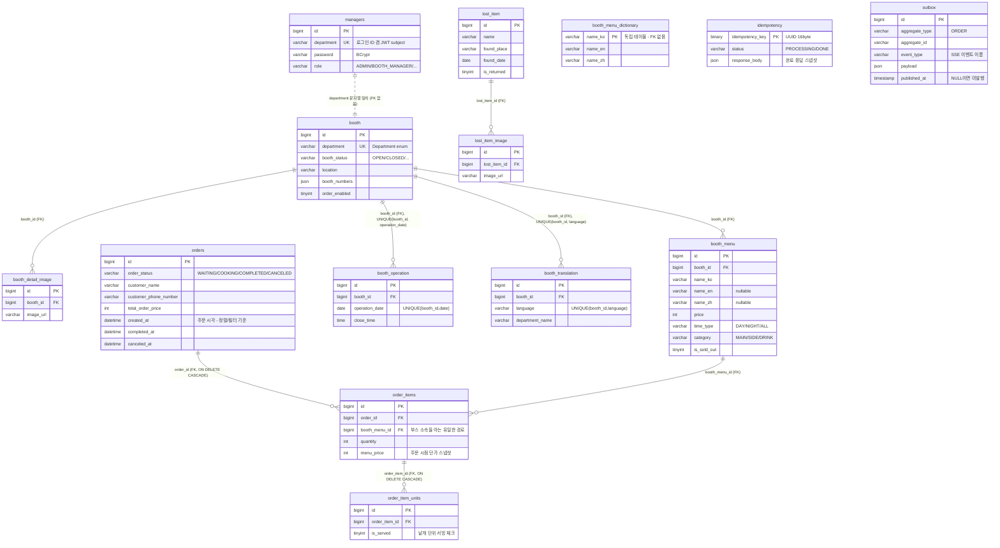

# ERD-0001: 축제 서비스 현행 스키마 (Flyway V1 ~ V13)

<!--
  파일 이름 규칙: docs/erd/erd-NNNN-<kebab-case-영문-설명>.md
  NNNN은 4자리 일련번호이며 기존 ERD의 최대 번호 + 1을 사용한다.
  스키마가 크게 바뀌면(예: 전국 대학 확장) 새 번호로 문서를 추가하고, 이 문서의 상태를 "대체됨"으로 바꾼다.
  작은 컬럼 추가는 이 문서를 직접 갱신하고 "적용된 마이그레이션" 표에 한 줄을 더한다.
  이 문서의 구성(개요 → 설계 원칙 → 테이블 명세 → 다이어그램 → 인덱스 현황 → 개선 후보)이 이후 ERD 문서의 템플릿이다.
-->

| 항목 | 내용 |
|---|---|
| 상태 | **활성** |
| 작성일 | 2026-09-10 (기존 뱅킹 프로젝트 문서를 축제 서비스 현행 스키마 기준으로 전면 재작성) |
| 기준 | `src/main/resources/db/migration/V1__init.sql` ~ `V13__create_outbox.sql` **전부 적용된 상태** |
| 관련 이슈 | 해당 없음 (현행 스키마 기록 — 이후 변경은 이슈·ADR 경유) |
| 관련 문서 | `AGENTS.md` 1.4(작업 범위), `docs/api-spec/api-conventions.md`, `docs/policy/development-policy.md` |

## 1. 개요

대학 축제 서비스의 현행 단일 MySQL 8 스키마다. 도메인은 **부스(booth) / 분실물(lostitem) / 운영자(manager) / 주문(order)** 네 갈래이며,
여기에 횡단 관심사 테이블(**멱등성, 아웃박스**)이 붙는다.

- **스키마는 Flyway로만 관리한다.** 새 변경은 항상 `V{N+1}__<snake_case_설명>.sql`을 **추가**하며, 이미 적용된 파일은 수정하지 않는다(체크섬 불일치로 기동 실패).
- 애플리케이션이 아는 테이블은 아래 14개 + Flyway가 자동 생성하는 `flyway_schema_history`다.
- 이 문서는 **지금 이 순간의 스키마**를 기술한다. `AGENTS.md` 1.4의 1번 작업(전국 단위 대학 확장)이 시작되면 이 구조가 크게 바뀐다 — 6장 참조.

### 1.1 적용된 마이그레이션

| 버전 | 파일 | 내용 |
|---|---|---|
| V1 | `init` | 11개 테이블 최초 생성 (booth 계열 5, lost_item 계열 2, managers, orders 계열 3) |
| V2 | `update_booth_location_and_numbers` | `booth.booth_numbers` JSON 추가, `booth.location_detail` 제거 |
| V3 | `add_booth_menu_multilingual_description` | `booth_menu.description_ko` → TEXT, `description_en`/`description_zh` 추가 |
| V4 | `add_columns_to_booth` | `booth.booth_status` 추가 (NOT NULL DEFAULT `'CLOSED'`) |
| V5 | `create_booth_menu_dictionary_table` | `booth_menu_dictionary` 생성 (번역 사전) |
| V6 | `modify_columns_menu` | `booth_menu.name_en`, `name_zh`를 NULL 허용으로 완화 |
| V7 | `drop_columns_booth_menu` | `booth_menu.icon_image_url` 제거 |
| V8 | `create_order_idempotency_table` | `order_idempotency` 생성 |
| V9 | `add_column_idempotency_status` | `order_idempotency.idempotency_status` 추가 |
| V10 | `alter_response_body_nullable` | `order_idempotency.response_body` NULL 허용 |
| V11 | `add_order_item_cascade` | `order_items → orders`, `order_item_units → order_items` FK에 `ON DELETE CASCADE` |
| V12 | `change_order_idempotency_to_idempotency` | **`idempotency` 신규 생성** (order 전용 → 범용화). `order_idempotency`는 남아 있음 |
| V13 | `create_outbox` | `outbox` 생성 (트랜잭셔널 아웃박스 패턴) |

## 2. 스키마 설계 원칙 (현행 관례)

아래는 **현재 코드가 실제로 따르고 있는 규칙**이다. 새 테이블도 이 규칙을 따른다.

- **PK**: 모든 테이블은 `BIGINT AUTO_INCREMENT` 대리 키를 PK로 쓴다.
  예외 2개 — `booth_menu_dictionary`(`name_ko VARCHAR(255)`를 PK로 사용), `idempotency`/`order_idempotency`(`BINARY(16)` UUID를 PK로 사용).
- **물리 FK를 적극적으로 사용한다.** 같은 도메인 안이든 도메인을 넘든(`order_items.booth_menu_id → booth_menu.id`) 모두 실제 `FOREIGN KEY` 제약을 건다.
  뱅킹 프로젝트처럼 "컨텍스트 간에는 ID만 저장" 하는 규칙은 **이 프로젝트에 적용하지 않는다.**
- **삭제**: 부모 삭제 시 자식이 함께 사라져야 하는 관계에만 `ON DELETE CASCADE`를 건다 (`orders → order_items → order_item_units`, V11).
  나머지는 기본 동작(RESTRICT)이다. `booth`를 지우면 자식 행이 남아 있어 삭제가 거부된다.
- **열거형**: MySQL `ENUM` 대신 `VARCHAR` + JPA `@Enumerated(EnumType.STRING)`. 값 추가 시 DDL 변경이 필요 없게 하기 위함.
- **금액**: `INT` (KRW, 소수점 없음). `DECIMAL`/`double` 컬럼을 쓰지 않는다.
- **불리언**: `TINYINT(1)` + `NOT NULL DEFAULT 0` (`order_enabled`, `is_sold_out`, `is_returned`, `is_served`).
- **공통 시각 컬럼**: `created_at DATETIME(6)`, `modified_at DATETIME(6)`.
  `global/common/BaseTimeEntity`(`@CreatedDate`/`@LastModifiedDate` + `AuditingEntityListener`)를 상속하면 자동으로 채워진다.
  **DDL 상으로는 대부분 NULL 허용**이며 애플리케이션이 채우는 구조다.
  `outbox`만 `BaseTimeEntity`를 쓰지 않고 Hibernate `@CreationTimestamp` + DB `DEFAULT CURRENT_TIMESTAMP(6)`를 쓴다.
- **JSON 컬럼**: 목록/자유 구조는 `JSON` 타입으로 둔다 (`booth.booth_numbers`, `idempotency.response_body`, `outbox.payload`).
  JPA 매핑은 `AttributeConverter`(예: `IntegerListJsonConverter`) 또는 `String` + `columnDefinition = "json"`.
- **문자셋**: 전 테이블 `utf8mb4` / `utf8mb4_unicode_ci` (`idempotency` 계열만 collate 미지정 → 기본값).

> **네이밍이 통일되어 있지 않다 (알려진 부채).**
> 단수형(`booth`, `booth_menu`, `lost_item`, `idempotency`, `outbox`)과 복수형(`managers`, `orders`, `order_items`, `order_item_units`)이 섞여 있다.
> 기존 테이블 이름은 바꾸지 않는다(마이그레이션·엔티티·쿼리 전부 영향). **신규 테이블은 복수형 `snake_case`로 통일한다.**

## 3. 도메인별 테이블 명세

### 3.1 booth (부스 — 학과별 축제 부스)

**booth**

| 컬럼 | 타입 | 제약 | 설명 |
|---|---|---|---|
| id | BIGINT | PK, AUTO_INCREMENT | |
| department | VARCHAR(100) | **UNIQUE**, NOT NULL | `Department` enum 이름 (`SOFTWARE`, `SKULIKELION` …). **JWT subject·부스 소유권 판별의 기준 키** |
| thumbnail_url | VARCHAR(255) | NULL | S3/MinIO 객체 URL |
| order_enabled | TINYINT(1) | NOT NULL DEFAULT 0 | QR 오더 사용 여부 |
| booth_status | VARCHAR(50) | NOT NULL DEFAULT 'CLOSED' | `BoothStatus`: OPEN / SOLD_OUT / BREAK_TIME / LAST_ORDER_CLOSED / BOOTH_REASON_CLOSED / CLOSED |
| location | VARCHAR(100) | NULL | `BoothLocation`: DAEIL / EUNJU_1 / EUNJU_2 / CHEONGUN / HYEIN |
| booth_numbers | JSON | NULL | 부스 번호 목록 (`List<Integer>`, `IntegerListJsonConverter`) |
| account_name / account_number / bank_name | VARCHAR(100) | NULL | 계좌이체 안내용 (예금주 / 계좌번호 / 은행) |
| created_at / modified_at | DATETIME(6) | NULL | |

> `department`가 UNIQUE라는 것은 **한 학과 = 한 부스**를 뜻한다. 전국 확장 시 가장 먼저 깨지는 제약이다 (6장).

**booth_detail_image** — 부스 상세 이미지 (1:N)

| 컬럼 | 타입 | 제약 | 설명 |
|---|---|---|---|
| id | BIGINT | PK, AUTO_INCREMENT | |
| booth_id | BIGINT | NOT NULL, **FK → booth(id)** | |
| image_url | VARCHAR(255) | NOT NULL | |

**booth_menu** — 부스 판매 메뉴

| 컬럼 | 타입 | 제약 | 설명 |
|---|---|---|---|
| id | BIGINT | PK, AUTO_INCREMENT | |
| booth_id | BIGINT | NOT NULL, **FK → booth(id)** | |
| name_ko | VARCHAR(255) | NOT NULL | 한국어 메뉴명 |
| name_en / name_zh | VARCHAR(255) | NULL (V6에서 완화) | 영어 / 중국어 메뉴명 |
| description_ko / description_en / description_zh | TEXT | NULL | 다국어 설명 (V3) |
| price | INT | NULL | 단가 (KRW) |
| time_type | VARCHAR(50) | NULL | `TimeType`: DAY / NIGHT / ALL |
| is_sold_out | TINYINT(1) | NOT NULL DEFAULT 0 | 품절 여부 |
| category | VARCHAR(100) | NOT NULL | `MenuCategory`: MAIN / SIDE / DRINK |
| created_at / modified_at | DATETIME(6) | NULL | |

**booth_operation** — 날짜별 운영 시간

| 컬럼 | 타입 | 제약 | 설명 |
|---|---|---|---|
| id | BIGINT | PK, AUTO_INCREMENT | |
| booth_id | BIGINT | NOT NULL, **FK → booth(id)** | |
| operation_date | DATE | NOT NULL | 운영일 |
| — | — | **UNIQUE (booth_id, operation_date)** | 하루에 한 부스는 한 행 |
| time_type | VARCHAR(50) | NOT NULL | `TimeType` |
| day_open_time / night_open_time | TIME | NULL | 낮/밤 오픈 시각 |
| close_time | TIME | NOT NULL | 마감 시각 |
| created_at / modified_at | DATETIME(6) | NULL | |

**booth_translation** — 부스 소개 다국어

| 컬럼 | 타입 | 제약 | 설명 |
|---|---|---|---|
| id | BIGINT | PK, AUTO_INCREMENT | |
| booth_id | BIGINT | NOT NULL, **FK → booth(id)** | |
| language | VARCHAR(20) | NOT NULL | `Language`: KO / EN / ZH |
| — | — | **UNIQUE (booth_id, language)** | 언어당 한 행 |
| department_name | VARCHAR(255) | NOT NULL | 번역된 학과명 |
| booth_name | VARCHAR(255) | NULL | 번역된 부스명 |
| description | TEXT | NULL | 번역된 소개 |
| created_at / modified_at | DATETIME(6) | NULL | |

**booth_menu_dictionary** (V5) — 메뉴명 번역 사전. **FK도 시각 컬럼도 없는 독립 참조 테이블이다.**

| 컬럼 | 타입 | 제약 | 설명 |
|---|---|---|---|
| name_ko | VARCHAR(255) | **PK** | 한국어 메뉴명 (자연 키) |
| name_en / name_zh | VARCHAR(255) | NULL | 기 번역 결과 캐시 — AI 번역(`AnthropicClient`) 호출을 줄이기 위한 사전 |

### 3.2 lostitem (분실물)

**lost_item**

| 컬럼 | 타입 | 제약 | 설명 |
|---|---|---|---|
| id | BIGINT | PK, AUTO_INCREMENT | |
| name | VARCHAR(255) | NOT NULL | 물품명 |
| image_url | VARCHAR(1000) | NULL | 대표 이미지 |
| found_place | VARCHAR(255) | NOT NULL | 습득 장소 |
| found_date | DATE | NOT NULL | 습득 일자 |
| is_returned | TINYINT(1) | NOT NULL DEFAULT 0 | 반환 완료 여부 |
| created_at / modified_at | DATETIME(6) | NULL | |

**lost_item_image** — 추가 이미지 (1:N)

| 컬럼 | 타입 | 제약 | 설명 |
|---|---|---|---|
| id | BIGINT | PK, AUTO_INCREMENT | |
| lost_item_id | BIGINT | NOT NULL, **FK → lost_item(id)** | |
| image_url | VARCHAR(1000) | NOT NULL | |
| created_at / modified_at | DATETIME(6) | NULL | |

> `lost_item.image_url`과 `lost_item_image` 테이블이 공존한다. 대표 이미지 1장 + 추가 이미지 N장 구조다.

### 3.3 manager (운영자 계정 — 인증의 주체)

**managers**

| 컬럼 | 타입 | 제약 | 설명 |
|---|---|---|---|
| id | BIGINT | PK, AUTO_INCREMENT | |
| department | VARCHAR(100) | **UNIQUE**, NOT NULL | `Department` enum 이름. **로그인 ID 겸용이며 JWT subject가 된다** |
| password | VARCHAR(255) | NOT NULL | BCrypt 해시 (평문 저장 금지) |
| role | VARCHAR(50) | DEFAULT 'USER' | `Role`: USER / ADMIN / BOOTH_MANAGER / STUDENT_COUNCIL |
| created_at / modified_at | DATETIME(6) | NULL | |

> **`managers.department`와 `booth.department`는 물리 FK 없이 값으로만 이어져 있다.**
> "이 매니저가 이 부스의 주인인가"는 애플리케이션이 문자열 비교로 판단한다. 두 테이블 사이에 유일하게 FK가 없는 연결이다.
> Refresh Token은 DB가 아니라 **Redis**(`global/infra/redis/RefreshTokenRepository`)에 보관하므로 토큰 테이블이 없다.

### 3.4 order (주문 — QR 오더)

**orders**

| 컬럼 | 타입 | 제약 | 설명 |
|---|---|---|---|
| id | BIGINT | PK, AUTO_INCREMENT | |
| table_number | INT | NULL | 테이블 번호 |
| num_of_people | INT | NULL | 인원 수 |
| customer_name | VARCHAR(255) | NOT NULL | 주문자 이름 |
| customer_phone_number | VARCHAR(255) | NOT NULL | 주문자 전화번호 |
| total_order_price | INT | NULL | 주문 총액 (KRW) |
| order_status | VARCHAR(50) | DEFAULT 'WAITING' | `OrderStatus`: WAITING / COOKING / COMPLETED / CANCELED |
| order_cancel_reason | VARCHAR(100) | NULL | `OrderCancelReason` |
| completed_at / canceled_at | DATETIME(6) | NULL | 전이 시각 |
| created_at / modified_at | DATETIME(6) | NULL | `created_at`이 곧 주문 시각이며 목록 정렬·일자 필터의 기준이다 |

> ### ⚠️ `orders`에는 `booth_id`가 없다 — 이 스키마의 가장 중요한 특징
> 주문이 어느 부스 것인지는 **`orders → order_items → booth_menu → booth`** 3-hop 조인으로만 알 수 있다.
> 실제로 `OrderRepository`의 거의 모든 조회 쿼리가 `JOIN oi.boothMenu bm ... bm.booth.department = :departmentName` 형태다.
> 부스 관리자의 주문 목록 조회(대기/조리/완료/취소)와 매출 집계가 전부 이 경로를 탄다.
> **대량 데이터 환경에서 가장 먼저 무너질 지점이며, `AGENTS.md` 1.4의 3번(성능)·4번(CQRS) 작업의 1순위 대상이다.**

**order_items** — 주문 상세 (메뉴 단위)

| 컬럼 | 타입 | 제약 | 설명 |
|---|---|---|---|
| id | BIGINT | PK, AUTO_INCREMENT | |
| order_id | BIGINT | NULL, **FK → orders(id) ON DELETE CASCADE** (V11) | |
| booth_menu_id | BIGINT | NULL, **FK → booth_menu(id)** | |
| quantity | INT | NULL | 수량 |
| menu_price | INT | NULL | **주문 시점 단가 스냅샷** — 이후 메뉴 가격이 바뀌어도 과거 주문 금액이 흔들리지 않게 한다 |
| total_order_item_price | INT | NULL | 항목 합계 |

**order_item_units** — 주문 상세의 **개별 낱개**. 3개 주문 시 3행이 생기며, 서빙 체크를 낱개 단위로 한다.

| 컬럼 | 타입 | 제약 | 설명 |
|---|---|---|---|
| id | BIGINT | PK, AUTO_INCREMENT | |
| order_item_id | BIGINT | NULL, **FK → order_items(id) ON DELETE CASCADE** (V11) | |
| is_served | TINYINT(1) | NOT NULL DEFAULT 0 | 서빙(제공) 완료 여부 |

> **행 증폭 주의**: `order_item_units`는 `sum(order_items.quantity)`만큼 생긴다.
> 대량 데이터 적재 시 이 테이블이 가장 큰 테이블이 된다. 데이터 생성 스펙(LLD)에 수량 분포를 반드시 명시해야 하는 이유다.

### 3.5 global (횡단 관심사 — 멱등성, 아웃박스)

**idempotency** (V12) — `@Idempotent` AOP가 사용하는 현행 테이블.

| 컬럼 | 타입 | 제약 | 설명 |
|---|---|---|---|
| idempotency_key | BINARY(16) | **PK** | 클라이언트가 보낸 `Idempotency-Key` UUID. **중복 방지의 최종 방어선은 애플리케이션 검사가 아니라 이 PK 제약이다** |
| status | VARCHAR(20) | NOT NULL | `IdempotencyStatus`: PROCESSING / DONE |
| response_body | JSON | NULL | 완료 시 응답 스냅샷 → 재요청에 그대로 반환 (재처리 금지). PROCESSING 동안 NULL |
| created_at / modified_at | DATETIME(6) | NOT NULL | 만료 판정과 `DbIdempotencyScheduler`의 정리 기준 |

**order_idempotency** (V8~V10) — **V12에서 `idempotency`로 대체되었으나 DROP되지 않고 남아 있는 레거시 테이블.**
매핑된 JPA 엔티티가 없어 현재 아무도 쓰지 않는다. 컬럼은 `idempotency`와 같고 상태 컬럼명만 `idempotency_status`다.
→ 정리(DROP) 여부는 6장 참조.

**outbox** (V13) — 트랜잭셔널 아웃박스(비즈니스 데이터 변경과 이벤트 기록을 **한 트랜잭션**에 묶어, 커밋된 이벤트는 반드시 발행되게 하는 패턴).

| 컬럼 | 타입 | 제약 | 설명 |
|---|---|---|---|
| id | BIGINT | PK, AUTO_INCREMENT | 폴링 정렬 키 (`ORDER BY id ASC`) |
| aggregate_type | VARCHAR(255) | NOT NULL | `AggregateType`: 현재 `ORDER` 하나 |
| aggregate_id | VARCHAR(255) | NOT NULL | 대상 식별자 (주문 id, 부스 id 등을 문자열로) |
| event_type | VARCHAR(255) | NOT NULL | `OrderSseEventType.eventName` (`waitingOrderEvent` 등) |
| payload | JSON | NOT NULL | 이벤트 페이로드 직렬화 결과 |
| created_at | DATETIME(6) | NOT NULL DEFAULT CURRENT_TIMESTAMP(6) | |
| published_at | TIMESTAMP | NULL | **NULL = 미발행.** 발행 후 `markAsPublished()`가 채운다 |

> `PollingPublisher`가 `@Scheduled(fixedDelay = 200)`으로
> `SELECT * FROM outbox WHERE published_at IS NULL ORDER BY id ASC LIMIT :limit FOR UPDATE SKIP LOCKED`를 돌린다.
> `FOR UPDATE SKIP LOCKED`(다른 트랜잭션이 잠근 행은 건너뛰고 잠기지 않은 행만 잠그는 방식)로 다중 인스턴스 중복 발행을 막는다.
> **발행된 행을 삭제하지 않으므로 이 테이블은 단조 증가한다.** 5장·6장 참조.

## 4. ERD 다이어그램

실선(`--`)은 물리 FK, 점선(`..`)은 **FK 없이 값으로만 이어진 참조**다.

> `idempotency`, `outbox`, `booth_menu_dictionary`는 다른 테이블과 FK로 이어지지 않는 독립 테이블이라 관계선이 없다.

## 5. 인덱스 현황 (성능 작업의 출발점)

### 5.1 현재 존재하는 인덱스가 전부다

| 테이블 | 인덱스 | 종류 |
|---|---|---|
| 전 테이블 | `PRIMARY (id)` | PK 클러스터드 |
| booth | `department` | UNIQUE |
| managers | `department` | UNIQUE |
| booth_operation | `uq_booth_operation (booth_id, operation_date)` | UNIQUE |
| booth_translation | `uq_booth_translation (booth_id, language)` | UNIQUE |
| booth_detail_image / booth_menu / booth_operation / booth_translation | `booth_id` | FK 부수 인덱스 (MySQL 자동 생성) |
| lost_item_image | `lost_item_id` | FK 부수 인덱스 |
| order_items | `order_id`, `booth_menu_id` | FK 부수 인덱스 |
| order_item_units | `order_item_id` | FK 부수 인덱스 |
| idempotency / order_idempotency | `PRIMARY (idempotency_key)` | PK |
| outbox | `PRIMARY (id)` | PK |

**즉, 명시적으로 설계해서 만든 조회용 보조 인덱스는 하나도 없다.** UNIQUE 제약과 MySQL이 FK 때문에 자동으로 만든 인덱스가 전부다.

### 5.2 인덱스가 없어 현재 풀스캔/필터링에 의존하는 쿼리

`AGENTS.md` 1.4의 3번 작업(성능)에서 **실측(`EXPLAIN`) 후** 다루어야 할 후보다. 여기 적힌 것은 가설이며, 근거 없이 인덱스를 먼저 추가하지 않는다.

| 대상 | 쿼리 성격 | 인덱스가 없는 컬럼 |
|---|---|---|
| `orders` | 상태별 목록 조회 (대기/조리/완료/취소) | `order_status` |
| `orders` | 커서 페이지네이션 정렬·일자 필터 | `created_at`, `completed_at`, `canceled_at` |
| `orders` | 완료/취소 목록의 `keyword` 검색 | `customer_name`, `customer_phone_number` |
| `orders` | 부스 소속 판별 (3-hop 조인) | 조인 경로 자체 — 비정규화 또는 Read Model 후보 (3.4 경고 참조) |
| `outbox` | `WHERE published_at IS NULL ORDER BY id` 폴링 (200ms마다!) | **`published_at`** — 미발행 행이 앞쪽에 몰려 있어 지금은 빠르지만, 발행 완료 행이 쌓일수록 스캔 범위가 커진다 |
| `booth_menu` | 부스별 + 시간대별 + 품절 제외 메뉴 조회 | `(booth_id, time_type, is_sold_out)` 복합 후보 |
| `booth_menu_dictionary` | 번역 사전 조회 | PK(`name_ko`)로 조회하므로 문제 없음 |

## 6. 미결정 / 개선 후보 (구현 착수 시 ADR·LLD로 확정)

번호 순서는 우선순위가 아니라 `AGENTS.md` 1.4의 작업 갈래에 대응한다.

### 6.1 전국 단위 대학 확장 (작업 1) — **다음 스키마 개편의 본체**

- **`booth.department`의 UNIQUE 제약이 깨진다.** 서로 다른 대학에 같은 이름의 학과가 존재하기 때문이다.
  → `universities` 테이블 신설 + `booth.university_id` 도입 + UNIQUE를 `(university_id, department)` 복합으로 이전하는 방향이 유력하다. **ADR 필수.**
- **`Department`가 Java enum으로 하드코딩되어 있다** (`global/enums/Department` — 서경대 30여 개 학과). 전국 확장 시 enum으로는 감당할 수 없다.
  → 테이블(`departments`)로 승격할지, 부스에 자유 문자열을 둘지 결정해야 한다. **ADR 필수** (인증 토큰의 subject가 `Department` 이름이므로 인증 흐름까지 영향).
- **`managers.department` ↔ `booth.department` 문자열 결합도 함께 재설계**해야 한다 (3.3 참조). `managers.booth_id` FK로 바꾸는 것이 자연스럽다.
- 축제 자체를 나타내는 엔티티(`festivals`: 대학 + 기간)가 필요한지 결정한다. `booth_operation.operation_date`만으로 회차 구분이 되는지 검토.

### 6.2 대량 데이터 적재 (작업 2)

- **행 증폭 비율을 LLD에 못 박아야 한다**: 1 order → N order_items → Σquantity order_item_units (3.4 경고).
- FK와 인덱스가 걸린 상태로 대량 INSERT하면 느리다. 적재 중 인덱스/FK를 끄고 나중에 붙이는 전략을 쓸지 ADR로 결정한다.
- 적재 대상에서 제외할 테이블(`idempotency`, `outbox`)을 명시한다.

### 6.3 성능 개선 (작업 3)

- 5.2의 인덱스 후보를 `EXPLAIN` 실측 후 하나씩 도입한다. **Before/After 수치 없이 인덱스를 추가하지 않는다.**
- `orders`에 `booth_id`를 비정규화 컬럼으로 추가할지 결정한다 (3-hop 조인 제거). 스키마 변경이므로 **ADR 필수**이며, 기존 데이터 백필 전략을 함께 정해야 한다.
- `total_order_price`, `total_order_item_price`처럼 이미 존재하는 비정규화 컬럼의 정합성 검증 시점을 정한다.

### 6.4 CQRS / Read Model (작업 4)

- 부스 관리자 주문 목록을 MongoDB 비정규화 문서로 옮길 때, **갱신 트리거로 기존 `outbox`를 재사용할 수 있는지**를 옵션에 반드시 포함한다 (이미 주문 상태 전이가 전부 outbox에 적재된다).
- Read Model 도입 후 `orders`/`order_items` 조회 인덱스를 어디까지 유지할지 결정한다.

### 6.5 정리(cleanup) 항목

- **`order_idempotency` 테이블 DROP** — V12에서 `idempotency`로 대체되었으나 남아 있고, 매핑된 엔티티가 없다. 운영 데이터 확인 후 `V{N}__drop_order_idempotency.sql`로 제거한다.
- **`outbox` 보관 정책 부재** — 발행 완료 행을 지우거나 아카이빙하지 않아 무한 증가한다. TTL 삭제 배치 또는 파티셔닝을 결정한다 (`DbIdempotencyScheduler`와 같은 방식이 참고가 된다).
- **`idempotency` 만료 기준 문서화** — 보관 기간이 코드에만 있고 문서에 없다. `docs/policy/development-policy.md`로 승격할지 검토한다.
- **네이밍 단수/복수 혼용** (2장 각주) — 기존 테이블은 유지, 신규는 복수형.
- **`created_at`/`modified_at`의 NULL 허용** — 애플리케이션이 항상 채우지만 DDL이 보장하지 않는다. `NOT NULL`로 조일지 결정한다.
