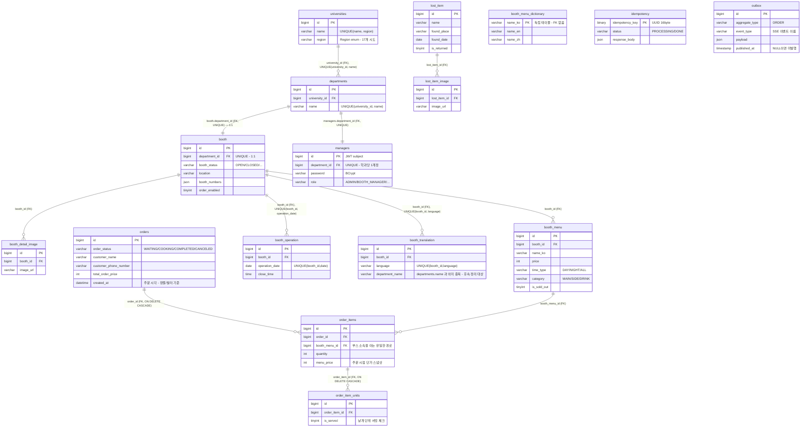

# ERD-0002: 전국 대학 확장 스키마 (Flyway V1 ~ V14)

<!--
  파일 이름 규칙: docs/erd/erd-NNNN-<kebab-case-영문-설명>.md
  이 문서는 erd-0001-initial-schema.md를 대체한다.
  구성(개요 → 설계 원칙 → 테이블 명세 → 다이어그램 → 인덱스 현황 → 개선 후보)은 erd-0001의 형식을 그대로 따른다.
-->

| 항목 | 내용 |
|---|---|
| 상태 | **활성** |
| 작성일 | 2026-09-14 |
| 대체 대상 | [`erd-0001-initial-schema.md`](erd-0001-initial-schema.md) (→ 대체됨) |
| 기준 | `V1__init.sql` ~ **`V14__create_universities_and_departments.sql`** 전부 적용된 상태 |
| 관련 이슈 | [#3](https://github.com/silversieon/likelion14th-festival-be-V2/issues/3) |
| 관련 문서 | [ADR-0001](../adr/ADR-0001-university-department-schema-and-auth-identity.md), [LLD-0001](../lld/LLD-0001-university-department-and-auth-identity.md), `docs/policy/development-policy.md`, `docs/api-spec/auth.md` |

## 1. 개요

erd-0001의 스키마에 **전국 단위 대학 확장**이 반영된 결과다. 도메인이 다섯 갈래가 되었다:
**대학·학과(university, 신규) / 부스(booth) / 분실물(lostitem) / 운영자(manager) / 주문(order)** + 횡단 관심사(멱등성, 아웃박스).

**erd-0001에서 달라진 것은 딱 세 가지다.** 나머지 테이블은 컬럼 하나 바뀌지 않았다.

| # | 변경 | 근거 |
|---|---|---|
| 1 | `universities`, `departments` **테이블 신설** (1:N) | `Department` Java enum을 데이터로 승격 |
| 2 | `booth.department`(VARCHAR UNIQUE) → **`booth.department_id`**(BIGINT UNIQUE FK) | 동명 학과 공존 |
| 3 | `managers.department`(VARCHAR UNIQUE) → **`managers.department_id`**(BIGINT UNIQUE FK) | FK 없는 문자열 결합 제거 |

> **erd-0001 4장의 점선(`..`)이 사라졌다.** `managers ↔ booth`는 더 이상 문자열 값으로 이어지지 않고, **둘 다 `departments.id`를 FK로 참조**한다. 이제 스키마의 모든 참조가 물리 FK다.

### 1.1 적용된 마이그레이션

V1~V13은 erd-0001 1.1과 동일하다. 이번에 추가된 것은 V14 하나다.

| 버전 | 파일 | 내용 |
|---|---|---|
| V1 ~ V13 | (erd-0001 1.1 참조) | 초기 스키마 ~ `outbox` 생성 |
| **V14** | `create_universities_and_departments` | `universities`·`departments` 생성 + 서경대학교 1행·학과 33행 적재 + `booth`/`managers`를 `department_id` FK로 **백필 전환** + 옛 `department` 컬럼 제거 |

**V14의 단계 구성** (policy 4.3의 5단계를 한 파일에서 수행 — 근거는 LLD-0001 7.2)

```
① universities / departments 생성
② departments.legacy_code 임시 컬럼 추가          ← 백필 조인 키
③ 서경대학교 1행 + Department enum 33행 INSERT     ← 코드에 있던 데이터를 DB로 이관
④ booth/managers.department_id 를 nullable 로 추가
⑤ legacy_code = department 조인으로 UPDATE 백필
⑥ NOT NULL → UNIQUE → FK 부여                     ← 매핑 실패 시 여기서 중단된다
⑦ 옛 department 컬럼 + legacy_code 제거
```

> ⚠️ **되돌릴 수 없다.** Flyway에 `undo`가 없고 ⑦에서 옛 컬럼이 사라진다. 실행 전 `booth` / `managers` / 주문 계열 백업이 유일한 롤백 수단이다.

## 2. 스키마 설계 원칙 (현행 관례)

erd-0001 2장과 동일하며, 이번 변경으로 다음이 추가·확정되었다.

- **신규 테이블은 복수형 `snake_case`** — `universities`, `departments`가 이 규칙을 따른 첫 사례다. (기존 단수/복수 혼용은 그대로 둔다)
- **`Region`은 MySQL `ENUM`이 아니라 `VARCHAR(50)` + JPA `@Enumerated(STRING)`** — 값 추가 시 DDL 변경이 필요 없게 하는 기존 관례 그대로다.
- **"이름"은 자연 키로 쓰지 않는다.** 학과명·대학명은 바뀔 수 있으므로 식별은 항상 대리 키(`BIGINT id`)로 한다. 이번 개편의 핵심 교훈이며, JWT subject가 이름에서 `manager.id`로 바뀐 이유이기도 하다 (ADR-0001).

## 3. 도메인별 테이블 명세

### 3.0 university (대학·학과 — **신규**)

**universities**

| 컬럼 | 타입 | 제약 | 설명 |
|---|---|---|---|
| id | BIGINT | PK, AUTO_INCREMENT | |
| name | VARCHAR(100) | NOT NULL | 학교명 (예: `서경대학교`) |
| region | VARCHAR(50) | NOT NULL | 시도명. `Region` enum 17개 (`SEOUL`, `GYEONGGI`, `GYEONGNAM` …) |
| — | — | **UNIQUE (name, region)** `uq_universities_name_region` | 동명 대학이 다른 시도에 있을 여지를 남기면서 중복 적재는 막는다 |
| created_at / modified_at | DATETIME(6) | NULL | `BaseTimeEntity` |

**departments**

| 컬럼 | 타입 | 제약 | 설명 |
|---|---|---|---|
| id | BIGINT | PK, AUTO_INCREMENT | |
| university_id | BIGINT | NOT NULL, **FK → universities(id)** `fk_departments_university` | 소속 대학 |
| name | VARCHAR(100) | NOT NULL | 학과명 (예: `소프트웨어학과`) |
| — | — | **UNIQUE (university_id, name)** `uq_departments_university_name` | **이 제약이 전국 확장의 핵심이다.** 같은 대학 안에서만 학과명이 유일하므로, **다른 대학에는 동명 학과가 공존**할 수 있다 |
| created_at / modified_at | DATETIME(6) | NULL | `BaseTimeEntity` |

> V14가 적재한 초기 데이터: `universities` 1행(서경대학교/서울특별시), `departments` **33행**(구 `Department` enum 전량).
> 전국 규모 적재는 다음 작업(AGENTS.md 1.4-②)에서 진행하며, 규모·분포는 사용자가 지정한다.

### 3.1 booth (부스)

**booth** — **`department` 컬럼이 `department_id`로 교체된 것 외에는 erd-0001과 같다.**

| 컬럼 | 타입 | 제약 | 설명 |
|---|---|---|---|
| id | BIGINT | PK, AUTO_INCREMENT | |
| **department_id** | **BIGINT** | **NOT NULL, UNIQUE `uq_booth_department`, FK → departments(id)** `fk_booth_department` | 운영 학과. **UNIQUE가 곧 1:1** — 한 학과 = 한 부스 |
| thumbnail_url | VARCHAR(255) | NULL | S3/MinIO 객체 URL |
| order_enabled | TINYINT(1) | NOT NULL DEFAULT 0 | QR 오더 사용 여부 |
| booth_status | VARCHAR(50) | NOT NULL DEFAULT 'CLOSED' | `BoothStatus` |
| location | VARCHAR(100) | NULL | `BoothLocation` |
| booth_numbers | JSON | NULL | `List<Integer>` |
| account_name / account_number / bank_name | VARCHAR(100) | NULL | 계좌이체 안내용 |
| created_at / modified_at | DATETIME(6) | NULL | |

> **erd-0001 3.1의 경고가 해소되었다.** "`department`가 UNIQUE라는 것은 한 학과 = 한 부스를 뜻하며, 전국 확장 시 가장 먼저 깨지는 제약"이었다.
> 이제 유일성의 범위가 `departments` 행으로 좁혀져, 대학이 늘어도 제약이 깨지지 않는다.

**booth_detail_image / booth_menu / booth_operation / booth_translation / booth_menu_dictionary** — erd-0001 3.1과 **동일하다. 변경 없음.**

> ⚠️ **`booth_translation.department_name`은 그대로 남아 있다.** 다국어 학과명(KO/EN/ZH)을 담는 컬럼으로, `departments.name`과 의미가 겹친다.
> 학과명의 단일 출처를 어디로 할지는 후속 작업으로 남겼다 (ADR-0001 후속 작업 / LLD-0001 14장 O2).

### 3.2 lostitem (분실물)

erd-0001 3.2와 **동일하다. 변경 없음.**

### 3.3 manager (운영자 계정 — 인증의 주체)

**managers**

| 컬럼 | 타입 | 제약 | 설명 |
|---|---|---|---|
| id | BIGINT | PK, AUTO_INCREMENT | **JWT subject가 이 값이다** |
| **department_id** | **BIGINT** | **NOT NULL, UNIQUE `uq_managers_department`, FK → departments(id)** `fk_managers_department` | 소속 학과. UNIQUE = 학과당 계정 1개 |
| password | VARCHAR(255) | NOT NULL | BCrypt 해시 |
| role | VARCHAR(50) | DEFAULT 'USER' | `Role`: USER / ADMIN / BOOTH_MANAGER / STUDENT_COUNCIL |
| created_at / modified_at | DATETIME(6) | NULL | |

> **erd-0001 3.3의 경고가 해소되었다.** "`managers.department`와 `booth.department`는 물리 FK 없이 값으로만 이어져 있다 — 두 테이블 사이에 유일하게 FK가 없는 연결"이었다.
> 이제 둘 다 `departments.id`를 FK로 참조하며, 소유권 판정은 **`booth.department_id == managers.department_id` 정수 비교**다.
>
> **로그인 ID가 사라졌다.** 예전에는 `managers.department`가 로그인 ID를 겸했지만, 이제 로그인은 `{universityId, departmentId, password}`로 계정을 특정한다 (`docs/api-spec/auth.md`).
> Refresh Token은 여전히 DB가 아니라 **Redis**에 보관하므로 토큰 테이블이 없다.

### 3.4 order (주문 — QR 오더)

erd-0001 3.4와 **동일하다. 변경 없음.**

> ### ⚠️ `orders`에는 여전히 `booth_id`가 없다
> 주문의 부스 소속은 **`orders → order_items → booth_menu → booth`** 3-hop 조인으로만 알 수 있다.
> 이번 개편은 부스의 **식별자**를 바꿨을 뿐 이 조인 경로를 건드리지 않았다.
> **여전히 대량 데이터에서 가장 먼저 무너질 지점**이며, AGENTS.md 1.4의 3번(성능)·4번(CQRS) 작업의 1순위 대상이다 (6.2).

### 3.5 global (횡단 관심사)

`idempotency`, `order_idempotency`(레거시), `outbox` — erd-0001 3.5와 **동일하다. 변경 없음.**

## 4. ERD 다이어그램

erd-0001과 달리 **점선이 없다.** 모든 참조가 물리 FK다.



## 5. 인덱스 현황

### 5.1 현재 존재하는 인덱스

| 테이블 | 인덱스 | 종류 | 변경 |
|---|---|---|---|
| 전 테이블 | `PRIMARY (id)` | PK 클러스터드 | |
| **universities** | `uq_universities_name_region (name, region)` | UNIQUE | **신규** |
| **departments** | `uq_departments_university_name (university_id, name)` | UNIQUE | **신규** |
| **departments** | `fk_departments_university (university_id)` | FK 제약 | **신규** — 위 UNIQUE가 `university_id`로 시작하므로 MySQL이 **그것을 재사용**한다 |
| **booth** | `uq_booth_department (department_id)` | UNIQUE + FK | **교체** (구 `department` VARCHAR(100) UNIQUE) |
| **managers** | `uq_managers_department (department_id)` | UNIQUE + FK | **교체** (구 `department` VARCHAR(100) UNIQUE) |
| booth_operation | `uq_booth_operation (booth_id, operation_date)` | UNIQUE | 변경 없음 |
| booth_translation | `uq_booth_translation (booth_id, language)` | UNIQUE | 변경 없음 |
| booth_detail_image / booth_menu / booth_operation / booth_translation | `booth_id` | FK 부수 인덱스 | 변경 없음 |
| lost_item_image | `lost_item_id` | FK 부수 인덱스 | 변경 없음 |
| order_items | `order_id`, `booth_menu_id` | FK 부수 인덱스 | 변경 없음 |
| order_item_units | `order_item_id` | FK 부수 인덱스 | 변경 없음 |
| idempotency / order_idempotency | `PRIMARY (idempotency_key)` | PK | 변경 없음 |
| outbox | `PRIMARY (id)` | PK | 변경 없음 |

### 5.2 ⚠️ 조회용 보조 인덱스는 **여전히 하나도 없다**

**이번 개편은 조회 목적 인덱스를 추가하지 않았다.** 위에 새로 생긴 것은 전부 UNIQUE/FK **제약**에 부수된 인덱스이며,
policy 5.1의 "`EXPLAIN` 실행 계획과 응답시간 측정 없이 인덱스를 추가하지 않는다"를 지킨 결과다.

erd-0001 5.2의 인덱스 후보 표는 **그대로 유효하다** — `orders.order_status`, `orders.created_at`, `outbox.published_at`, `booth_menu (booth_id, time_type, is_sold_out)` 등.
이것들은 AGENTS.md 1.4-③(성능 개선)에서 **실측 후** 다룬다.

키 폭이 `VARCHAR(100)` → `BIGINT`로 좁아진 것은 사실이나, **이를 성능 개선으로 주장하지 않는다.** 실행 계획은 Before/After 모두 `const`(UNIQUE 1행 조회)로 동일하다 (LLD-0001 8.2).

> **실제 개선은 실행 계획이 아니라 쿼리 횟수에서 나왔다**: 인가 경로에서 `managers` 조회가 **요청당 1회 → 0회**가 되었다. 토큰 클레임의 `departmentId`를 그대로 쓰기 때문이다.

## 6. 미결정 / 개선 후보

### 6.1 ✅ 전국 단위 대학 확장 (작업 1) — **이 문서로 완료**

erd-0001 6.1의 네 항목이 모두 해소되었다.

| erd-0001 6.1의 지적 | 해소 방법 |
|---|---|
| `booth.department` UNIQUE가 깨진다 | `UNIQUE(booth.department_id)` + `UNIQUE(departments.university_id, name)`로 이전 |
| `Department` enum 하드코딩 | `departments` 테이블로 승격, enum 삭제 |
| `managers.department` ↔ `booth.department` 문자열 결합 | 양쪽 모두 `departments.id` FK로 전환 |
| 인증 토큰 subject가 `Department` 이름 | `manager.id` + `departmentId` 클레임으로 전환 (ADR-0001 옵션 2) |

**남은 것**

- **축제 엔티티(`festivals`: 대학 + 기간)가 필요한지** — erd-0001 6.1의 마지막 항목은 **아직 결정되지 않았다.** 현재는 `booth_operation.operation_date`만으로 회차를 구분한다. 대학이 늘면 대학별 축제 기간이 달라지므로 재검토가 필요하다.
- **대학·학과 목록 조회 API** — 프런트가 로그인 시 `universityId`/`departmentId`를 얻으려면 필요하다 (후속 이슈).
- **`booth_translation.department_name` 과 `departments.name`의 역할 정리** (3.1 각주).

### 6.2 대량 데이터 적재 (작업 2) — **다음 작업**

- **적재 순서에 제약이 생겼다**: `universities` → `departments` → `booth`/`managers` 순으로만 INSERT할 수 있다. FK 때문이다.
- 행 증폭은 그대로다: 1 order → N order_items → Σquantity order_item_units.
- 적재 대상 제외 테이블(`idempotency`, `outbox`)도 그대로다.
- 규모·편향·분포는 **사용자가 지정한다** (policy 3.1).

### 6.3 성능 개선 (작업 3)

- 5.2의 후보를 `EXPLAIN` 실측 후 하나씩 도입한다.
- `orders.booth_id` 비정규화 여부는 **여전히 미결정**이며 별도 ADR 대상이다 (3.4 경고).
- ⚠️ **전국 확장으로 새로 커진 위험 둘** (policy 부록 #9, #13):
    - `BoothScheduler.updateBoothStatusEveryMinute` — 매분 **전체 부스** UPDATE. 부스가 수천~수만 개가 되면 감당되지 않는다.
    - `LocalOrderSseEmitterStore.findByBoothId` — 전체 엔트리 스캔. 부스 수에 비례해 느려진다.

### 6.4 CQRS / Read Model (작업 4)

erd-0001 6.4와 동일. Read Model 갱신 트리거로 기존 `outbox` 재사용 가능 여부를 옵션에 반드시 포함한다.

### 6.5 정리(cleanup) 항목

- **`order_idempotency` 테이블 DROP** — 여전히 남아 있다 (V12에서 대체됨, 매핑 엔티티 없음).
- **`outbox` 보관 정책 부재** — 발행 완료 행이 무한 증가한다.
- **`idempotency` 만료 기준 문서화** — 정리 주기(1일)와 만료 기준(10분)이 어긋나 있다 (policy 8.4).
- **네이밍 단수/복수 혼용** — 기존 테이블은 유지, 신규는 복수형(이번 `universities`/`departments`가 그 사례).
- **`created_at`/`modified_at`의 NULL 허용** — 신규 두 테이블도 기존 관례를 따라 NULL 허용으로 두었다. 일괄 `NOT NULL` 전환 여부는 미결정.
