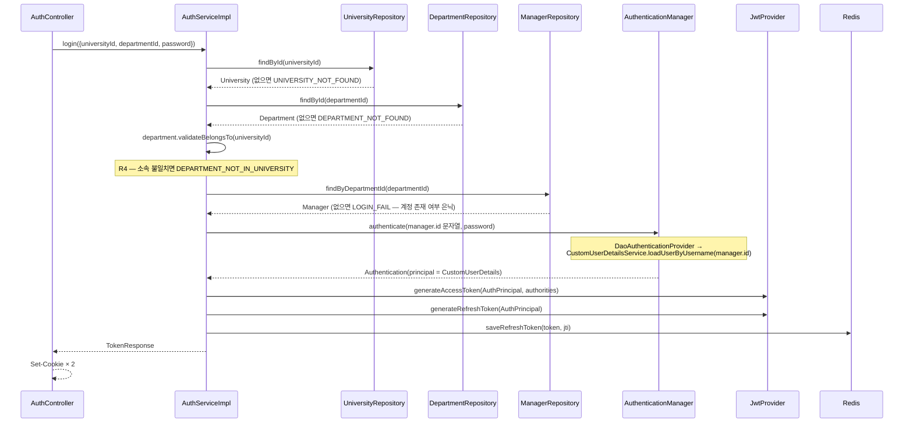
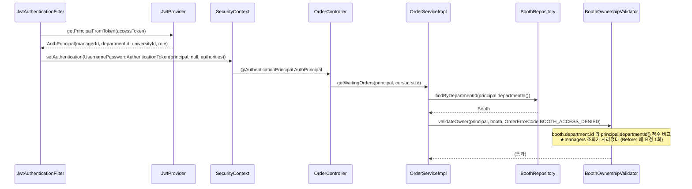

# LLD-0001: University·Department 도메인 신설과 인증 식별자 전환

| 항목 | 내용 |
|---|---|
| 상태 | **구현 완료** (2026-09-14, `./gradlew test` 전체 통과) |
| 작성일 | 2026-09-14 |
| 관련 이슈 | [#3](https://github.com/silversieon/likelion14th-festival-be-V2/issues/3) |
| 관련 ADR | [ADR-0001](../adr/ADR-0001-university-department-schema-and-auth-identity.md) — **승인됨 (2026-09-14, 옵션 2)** |
| 대상 도메인 | **university(신설)** · auth · booth · menu · manager · order · sse · global |
| 작업 갈래 | ① 전국 대학 확장 (AGENTS.md 1.4) |
| 관련 방침 | `docs/policy/development-policy.md` 4.1·4.2·4.3·4.4, 5.1, 9.2, 13.1·13.2 |
| API 스펙 | [`docs/api-spec/auth.md`](../api-spec/auth.md) — **본 문서보다 먼저 작성 완료** |
| 스키마 변경 | `V14__create_universities_and_departments.sql` + `docs/erd/erd-0002-university-schema.md` |

## 1. 개요 및 범위

`global/enums/Department` **Java enum**을 `universities` / `departments` **두 테이블**로 승격하고, 그 위에서 부스 관리자의 인증·인가 식별자를 `Department` enum 이름(자연 키)에서 **`manager.id` + `departmentId` 클레임(대리 키)** 으로 전환한다.

ADR-0001이 이 결정의 근거이며, 옵션 2가 승인되었다.

### 범위에 포함되는 것

1. `domain/university` 패키지 신설 — `University`, `Department` 엔티티 + `Region` enum + repository + `UniversityErrorCode`
2. `Booth` ↔ `Department` **1:1**, `Manager` → `Department` **N:1(DB UNIQUE)** 연관관계 전환
3. 인증·인가 전면 변경 — `AuthPrincipal`, `JwtProvider`, `CustomUserDetails(Service)`, `JwtAuthenticationFilter`, `AuthService`
4. `@AuthenticationPrincipal String departmentName` → `AuthPrincipal` (컨트롤러 18개 지점 + 서비스 시그니처)
5. 4곳에 복제된 소유권 검증 로직을 `BoothOwnershipValidator` 하나로 통합
6. Flyway `V14` 마이그레이션 1개
7. ERD-0002 신규 작성 + ERD-0001 "대체됨" 처리

### 명시적으로 제외되는 것 (Out of Scope)

사용자 지시 원문: *"실제 데이터 삽입이나 기능 추가는 다음 계획에서 요청할테니 우선 이번 요구사항에 맞게 코드 작성 해주고, 기존 방식과 유사하게, 필요 시에 기존 코드를 변경하지만 요청하지 않은 부분에 대해서는 많이 바꾸지마."*

- ❌ **대학·학과 목록 조회 API** (`GET /api/universities` 등) — ADR-0001 열린 질문 ② 확정에 따라 후속 이슈
- ❌ **대학·학과 데이터 적재** — AGENTS.md 1.4-② (분포·규모는 사용자가 지정한다, policy 3.1)
- ❌ **조회 인덱스 설계·성능 튜닝** — AGENTS.md 1.4-③. 이번에 추가하는 인덱스는 **제약(UNIQUE/FK)에 부수되는 것뿐**이며, 조회 목적 인덱스는 실측 없이 추가하지 않는다 (policy 5.1)
- ❌ `orders.booth_id` 비정규화 — ERD-0001 6.3, 별도 ADR 대상
- ❌ `booth_translation.department_name`과 `departments.name`의 역할 정리 — ADR-0001 후속 작업
- ❌ `OrderService`의 소유권 검증에 ADMIN 우회가 없는 **기존 불일치** (2.3 참조) — 동작을 그대로 보존하고 고치지 않는다

### 현재 상태 (Before)

```java
// global/enums/Department — 서경대 학과·자치기구 30여 개가 코드에 박혀 있다
public enum Department { SOFTWARE("소프트웨어학과"), BEAUTY("미용예술학부"), /* ... */ }
```

| 위치 | 현재 |
|---|---|
| `booth.department` | `VARCHAR(100)` **UNIQUE** NOT NULL — 부스의 정체성 |
| `managers.department` | `VARCHAR(100)` **UNIQUE** NOT NULL — 로그인 ID 겸용 |
| JWT `subject` | `"SOFTWARE"` (enum 이름) |
| 소유권 판정 | `Department.valueOf(tokenSub)` → `managerRepository.findByDepartment(...)` → **enum 동등 비교** |

`managers.department`와 `booth.department`는 **물리 FK 없이 문자열 값으로만** 이어져 있다 (ERD-0001 3.3 — 스키마 전체에서 유일한 FK 없는 참조).

## 2. 데이터 모델 (엔티티 / 테이블)

### 2.1 대상 엔티티

| 엔티티 | 테이블 | 신규/변경 | 위치 |
|---|---|---|---|
| `University` | `universities` | **신규** | `domain/university/entity/University.java` |
| `Department` | `departments` | **신규** | `domain/university/entity/Department.java` |
| `Region` | (enum, 컬럼 `universities.region`) | **신규** | `domain/university/enums/Region.java` |
| `Booth` | `booth` | 변경 — `department`(enum) → `department_id`(FK) | `domain/booth/entity/Booth.java` |
| `Manager` | `managers` | 변경 — `department`(enum) → `department_id`(FK) | `domain/manager/entity/Manager.java` |
| ~~`Department`(enum)~~ | — | **삭제** | ~~`global/enums/Department.java`~~ |

> **엔티티 `Department`와 삭제되는 enum `Department`는 이름이 같다.** 둘을 공존시키지 않는다 — enum을 먼저 지우고 엔티티를 넣는다 (ADR-0001 구현 규칙).

### 2.2 필드 / 컬럼 정의

**`universities`**

| 필드 (Java) | 컬럼 | 타입 | 제약 | 설명 |
|---|---|---|---|---|
| id | `id` | BIGINT | PK, AUTO_INCREMENT | |
| name | `name` | VARCHAR(100) | NOT NULL | 학교명 (예: `서경대학교`) |
| region | `region` | VARCHAR(50) | NOT NULL | 시도명. `Region` enum + `@Enumerated(STRING)` |
| — | — | — | **UNIQUE (`name`, `region`)** `uq_universities_name_region` | ADR-0001 열린 질문 ③ 확정 |
| createdAt / modifiedAt | `created_at` / `modified_at` | DATETIME(6) | NULL | `BaseTimeEntity` 상속 |

**`departments`**

| 필드 (Java) | 컬럼 | 타입 | 제약 | 설명 |
|---|---|---|---|---|
| id | `id` | BIGINT | PK, AUTO_INCREMENT | |
| university | `university_id` | BIGINT | NOT NULL, **FK → `universities(id)`** `fk_departments_university` | `@ManyToOne(fetch = LAZY)` |
| name | `name` | VARCHAR(100) | NOT NULL | 학과명 (예: `소프트웨어학과`) |
| — | — | — | **UNIQUE (`university_id`, `name`)** `uq_departments_university_name` | **동명 학과 공존을 보장하는 핵심 제약.** 대학이 다르면 같은 학과명이 허용된다 |
| createdAt / modifiedAt | `created_at` / `modified_at` | DATETIME(6) | NULL | `BaseTimeEntity` 상속 |

**`booth` (변경분만)**

| 필드 (Java) | 컬럼 | 타입 | 제약 | 설명 |
|---|---|---|---|---|
| ~~department~~ | ~~`department`~~ | ~~VARCHAR(100)~~ | **제거** | enum 값이었다 |
| department | `department_id` | BIGINT | NOT NULL, **UNIQUE** `uq_booth_department`, **FK → `departments(id)`** `fk_booth_department` | `@OneToOne(fetch = LAZY)`. **UNIQUE가 곧 1:1**이다 |

**`managers` (변경분만)**

| 필드 (Java) | 컬럼 | 타입 | 제약 | 설명 |
|---|---|---|---|---|
| ~~department~~ | ~~`department`~~ | ~~VARCHAR(100)~~ | **제거** | enum 값이자 로그인 ID였다 |
| department | `department_id` | BIGINT | NOT NULL, **UNIQUE** `uq_managers_department`, **FK → `departments(id)`** `fk_managers_department` | `@ManyToOne(fetch = LAZY)` |

> **왜 `Manager`는 `@ManyToOne`인가?** DB에는 UNIQUE를 걸어 "학과당 계정 1개"라는 현행 동작을 그대로 보존하지만(ADR-0001 열린 질문 ⑤),
> JPA 매핑을 `@ManyToOne`으로 두면 나중에 그 UNIQUE만 풀어도 **엔티티와 토큰 구조를 다시 바꾸지 않아도 된다.** 옵션 2를 고른 실익이 여기서 나온다.

**`Region` enum (17개 광역시·도)**

`SEOUL, BUSAN, DAEGU, INCHEON, GWANGJU, DAEJEON, ULSAN, SEJONG, GYEONGGI, GANGWON, CHUNGBUK, CHUNGNAM, JEONBUK, JEONNAM, GYEONGBUK, GYEONGNAM, JEJU`

각 상수는 한국어 표기(`서울특별시`, `경기도`, `경상남도` …)를 `description` 필드로 갖는다. `Department` enum의 기존 형태(`@Getter @RequiredArgsConstructor` + `description`)를 그대로 따른다.

### 2.3 비즈니스 규칙 / 불변식

| # | 규칙 | 강제 위치 |
|---|---|---|
| R1 | 한 대학 안에서 학과명은 유일하다. **다른 대학이면 같은 학과명이 허용된다** | DB `UNIQUE(university_id, name)` |
| R2 | 한 학과에는 부스가 최대 1개다 | DB `UNIQUE(booth.department_id)` |
| R3 | 한 학과에는 매니저 계정이 최대 1개다 | DB `UNIQUE(managers.department_id)` |
| R4 | 로그인·회원가입 시 `departmentId`는 **`universityId`에 속한 학과여야 한다** | `Department.validateBelongsTo(Long universityId)` — **엔티티 안에서** 검증한다 (policy 9.2: 규칙을 서비스에 흩지 않는다) |
| R5 | 부스 관리자는 **자기 학과의 부스만** 조작할 수 있다 | `BoothOwnershipValidator` (3.6) |
| R6 | ADMIN은 R5를 우회한다 — **단, `OrderService` 경로는 예외** | 아래 각주 |

> **R6의 기존 불일치를 그대로 보존한다.** 현재 `BoothServiceImpl` / `BoothMenuServiceImpl` / `LocalOrderSseSubscriber`의 검증에는 `&& currentManager.getRole() != Role.ADMIN` 우회가 있지만,
> `OrderServiceImpl.validateBoothManagerBelongsToBooth`에는 **없다.** 이것이 의도인지 누락인지는 이번 작업의 판단 대상이 아니므로,
> 검증기를 `validateOwnerOrAdmin` / `validateOwner` **두 메서드로 나누어 각 호출부의 현재 동작을 글자 그대로 유지**한다. 정리는 별도 이슈로 남긴다 (14장).

### 2.4 이벤트

**해당 없음.** SSE 이벤트 이름(`OrderSseEventType`)과 페이로드는 이번 작업에서 바뀌지 않는다. `LocalOrderSseSubscriber.subscribeOrderStatus`의 **파라미터 타입만** 바뀌며, 클라이언트 계약(이벤트 이름·data 구조)은 그대로다.

## 3. 클래스 / 시그니처 정의

### 3.1 Controller

**신규 컨트롤러 없음.** 기존 컨트롤러 18개 지점의 principal 타입만 바꾼다.

```java
// Before
public ResponseEntity<BaseResponse<...>> getWaitingOrders(
    @AuthenticationPrincipal String departmentName, ...) { ... }

// After
public ResponseEntity<BaseResponse<...>> getWaitingOrders(
    @AuthenticationPrincipal AuthPrincipal principal, ...) { ... }
```

변경 대상 (총 18곳):

| 컨트롤러 | 지점 수 |
|---|---|
| `BoothController` | 5 |
| `BoothMenuController` | 3 |
| `ManagerController` | 1 |
| `OrderController` | 8 |
| `OrderSseController` | 1 |

`AuthController`는 principal을 쓰지 않으므로 시그니처가 그대로이고, **요청 DTO만** 바뀐다 (3.5).

### 3.2 Service

```java
// domain/auth/service/AuthService — 시그니처 변경 없음 (DTO 내부만 바뀐다)
public interface AuthService {
  void signUp(SignUpRequest request);          // @Transactional
  TokenResponse login(LoginRequest request);   // @Transactional(readOnly = true)
  TokenResponse refresh(String refreshToken);  // @Transactional(readOnly = true)
  void logout(String refreshToken);
}
```

```java
// domain/manager/service/ManagerService — String departmentName → AuthPrincipal / Long
public interface ManagerService {
  List<ManagerResponse> getManagers(Role role);
  ManagerResponse getManager(Long managerId);
  ManagerResponse updateManagerPassword(Long managerId, UpdateManagerPasswordRequest request);
  void deleteManager(Long managerId);
  ManagerResponse getMyInfo(AuthPrincipal principal);     // was: String departmentName
  Manager getRequiredManager(Long managerId);             // was: String departmentName
}
```

```java
// domain/booth/service/booth/BoothService — 변경되는 시그니처만
BoothOperationResponse updateBoothOperation(AuthPrincipal principal, Long boothId, BoothOperationRequest request);
List<BoothOperationResponse> getBoothOperationInfos(AuthPrincipal principal, Long boothId);
BoothBusinessInfoResponse getBoothBusinessInfo(AuthPrincipal principal, LocalDate date);
void changeBoothStatusToOpen(AuthPrincipal principal);
void changeBoothStatusToClose(AuthPrincipal principal, BoothStatus boothStatus);
Booth getRequiredBooth(AuthPrincipal principal);
```

```java
// domain/booth/service/menu/BoothMenuService — 변경되는 시그니처만
void updateBoothMenuPrice(AuthPrincipal principal, Long menuId, UpdateBoothMenuPriceRequest request);
void updateBoothMenuSoldOut(AuthPrincipal principal, Long menuId, UpdateBoothMenuSoldOutRequest request);
OrderAvailableBoothMenuGroupResponse getAllMenus(AuthPrincipal principal);
```

```java
// domain/order/service/OrderService — 변경되는 시그니처만 (8개 모두 첫 인자가 바뀐다)
CursorPageResponse<...> getWaitingOrders(AuthPrincipal principal, WaitingOrderCursor cursor, Integer size);
CursorPageResponse<...> getCookingOrders(AuthPrincipal principal, CookingOrderCursor cursor, Integer size);
CursorPageResponse<...> getCompletedOrders(AuthPrincipal principal, ...);
CursorPageResponse<...> getCanceledOrders(AuthPrincipal principal, ...);
SalesResponse getSales(AuthPrincipal principal, LocalDate date);
void updateOrderStatus(AuthPrincipal principal, Long orderId, OrderStatus newOrderStatus);
void cancelOrder(AuthPrincipal principal, Long orderId, OrderCancelReason reason);
void updateOrderItemUnitServed(AuthPrincipal principal, Long orderItemUnitId, OrderItemUnitUpdateRequest request);
```

```java
// domain/order/sse/OrderSseSubscriber
SseEmitter subscribeOrderStatus(AuthPrincipal principal, OrderSseSubscribeType subscribeType);
```

> **university 도메인에는 `service`·`controller`를 만들지 않는다.** 이번 범위에 유스케이스가 없기 때문이다 (AGENTS.md 3.1 "필요한 것만 만든다").
> `AuthServiceImpl`이 `UniversityRepository` / `DepartmentRepository`를 직접 주입받는다 — service가 repository를 직접 쓰는 기존 방식 그대로다.

### 3.3 Repository

```java
// domain/university/repository/UniversityRepository
public interface UniversityRepository extends JpaRepository<University, Long> {
  boolean existsByNameAndRegion(String name, Region region);
}

// domain/university/repository/DepartmentRepository
public interface DepartmentRepository extends JpaRepository<Department, Long> {
  Optional<Department> findByUniversityIdAndName(Long universityId, String name);
  boolean existsByUniversityIdAndName(Long universityId, String name);
}
```

**변경되는 기존 리포지토리**

```java
// BoothRepository
Optional<Booth> findByDepartmentId(Long departmentId);   // was: findByDepartment(Department)
boolean existsByDepartmentId(Long departmentId);         // was: existsByDepartment(Department)

// ManagerRepository
Optional<Manager> findByDepartmentId(Long departmentId); // was: findByDepartment(Department)
boolean existsByDepartmentId(Long departmentId);         // 신규 — 회원가입 중복 검사용

// ManagerRepository의 JPQL 생성자 표현식 2개는 프로젝션 필드가 바뀐다
//   new ManagerResponse(m.id, m.department.id, m.department.name, m.role)
```

> `m.department.id`는 **FK 컬럼만 읽으므로 조인이 발생하지 않는다.** `m.department.name`은 `departments`와 묵시적 조인이 생긴다 — 관리자 목록 조회는 호출 빈도가 낮아 수용한다.

### 3.4 조회 전용 서비스 (CQRS)

**해당 없음.** CQRS는 AGENTS.md 1.4-④의 작업이며 아직 도입하지 않았다.

### 3.5 DTO

| DTO | 종류 | 변경 | 필드 |
|---|---|---|---|
| `LoginRequest` | 요청 | **변경** | ~~`departmentName(String)`~~ → `universityId(Long)`, `departmentId(Long)`, `password(String)` |
| `SignUpRequest` | 요청 | **변경** | ~~`departmentName(String)`~~ → `universityId(Long)`, `departmentId(Long)`, `password(String)`, `role(Role)`, `adminKey(String)` |
| `BoothRequest` | 요청 | **변경** | ~~`department(Department enum)`~~ → `departmentId(Long)` |
| `ManagerResponse` | 응답 | **변경** | ~~`department(Department enum)`~~ → `departmentId(Long)`, `departmentName(String)` |
| `AuthPrincipal` | 내부 | **신규** | `managerId(Long)`, `departmentId(Long)`, `universityId(Long)`, `role(Role)` |
| `TokenResponse` | 응답 | 변경 없음 | |

`BoothListResponse` / `BoothDetailResponse` 등 부스 조회 응답은 **`booth_translation.department_name`을 쓰고 있어 `Department` enum을 참조하지 않는다.** 따라서 조회 API 응답 계약은 바뀌지 않는다.

### 3.6 인증·인가 클래스 (이번 작업의 핵심)

```java
// global/security/AuthPrincipal — 인증된 요청의 주체
public record AuthPrincipal(Long managerId, Long departmentId, Long universityId, Role role) {
  public static AuthPrincipal from(Manager manager) { ... }
  public boolean isAdmin() { return role == Role.ADMIN; }
}
```

```java
// global/security/BoothOwnershipValidator — 4곳에 복제돼 있던 소유권 검증을 한 곳으로
@Component
public class BoothOwnershipValidator {
  /** 부스 소유 학과와 일치하거나 ADMIN이면 통과한다. (booth / menu / sse 경로) */
  public void validateOwnerOrAdmin(AuthPrincipal principal, Booth booth, BaseErrorCode errorCode);
  /** 부스 소유 학과와 일치해야만 통과한다. ADMIN도 통과하지 못한다. (order 경로 — 기존 동작 보존) */
  public void validateOwner(AuthPrincipal principal, Booth booth, BaseErrorCode errorCode);
}
```

```java
// global/security/jwt/JwtProvider
String generateAccessToken(AuthPrincipal principal, Collection<? extends GrantedAuthority> authorities);
GeneratedRefreshTokenPayload generateRefreshToken(AuthPrincipal principal);
Long getManagerIdFromToken(String token);        // was: getDepartmentFromToken(String)
AuthPrincipal getPrincipalFromToken(String token);
List<GrantedAuthority> getAuthoritiesFromToken(String token);  // 변경 없음
```

```java
// global/security/CustomUserDetails
public String getUsername();       // manager.id 를 문자열로 반환 (was: department enum 이름)
public AuthPrincipal toPrincipal();
```

```java
// global/security/CustomUserDetailsService
UserDetails loadUserByUsername(String username);  // username = manager.id 문자열 → findById
```

> **`UserDetailsService`는 단일 문자열만 받는다.** 그래서 "대학 + 학과" 복합 자격을 여기에 태울 수 없다.
> `AuthServiceImpl`이 먼저 `(universityId, departmentId)`로 `Manager`를 찾아 **`manager.id`를 username으로 변환한 뒤** `AuthenticationManager`에 넘긴다.
> Spring Security의 원래 계약과 어긋나는 어댑팅이므로 **그 이유를 코드 주석으로 남긴다** (ADR-0001 트레이드오프).

## 4. 패키지 / 클래스 구조

```
com.skulikelion.festival
├── domain/
│   ├── university/                         # ★ 신규 (AGENTS.md 3.1 — 필요한 것만 만든다)
│   │   ├── entity/
│   │   │   ├── University.java
│   │   │   └── Department.java
│   │   ├── enums/
│   │   │   └── Region.java
│   │   ├── exception/
│   │   │   └── UniversityErrorCode.java
│   │   └── repository/
│   │       ├── UniversityRepository.java
│   │       └── DepartmentRepository.java
│   │   # controller / dto / service / mapper 는 만들지 않는다 — 이번 범위에 유스케이스가 없다
│   ├── auth/          # dto/request/{LoginRequest, SignUpRequest} 변경, service 변경
│   ├── booth/         # entity/Booth, repository, service(booth·menu), dto/request/booth/BoothRequest, mapper 변경
│   ├── manager/       # entity/Manager, repository, service, dto/response/ManagerResponse, mapper 변경
│   └── order/         # service, sse/local 변경 (시그니처만)
└── global/
    ├── enums/
    │   └── ~~Department.java~~             # ★ 삭제
    ├── security/
    │   ├── AuthPrincipal.java              # ★ 신규
    │   ├── BoothOwnershipValidator.java    # ★ 신규
    │   ├── CustomUserDetails.java          # 변경
    │   ├── CustomUserDetailsService.java   # 변경
    │   └── jwt/JwtProvider.java            # 변경
    └── filter/JwtAuthenticationFilter.java # 변경
```

## 5. 시퀀스 흐름

### 5.1 로그인 (대학 + 학과 → 토큰)



### 5.2 인증된 요청 — 인가와 소유권 판정 (조회 0회)



## 6. API 명세

상세는 [`docs/api-spec/auth.md`](../api-spec/auth.md)에 있다. 여기에는 목록만 남긴다.

| Method | Path | 변경 | 스펙 문서 |
|---|---|---|---|
| POST | `/api/auth/register` | **요청 본문 변경** | [auth.md](../api-spec/auth.md#1-회원가입) |
| POST | `/api/auth/login` | **요청 본문 변경** | [auth.md](../api-spec/auth.md#2-로그인) |
| POST | `/api/auth/refresh` | 계약 변경 없음 | [auth.md](../api-spec/auth.md#3-토큰-재발급) |
| POST | `/api/auth/logout` | 계약 변경 없음 | [auth.md](../api-spec/auth.md#4-로그아웃) |
| POST | `/api/booths` | **요청 본문 변경** (`department` → `departmentId`) | booth.md _(미작성 — 후속)_ |
| PUT | `/api/booths/{boothId}` | **요청 본문 변경** (동일) | booth.md _(미작성 — 후속)_ |
| GET | `/api/managers`, `/api/managers/{managerId}`, `/api/managers/me` | **응답 `data` 변경** (`department` → `departmentId` + `departmentName`) | manager.md _(미작성 — 후속)_ |

> `booth.md` / `manager.md`는 아직 저장소에 존재하지 않는다 (현재 `api-spec`에는 `api-conventions.md`뿐이다).
> AGENTS.md ③은 **"REST API를 추가·변경하는 작업"** 에 스펙 선행 작성을 요구하며, 이번 작업에서 실제로 계약이 바뀌는 것은 auth가 본체다.
> booth·manager의 스펙 문서 신규 작성은 **문서 부채를 이번 PR로 끌어오지 않기 위해** 후속 이슈로 분리하고, 위 표에 변경 내용을 명시해 둔다 (14장).

## 7. 영속성 / 스키마 변경

### 7.1 마이그레이션

- 파일: `src/main/resources/db/migration/V14__create_universities_and_departments.sql`
- **`V1`~`V13`은 수정하지 않는다** (체크섬 불일치 시 기동 실패 — policy 4.1).

전문은 실제 파일을 정본으로 삼는다. 아래는 **단계 구성과 각 단계의 의도**다 (policy 4.3의 5단계를 한 파일 안에서 순서대로 수행).

| 단계 | 내용 | policy 4.3 대응 |
|---|---|---|
| 1 | `universities` / `departments` 생성 | (신규 테이블) |
| 2 | `departments.legacy_code VARCHAR(100) NULL` **임시 컬럼** 추가 | 백필 조인 키 |
| 3 | 서경대학교 1행 + `Department` enum **33행**을 `departments`에 INSERT | 마스터 데이터 이관 |
| 4 | `booth.department_id` / `managers.department_id`를 **nullable로** 추가 | ① 컬럼 추가(nullable) |
| 5 | `legacy_code = department` 조인으로 **UPDATE 백필** | ② 백필 |
| 6 | `MODIFY ... NOT NULL` → UNIQUE → FK 부여 | ④ 제약 추가 |
| 7 | 옛 `department` 컬럼 제거 + `legacy_code` 제거 | ⑤ 옛 컬럼 제거 |

```sql
-- 핵심 부분만 발췌 (전문은 V14 파일 참조)

-- 3) enum 33개를 행으로. 한글 학과명(description)은 Java enum에만 있으므로 여기에 값으로 써 넣는다.
INSERT INTO departments (university_id, name, legacy_code, created_at, modified_at)
SELECT u.id, t.name, t.legacy_code, NOW(6), NOW(6)
FROM universities u
         JOIN (SELECT '여정 사회과학대' AS name, 'SOCIAL' AS legacy_code
               UNION ALL SELECT '경영학부', 'BUSINESS'
               /* ... 총 33행 ... */) t
WHERE u.name = '서경대학교' AND u.region = 'SEOUL';

-- 5) 백필 — legacy_code 로 옛 enum 값과 새 행을 잇는다
UPDATE booth b
    JOIN departments d ON d.legacy_code = b.department
SET b.department_id = d.id;

-- 6) 매핑되지 않은 행이 하나라도 있으면 이 문장이 실패하고 마이그레이션 전체가 롤백된다.
--    조용한 데이터 유실보다 명시적 실패를 택한다.
ALTER TABLE booth MODIFY COLUMN department_id BIGINT NOT NULL;
```

- `SET @변수` 대신 **`INSERT ... SELECT` + `WHERE`** 형태를 쓴다. MySQL 사용자 변수는 Flyway의 문장 분리·커넥션 처리에 의존하게 되므로 피한다.
- `booth.department`의 UNIQUE 인덱스는 **컬럼과 함께 사라지므로** 별도 `DROP INDEX`가 필요 없다.

### 7.2 기존 데이터 백필 / 롤백

**백필한다.** ADR-0001 열린 질문 ①은 2026-09-14 개발자 재질의(*"혹시 기존 데이터 유지하는 형태로 가능한가"*)로 **번복되어 "보존한다 — 백필로 전환"** 으로 확정되었다.

**백필이 가능한 근거**

기존 `booth.department` / `managers.department`에 들어 있는 값은 전부 `Department` enum 이름이고, 그 enum은 **서경대학교 한 학교의 학과·자치기구**다. 따라서 대학이 하나로 확정되며 `(대학, 학과명)` 조합을 기계적으로 복원할 수 있다.

**보존되는 것 / 보존되지 않는 것**

| | 내용 |
|---|---|
| ✅ 보존 | `booth`와 그 자식 전부(`booth_menu`, `booth_operation`, `booth_translation`, `booth_detail_image`), `orders` 계열 전부, `managers` 계정(비밀번호 해시 포함) |
| ❌ 보존 안 됨 | **발급된 JWT.** subject가 `Department` 이름 → `manager.id`로 바뀌므로 기존 토큰은 전부 무효다. 배포 후 **전원 재로그인** 필요 (계정 자체는 살아 있다) |

**실패 처리**

- `booth.department` / `managers.department`에 enum 33개 중 어느 것과도 매칭되지 않는 값이 있으면 **6단계의 `MODIFY ... NOT NULL`에서 마이그레이션이 실패**한다. MySQL DDL은 트랜잭션이 아니므로 앞선 문장이 이미 반영된 상태로 멈춘다 — **수동 정리 후 재실행이 필요하다.**
- 이것은 의도된 설계다. NULL을 허용해 넘어가면 **어느 부스가 어느 학과인지 모르는 행**이 조용히 남는다.

**롤백**

- **⚠️ 되돌릴 수 없다.** Flyway에는 `undo`가 없고, 6·7단계에서 옛 컬럼이 제거된다.
- **실행 전 `booth` / `managers` / `orders` 계열을 백업한다.** 이것이 유일한 롤백 수단이다.
- 실행 시점은 **축제 기간 외**여야 한다 (policy 4.3).

**마이그레이션 파일을 나누지 않는 이유**

policy 4.3이 *"한 마이그레이션에 다 넣지 않는다"* 고 하는 목적은 **구/신 애플리케이션 버전이 공존하는 무중단 배포**를 가능하게 하는 것이다. 이번 변경은 **토큰 형식이 바뀌어 구·신 버전이 애초에 공존할 수 없고**, 대상 테이블도 30여 행이라 `ALTER TABLE` 잠금 시간이 문제되지 않는다. 파일을 쪼개도 Flyway가 기동 시 한꺼번에 적용하므로 실익이 없다. (ADR-0001 구현 규칙에 같은 근거를 기록했다.)

### 7.3 ERD 갱신

- [x] `docs/erd/erd-0002-university-schema.md` 신규 작성 (테이블 명세 + 다이어그램 + 적용된 마이그레이션 표 + 인덱스 현황)
- [x] `docs/erd/erd-0001-initial-schema.md`의 상태를 **"대체됨 (→ erd-0002)"** 으로 변경

## 8. 인덱스 / 쿼리 설계

### 8.1 대상 쿼리

이번 작업으로 **새로 생기거나 형태가 바뀌는** 쿼리다.

```sql
-- (a) 로그인·인가 경로에서 부스를 찾는다 (기존: booth.department = 'SOFTWARE')
SELECT * FROM booth WHERE department_id = ?;

-- (b) 로그인 시 학과로 매니저를 찾는다 (기존: managers.department = 'SOFTWARE')
SELECT * FROM managers WHERE department_id = ?;

-- (c) 회원가입 시 학과 소속 검증
SELECT * FROM departments WHERE id = ?;
```

### 8.2 실행 계획 비교

| | Before | After (예상) |
|---|---|---|
| (a) type / key | `const` / `department` (UNIQUE, VARCHAR(100)) | `const` / `uq_booth_department` (UNIQUE, BIGINT) |
| (b) type / key | `const` / `department` (UNIQUE, VARCHAR(100)) | `const` / `uq_managers_department` (UNIQUE, BIGINT) |
| (c) type / key | (해당 없음 — 테이블이 없었다) | `const` / `PRIMARY` |
| rows | 1 | 1 |
| Extra | — | — |

> **실행 계획은 Before/After 모두 `const`(UNIQUE 인덱스 1행 조회)로 동일하다.** 인덱스 키가 `VARCHAR(100)` → `BIGINT`로 좁아지므로 비교 비용과 인덱스 크기가 줄지만, **이 차이를 성능 개선 근거로 주장하지 않는다** (policy 5.1 — 실측 없는 최적화 금지). 위 표는 "느려지지 않음"을 확인하기 위한 것이다.
>
> **실제 개선은 실행 계획이 아니라 쿼리 횟수에서 나온다**: 인가 경로에서 (b)가 **요청당 1회 → 0회**가 된다 (토큰 클레임의 `departmentId`를 그대로 쓰기 때문).

### 8.3 추가/변경할 인덱스

| 테이블 | 인덱스 | 컬럼 순서와 그 이유 |
|---|---|---|
| `universities` | `uq_universities_name_region` UNIQUE | `(name, region)` — 중복 적재 방지용 **제약**이다. 조회 목적이 아니다 |
| `departments` | `uq_departments_university_name` UNIQUE | `(university_id, name)` — 등호 조건 컬럼(`university_id`)을 앞에 둔다 (policy 5.4). `university_id` 단독 조회(= 특정 대학의 학과 목록)도 이 인덱스의 **좌측 프리픽스**로 커버된다 |
| `departments` | `fk_departments_university` | FK 제약. 위 UNIQUE가 `university_id`로 시작하므로 MySQL이 **별도 인덱스를 만들지 않고 재사용**한다 |
| `booth` | `uq_booth_department` UNIQUE | `(department_id)` — 1:1을 강제하는 제약이자 (a) 쿼리의 조회 인덱스 |
| `managers` | `uq_managers_department` UNIQUE | `(department_id)` — 학과당 계정 1개를 강제하는 제약이자 (b) 쿼리의 조회 인덱스 |

- **조회 목적으로 새로 추가하는 인덱스는 없다.** 위는 전부 UNIQUE/FK 제약에 부수되는 것이며, policy 5.1의 "실측 없는 인덱스 추가 금지"에 걸리지 않는다.
- **느려지는 쓰기 경로**: `booth` INSERT/UPDATE에 UNIQUE 인덱스 유지 비용이 생기지만, 제거되는 `booth.department` UNIQUE(VARCHAR(100))를 **대체**하는 것이므로 순증이 아니다. 오히려 키가 좁아진다.
- **주문 생성 경로(피크 시 가장 중요한 쓰기)에는 인덱스가 추가되지 않는다.** `orders` / `order_items` / `order_item_units`는 이번 작업에서 스키마가 바뀌지 않는다.

## 9. 데이터 생성 스펙

**해당 없음.** 사용자 지시 원문: *"실제 데이터 삽입이나 기능 추가는 다음 계획에서 요청할테니"*.
대학·학과의 규모·분포 조건은 **다음 작업에서 사용자가 지정한다.** 에이전트가 임의로 가정하지 않는다 (policy 3.1).

## 10. 캐싱 / Read Model

**해당 없음.** 캐싱은 policy 6.1의 순서상 마지막 수단이며, 이번 작업은 성능 작업이 아니다.

## 11. 트랜잭션 / 동시성 / 멱등성

| 항목 | 내용 |
|---|---|
| 트랜잭션 경계 | 기존과 동일하게 **서비스 메서드**에 선언한다 (policy 9.4). `AuthServiceImpl.signUp`은 `@Transactional`, `login`/`refresh`는 `@Transactional(readOnly = true)` |
| 새로 생기는 락 | **없음** |
| 동시성 — 같은 학과에 매니저 2개 동시 가입 | 애플리케이션의 `existsByDepartmentId` 검사와 INSERT 사이에 경합이 있을 수 있다. **최종 방어선은 `uq_managers_department` UNIQUE 제약**이며(policy 8.1과 같은 원칙), 제약 위반은 `DataIntegrityViolationException`으로 올라간다 |
| 동시성 — 같은 학과에 부스 2개 동시 생성 | 위와 동일. `uq_booth_department`가 최종 방어선 |
| 멱등성 | **해당 없음.** 이번 작업은 `@Idempotent`가 붙은 API를 추가하지 않는다. 주문 생성의 `FALLBACK` 전략은 그대로다 |
| 이벤트 발행 | **해당 없음.** 발행 경로(`direct`/`outbox`)와 리스너 애노테이션(policy 10.2)은 건드리지 않는다 |
| 외부 호출 | **해당 없음.** 인증 경로에 S3·AI 호출이 없다 |

## 12. 예외 및 에러 정책

### 12.1 신규 에러 코드 — `UniversityErrorCode`

`domain/university/exception/UniversityErrorCode.java`. 명명은 api-conventions 5.3 규칙 `<도메인>_<HTTP 3자리><일련 2자리>`를 따른다.

| 상황 | 에러 코드 (enum) | code | HTTP | message 문자열 |
|---|---|---|---|---|
| 학과가 요청한 대학 소속이 아님 (R4) | `DEPARTMENT_NOT_IN_UNIVERSITY` | `UNIVERSITY_40002` | 400 | 해당 대학에 속한 학과가 아닙니다. |
| 대학 없음 | `UNIVERSITY_NOT_FOUND` | `UNIVERSITY_40401` | 404 | 해당 대학을 찾을 수 없습니다. |
| 학과 없음 | `DEPARTMENT_NOT_FOUND` | `UNIVERSITY_40402` | 404 | 해당 학과를 찾을 수 없습니다. |

### 12.2 신규 에러 코드 — `AuthErrorCode` 추가분

| 상황 | 에러 코드 (enum) | code | HTTP | message 문자열 |
|---|---|---|---|---|
| 그 학과에 이미 관리자 계정이 있음 | `ALREADY_EXIST_MANAGER` | `AUTH4091` | 409 | 이미 해당 학과의 관리자 계정이 존재합니다. |

### 12.3 제거되는 에러 코드

| 에러 코드 | 사유 |
|---|---|
| `AuthErrorCode.INVALID_DEPARTMENT` (`AUTH4005`) | `Department.from(String)` / `Department.valueOf(String)`가 사라져 발생 지점이 없어진다. **번호 `AUTH4005`는 재사용하지 않는다** (api-conventions 5.3) |
| `AuthErrorCode.ALREADY_EXIST_DEPARTMENT` (`AUTH4001`) | `ALREADY_EXIST_MANAGER`(409)로 대체한다. 상태 코드가 400 → 409로 바뀌는 것이 실제 의미(자원 충돌)에 맞다. **`AUTH4001`은 재사용하지 않는다** |

### 12.4 유지되는 에러 코드

`LOGIN_FAIL`(AUTH4003), `INCORRECT_ADMIN_KEY`(AUTH4004), `EXPIRED_ACCESS_TOKEN`(AUTH4011), `UNAUTHORIZED_TOKEN`(AUTH4012), `BoothErrorCode.BOOTH_NOT_FOUND`, `BoothErrorCode.BOOTH_ACCESS_DENIED`, `OrderErrorCode.BOOTH_ACCESS_DENIED`, `ManagerErrorCode.MANAGER_NOT_FOUND` — **메시지 문자열을 바꾸지 않는다** (api-conventions 5.2: message 변경은 프런트 계약 변경).

## 13. 테스트 계획

각 항목이 하나의 TDD 사이클(Red → Green → Refactor) 단위다. **아래→위가 아니라 위→아래 순서로** 진행한다 (repository → entity → service → security → controller).

### 13.1 단위 테스트 — TDD 사이클 대상

**A. 엔티티 불변식 (`domain/university/entity`)**

- [ ] A1. `Department.validateBelongsTo(universityId)`는 소속 대학이 같으면 예외를 던지지 않는다
- [ ] A2. `Department.validateBelongsTo(universityId)`는 소속 대학이 다르면 `CustomException(DEPARTMENT_NOT_IN_UNIVERSITY)`를 던진다

**B. 인증 주체 (`global/security/AuthPrincipal`)**

- [ ] B1. `AuthPrincipal.from(manager)`는 `managerId` / `departmentId` / `universityId` / `role`을 매니저로부터 채운다
- [ ] B2. `role`이 `ADMIN`이면 `isAdmin()`이 `true`, 그 외 역할이면 `false`다

**C. 소유권 검증 (`global/security/BoothOwnershipValidator`)**

- [ ] C1. `validateOwnerOrAdmin` — principal의 `departmentId`가 부스의 학과와 같으면 통과한다
- [ ] C2. `validateOwnerOrAdmin` — 학과가 다르지만 `role`이 `ADMIN`이면 통과한다
- [ ] C3. `validateOwnerOrAdmin` — 학과가 다르고 ADMIN도 아니면 전달받은 `errorCode`로 `CustomException`을 던진다
- [ ] C4. `validateOwner` — 학과가 다르면 **`ADMIN`이어도** `CustomException`을 던진다 (기존 `OrderService` 동작 보존, 2.3의 R6)

**D. JWT (`global/security/jwt/JwtProvider`)**

- [ ] D1. `generateAccessToken`이 만든 토큰의 `subject`는 `manager.id` 문자열이다
- [ ] D2. `getPrincipalFromToken`은 토큰의 `sub` / `departmentId` / `universityId` / `role` 클레임으로 `AuthPrincipal`을 복원한다 (**generate → parse 왕복 검증**)
- [ ] D3. Refresh Token으로 `validateToken(token, ACCESS_TOKEN)`을 호출하면 `false`다 (타입 교차 사용 차단 — 기존 동작 유지)

**E. 인증 서비스 (`domain/auth/service/AuthServiceImpl`)**

- [ ] E1. `signUp` — `adminKey`가 다르면 `CustomException(INCORRECT_ADMIN_KEY)`를 던지고 `managerRepository.save`를 호출하지 않는다
- [ ] E2. `signUp` — `universityId`가 없으면 `CustomException(UNIVERSITY_NOT_FOUND)`
- [ ] E3. `signUp` — `departmentId`가 없으면 `CustomException(DEPARTMENT_NOT_FOUND)`
- [ ] E4. `signUp` — 학과가 그 대학 소속이 아니면 `CustomException(DEPARTMENT_NOT_IN_UNIVERSITY)`
- [ ] E5. `signUp` — 그 학과에 이미 매니저가 있으면 `CustomException(ALREADY_EXIST_MANAGER)`
- [ ] E6. `signUp` — 정상 요청이면 비밀번호를 `passwordEncoder`로 인코딩해 저장한다 (**평문이 저장되지 않는다**)
- [ ] E7. `login` — 해당 학과에 매니저가 없으면 `CustomException(LOGIN_FAIL)`을 던진다 (**계정 없음과 비밀번호 불일치가 같은 메시지**, policy 13.2)
- [ ] E8. `login` — 인증에 성공하면 `AuthenticationManager`에 **`manager.id` 문자열**을 username으로 넘긴다
- [ ] E9. `login` — 성공 시 Access/Refresh 토큰을 발급하고 `refreshTokenRepository.saveRefreshToken`을 호출한다

**F. 사용자 조회 (`global/security/CustomUserDetailsService`)**

- [ ] F1. `loadUserByUsername("1024")`는 `managerRepository.findById(1024L)` 결과로 `CustomUserDetails`를 만든다
- [ ] F2. 해당 id의 매니저가 없으면 `UsernameNotFoundException`을 던진다

**G. 부스·주문 서비스의 소유권 경로**

- [ ] G1. `OrderServiceImpl.getWaitingOrders` — principal의 학과에 부스가 없으면 `CustomException(BOOTH_NOT_FOUND)`
- [ ] G2. `OrderServiceImpl.updateOrderStatus` — 다른 학과의 부스면 `CustomException(OrderErrorCode.BOOTH_ACCESS_DENIED)`
- [ ] G3. `BoothServiceImpl.getBoothOperationInfos` — 다른 학과의 부스면 `CustomException(BoothErrorCode.BOOTH_ACCESS_DENIED)`
- [ ] G4. `BoothServiceImpl.getBoothOperationInfos` — ADMIN이면 다른 학과의 부스도 조회된다

**H. 리포지토리 (`@DataJpaTest` 없이 통합으로 — 13.2 참조)**

> 리포지토리 메서드는 Spring Data가 생성하므로 단위 테스트 대상이 아니다. 제약 동작은 13.2에서 MySQL로 검증한다.

### 13.2 통합 테스트

`IntegrationTestSupport`(MySQL 8.0 + Redis 7 Testcontainers)를 상속한다. **⚠️ Docker Desktop이 실행 중이어야 통과한다** (AGENTS.md 5장).

- [ ] I1. **서로 다른 두 대학에 같은 이름의 학과(`소프트웨어학과`)를 저장할 수 있다** — `UNIQUE(university_id, name)`가 대학별로 동작함을 증명한다. **이 ADR의 핵심 주장(동인 1)을 증명하는 테스트다**
- [ ] I2. 같은 대학에 같은 이름의 학과를 두 번 저장하면 `DataIntegrityViolationException`이 발생한다
- [ ] I3. 같은 학과에 부스를 두 개 저장하면 `DataIntegrityViolationException`이 발생한다 (R2 — 1:1 강제)
- [ ] I4. 같은 학과에 매니저를 두 명 저장하면 `DataIntegrityViolationException`이 발생한다 (R3)
- [ ] I5. **A대학 소프트웨어학과 매니저의 토큰으로 B대학 소프트웨어학과 부스의 주문 상태 변경을 시도하면 403이 응답된다** — 동명 학과 소유권 분리 검증 (ADR-0001 준수 확인 항목)
- [ ] I6. `POST /api/auth/login`에 `{universityId, departmentId, password}`를 보내면 200과 함께 `ACCESS_TOKEN` / `REFRESH_TOKEN` 쿠키가 내려온다
- [ ] I7. Flyway `V1`~`V14`가 모두 적용된 상태로 애플리케이션 컨텍스트가 기동된다 (**체크섬 오류·엔티티/DDL 불일치 없음**)

> I5·I7은 비용이 큰 테스트다. **I1~I4(제약)와 I7(기동)을 필수로 하고, I5·I6은 컨트롤러 사이클 완료 후 추가한다.**

### 13.2.1 마이그레이션 백필 수동 검증 (2026-09-14 실행 결과)

**통합 테스트(I7)는 빈 DB에 V14를 적용하므로 백필 `UPDATE`가 0행을 처리한다.** 데이터 보존이 이번 작업의 요구사항이므로, **실제 행이 있는 상태**를 별도 MySQL 8.0 컨테이너로 재현해 확인했다.

**절차**: `mysql:8.0` 컨테이너 → V1~V13 순차 적용 → 구 `Department` enum 값을 가진 데이터 시딩 → V14 적용 → 결과 확인

| 검증 항목 | 결과 |
|---|---|
| `universities` 적재 | **1행** (서경대학교 / SEOUL) |
| `departments` 적재 | **33행** |
| `booth` 백필 | **3/3행 보존** — `SOFTWARE`→소프트웨어학과, `BEAUTY`→미용예술학부, `SKULIKELION`→멋사 운영진 |
| `managers` 백필 | **2/2행 보존** (BCrypt 해시·role 유지) |
| 자식 데이터 | `booth_menu` 1, `booth_translation` 1, `orders` 1, `order_items` 1, `order_item_units` 2 — **전부 보존** |
| 최종 제약 | `booth.department_id BIGINT NOT NULL` + `uq_booth_department` + `fk_booth_department` / `managers` 동일 — 모두 생성됨 |
| 옛 컬럼 | `booth.department`, `managers.department`, `departments.legacy_code` **모두 제거 확인** |

**실패 경로도 함께 검증했다** (7.2의 주장): `booth.department`에 enum 33개 중 어느 것과도 매칭되지 않는 값(`'UNKNOWN_DEPT'`)을 심고 V14를 적용하면

```
ERROR 1138 (22004) at line 172: Invalid use of NULL value
```

즉 **6단계 `ALTER TABLE booth MODIFY COLUMN department_id BIGINT NOT NULL`에서 중단**된다. 조용한 데이터 유실 대신 명시적 실패가 나는 것을 확인했다.

### 13.3 성능 측정

**해당 없음.** 이번 작업은 성능 개선 작업(AGENTS.md 1.4-③)이 아니며, ADR-0001도 성능 결정이 아니다.
인가 경로의 쿼리 1회 감소는 8.2에 구조적 근거로만 기록하고 **수치로 주장하지 않는다.** 부하 측정은 데이터 적재(1.4-②) 이후 별도 작업에서 수행한다.

## 14. 미해결 질문 (Open Questions)

- **O1.** `OrderService` 소유권 검증에만 ADMIN 우회가 없다 (2.3 R6). 의도인지 누락인지 확인 후 통일해야 한다 → **별도 이슈로 분리.** 이번 작업은 기존 동작을 그대로 보존한다
- **O2.** `booth_translation.department_name`(다국어 학과명)과 `departments.name`이 의미상 겹친다. 학과명의 단일 출처를 어디로 할지 → ADR-0001 후속 작업
- **O3.** `docs/api-spec/booth.md` / `manager.md`가 아직 없다. 이번에 두 도메인의 요청·응답이 바뀌었으므로 스펙 문서를 신규 작성해야 한다 → **별도 문서 이슈**
- **O4.** 대학·학과 목록 조회 API가 없어 프런트가 `universityId`/`departmentId`를 얻을 수 없다 → **후속 이슈 (ADR-0001 열린 질문 ② 확정)**
- **O5.** `Region` enum을 17개 광역시·도로 고정했다 (ADR-0001 열린 질문 ④, 에이전트 기본값). 해외 대학·특수 캠퍼스를 다루게 되면 재검토가 필요하다
- **O6.** `LocalOrderSseEmitterStore.findByBoothId`의 전체 스캔(policy 부록 #13)은 부스가 수천 개가 되는 이번 개편 이후 실제 병목이 된다 → 별도 이슈
