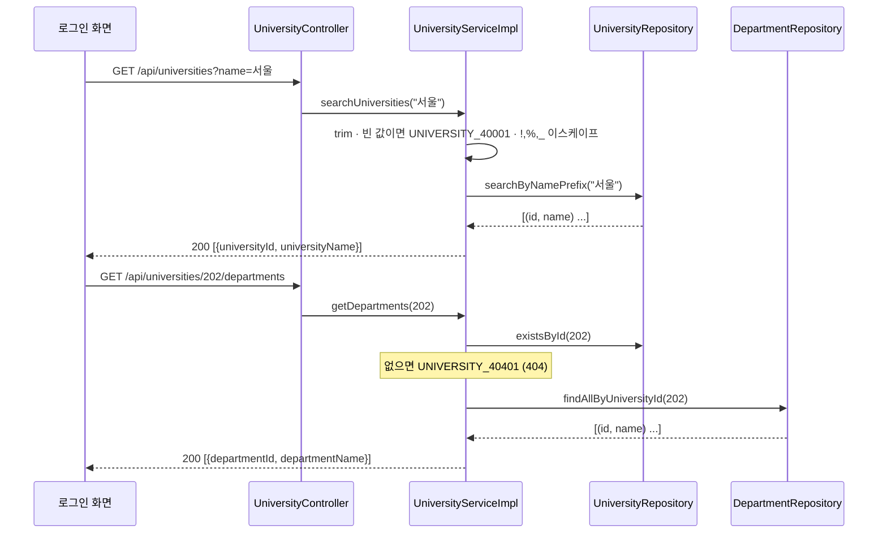

# LLD-0002: 로그인 화면용 학교명 검색·학과 목록 조회 API

| 항목 | 내용 |
|---|---|
| 상태 | **구현 완료** (2026-09-16, `./gradlew build` 통과) |
| 작성일 | 2026-09-16 |
| 관련 이슈 | [#5](https://github.com/silversieon/likelion14th-festival-be-V2/issues/5) |
| 관련 ADR | 해당 없음 (사용자 지시 기반) — 기존 결정 [ADR-0001](../adr/ADR-0001-university-department-schema-and-auth-identity.md) 범위 안의 조회 기능이며 스키마 변경이 없다 |
| 대상 도메인 | university · global(security) |
| 작업 갈래 | ① 전국 대학 확장 (후속) |
| 관련 방침 | `docs/policy/development-policy.md` 5.1·5.4(인덱스), 6.1(캐싱 순서), 13장(인증) |
| API 스펙 | [`docs/api-spec/university.md`](../api-spec/university.md) — **본 문서보다 먼저 작성** |
| 스키마 변경 | 없음 |

## 1. 개요 및 범위

ADR-0001로 로그인 요청이 `{universityId, departmentId, password}`가 되었지만 프런트가 그 id를 얻을 방법이 없었다. 로그인 화면의 **학교 검색 → 학과 선택** 흐름에 필요한 조회 API 두 개를 만든다.

**사용자 지시 원문**

> "학교명 검색으로 왼쪽 문자열부터 일치하면 학교 찾을 수 있게하는 API, 학교 식별자, 학교명 반환해줘야함. 또 해당 학교 식별자를 받아서 해당 학교의 학과명을 전부 리스트로 반환해주는(커서 기반 일단 필요없음) API 필요. 학과 식별자, 학과명 필요."

### 범위에 포함

- `GET /api/universities?name=` — 학교명 **전방 일치(prefix)** 검색 → `universityId`, `universityName`
- `GET /api/universities/{universityId}/departments` — 학교의 학과 전체 → `departmentId`, `departmentName`
- 두 경로를 `SecurityConfig` permitAll + `JwtAuthenticationFilter` 제외 경로에 추가

### 제외 (Out of Scope)

- ❌ 커서 페이지네이션 — 사용자 지시 "커서 기반 일단 필요없음"
- ❌ 중간 일치(`%keyword%`) 검색, 시도(`region`) 필터
- ❌ 캐싱 — policy 6.1 순서상 실측 후 판단
- ❌ `GlobalExceptionHandler`에 `MissingServletRequestParameterException` 처리 추가 — 요청 범위 밖의 전역 변경이라 하지 않는다 (2.3 참고)

### 현재 상태 (Before)

`domain/university`에는 `entity` / `enums` / `exception` / `repository`만 있고 조회 API가 없다. 데이터는 V14~V16으로 적재되어 있다 (대학 359, 학과 14,095).

## 2. 데이터 모델

### 2.1 대상 엔티티

| 엔티티 | 테이블 | 신규/변경 |
|---|---|---|
| `University` | `universities` | 변경 없음 (조회만) |
| `Department` | `departments` | 변경 없음 (조회만) |

### 2.2 필드 / 컬럼 정의

해당 없음 — 스키마 변경 없음. 현행 정의는 `docs/erd/erd-0002-university-schema.md` 3.0.

### 2.3 비즈니스 규칙

| # | 규칙 | 위치 |
|---|---|---|
| R1 | 학교명 검색은 **전방 일치**다. 입력값의 `%`·`_`는 와일드카드가 아니라 문자로 취급한다 | `UniversityServiceImpl`이 `!`·`%`·`_` 앞에 `!`를 붙이고, JPQL `ESCAPE '!'` |
| R2 | 검색어는 앞뒤 공백을 제거한다. **없거나 공백뿐이면 400** (`UNIVERSITY_40001`) | `UniversityServiceImpl` |
| R3 | 존재하지 않는 학교의 학과를 조회하면 **404** (`UNIVERSITY_40401`). 학교는 있는데 학과가 없으면 **빈 배열** | `UniversityServiceImpl` |
| R4 | 두 목록 모두 **이름 오름차순** | JPQL `ORDER BY` |

> **R2를 서비스에서 검증하는 이유**: `@RequestParam String name`을 필수로 두면 누락 시 `MissingServletRequestParameterException`이 나는데, 현재 `GlobalExceptionHandler`에 이 처리기가 없어 최종 `Exception` 핸들러가 **500**을 반환한다. 전역 핸들러를 고치는 것은 범위 밖이므로 `required = false`로 받고 서비스에서 400 도메인 예외로 바꾼다.

### 2.4 이벤트

해당 없음.

## 3. 클래스 / 시그니처 정의

### 3.1 Controller

```java
@RestController
@RequiredArgsConstructor
@RequestMapping("/api/universities")          // 신규 컨트롤러는 자원까지 클래스에 묶는다 (api-conventions 2.1)
@Tag(name = "University", description = "대학·학과 조회 기능을 제공하는 API")
public class UniversityController {
  @GetMapping
  ResponseEntity<BaseResponse<List<UniversitySearchResponse>>> searchUniversities(
      @RequestParam(required = false) String name);

  @GetMapping("/{universityId}/departments")
  ResponseEntity<BaseResponse<List<DepartmentResponse>>> getDepartments(@PathVariable Long universityId);
}
```

### 3.2 Service

```java
public interface UniversityService {
  List<UniversitySearchResponse> searchUniversities(String name);       // @Transactional(readOnly = true)
  List<DepartmentResponse> getDepartments(Long universityId);           // @Transactional(readOnly = true)
}
```

### 3.3 Repository

```java
// UniversityRepository
@Query("""
    SELECT new ...UniversitySearchResponse(u.id, u.name)
    FROM University u
    WHERE u.name LIKE CONCAT(:prefix, '%') ESCAPE '!'
    ORDER BY u.name ASC
    """)
List<UniversitySearchResponse> searchByNamePrefix(@Param("prefix") String escapedPrefix);

// DepartmentRepository
@Query("""
    SELECT new ...DepartmentResponse(d.id, d.name)
    FROM Department d
    WHERE d.university.id = :universityId
    ORDER BY d.name ASC
    """)
List<DepartmentResponse> findAllByUniversityId(@Param("universityId") Long universityId);
```

- 이스케이프 문자를 `\`가 아니라 `!`로 둔다. MySQL은 문자열 리터럴 안의 백슬래시를 이스케이프로 해석해 `ESCAPE '\'`가 문법 오류가 될 수 있다.
- 엔티티가 아니라 **DTO 프로젝션**(`SELECT new`)으로 필요한 두 컬럼만 읽는다 (policy 5.6, 기존 `BoothRepository` 관례).
- `d.university.id`는 FK 컬럼만 읽으므로 `universities`와 **조인이 발생하지 않는다.**

### 3.4 조회 전용 서비스 (CQRS)

해당 없음.

### 3.5 DTO

| DTO | 종류 | 필드 | 위치 |
|---|---|---|---|
| `UniversitySearchResponse` | 응답 | `universityId(Long)`, `universityName(String)` | `domain/university/dto/response/` |
| `DepartmentResponse` | 응답 | `departmentId(Long)`, `departmentName(String)` | `domain/university/dto/response/` |

기존 응답 DTO 관례(`@Getter @Builder @NoArgsConstructor @AllArgsConstructor` + `@Schema`)를 따른다. JPQL 생성자 표현식이 `(Long, String)` 생성자를 사용한다.

## 4. 패키지 / 클래스 구조

```
domain/university/
├── controller/UniversityController.java          ★ 신규
├── dto/response/
│   ├── UniversitySearchResponse.java              ★ 신규
│   └── DepartmentResponse.java                    ★ 신규
├── service/
│   ├── UniversityService.java                     ★ 신규
│   └── UniversityServiceImpl.java                 ★ 신규
├── exception/UniversityErrorCode.java             (UNIVERSITY_40001 추가)
└── repository/{University,Department}Repository   (조회 메서드 추가)
global/
├── config/SecurityConfig.java                     (permitAll 추가)
└── filter/JwtAuthenticationFilter.java            (shouldNotFilter 추가)
```

## 5. 시퀀스 흐름



## 6. API 명세

| Method | Path | 설명 | 스펙 문서 |
|---|---|---|---|
| GET | `/api/universities?name=` | 학교명 전방 일치 검색 | [university.md](../api-spec/university.md#1-학교명-검색) |
| GET | `/api/universities/{universityId}/departments` | 학교별 학과 목록 | [university.md](../api-spec/university.md#2-학교별-학과-목록-조회) |

## 7. 영속성 / 스키마 변경

해당 없음.

## 8. 인덱스 / 쿼리 설계

### 8.1 대상 쿼리

```sql
-- (a) 학교명 전방 일치
SELECT id, name FROM universities WHERE name LIKE '서울%' ESCAPE '!' ORDER BY name;

-- (b) 학교별 학과
SELECT id, name FROM departments WHERE university_id = ? ORDER BY name;
```

### 8.2 실행 계획 — 실측 (2026-09-16)

**측정 조건**: 로컬 Docker `mysql:8.0`, Flyway V1~V16 SQL 순차 적용(대학 **359**, 학과 **14,095**), `ANALYZE TABLE` 후 `EXPLAIN`.

| | (a) universities `name LIKE '서울%'` | (b) departments `university_id = 100` |
|---|---|---|
| type | **`range`** | **`ref`** |
| key | `uq_universities_name_region` | `uq_departments_university_name` |
| rows (예상 스캔) | 11 | 30 |
| Extra | `Using where; Using index` | `Using index` |
| filesort | **없음** | **없음** |

- **두 쿼리 모두 `Using index` — 커버링 인덱스**(조회에 필요한 컬럼을 모두 인덱스에 포함시켜, 실제 테이블을 다시 읽지 않고 인덱스만으로 조회를 끝내는 방식)로 처리된다. InnoDB 보조 인덱스는 리프에 PK(`id`)를 함께 저장하므로 `id`, `name`만 읽는 이 쿼리는 테이블 본문에 가지 않는다.
- **(a)는 전방 일치여서 `range` 스캔이 된다.** 중간 일치(`%서울%`)였다면 인덱스의 시작 위치를 특정할 수 없어 인덱스 풀스캔이다 — 사용자 지시가 전방 일치인 것이 성능상으로도 유리하다.
- **(b)는 등호 조건 컬럼이 앞, 정렬 컬럼이 뒤인 복합 인덱스**(policy 5.4)라 조건·정렬을 모두 인덱스 순서로 처리한다 (`Using filesort` 없음).
- **학교당 학과 수 최댓값은 179개**(실데이터)다. 페이지네이션 없이 전체를 내려도 되는 규모임을 확인했다.

### 8.3 추가/변경할 인덱스

**없음.** 8.2 실측에서 기존 UNIQUE 제약 인덱스가 조건·정렬·조회 컬럼을 모두 커버함을 확인했다. 새 인덱스를 추가할 근거가 없다 (policy 5.1).

## 9. 데이터 생성 스펙

해당 없음.

## 10. 캐싱 / Read Model

해당 없음. 대학·학과는 변경이 드물어 캐싱 후보(policy 6.2)이지만, 6.1 순서상 쿼리·인덱스로 먼저 해결하고 실측 후 판단한다.

## 11. 트랜잭션 / 동시성 / 멱등성

- 두 서비스 메서드 모두 `@Transactional(readOnly = true)` (policy 5.6·9.4).
- 쓰기가 없으므로 동시성·멱등성 해당 없음.

## 12. 예외 및 에러 정책

| 상황 | 에러 코드 (enum) | code | HTTP | message 문자열 |
|---|---|---|---|---|
| 검색어 누락·공백 | `UNIVERSITY_NAME_REQUIRED` **(신규)** | `UNIVERSITY_40001` | 400 | 검색할 학교명을 입력해주세요. |
| 없는 학교의 학과 조회 | `UNIVERSITY_NOT_FOUND` (기존) | `UNIVERSITY_40401` | 404 | 해당 대학을 찾을 수 없습니다. |

## 13. 테스트 계획

### 13.1 단위 테스트 — `UniversityServiceImpl`

- [x] S1. 검색어가 `null`이면 `UNIVERSITY_NAME_REQUIRED`
- [x] S2. 검색어가 공백뿐이면 `UNIVERSITY_NAME_REQUIRED`
- [x] S3. 검색어 앞뒤 공백을 제거해 리포지토리에 넘긴다
- [x] S4. 검색어의 `!`, `%`, `_` 앞에 `!`를 붙여 리포지토리에 넘긴다
- [x] S5. 없는 학교 id로 학과를 조회하면 `UNIVERSITY_NOT_FOUND`이고 학과 조회를 하지 않는다
- [x] S6. 있는 학교면 리포지토리 결과를 그대로 반환한다

### 13.2 통합 테스트 (Testcontainers MySQL + 실제 필터 체인)

- [x] I1. 전방 일치로만 찾는다 — `"테스트"`는 `"테스트대학교"`를 찾고 `"대학교"`는 찾지 않는다
- [x] I2. 결과가 학교명 오름차순이다
- [x] I3. `%` 검색어가 와일드카드로 동작하지 않는다
- [x] I4. 학과 목록이 해당 학교의 학과만, 학과명 오름차순으로 반환된다 (동명 학과가 있는 다른 학교의 학과가 섞이지 않는다)
- [x] I5. **토큰 없이** 두 API를 호출하면 200이다
- [x] I6. **만료·위조된 `ACCESS_TOKEN` 쿠키**가 있어도 200이다 (JWT 필터 제외 확인)
- [x] I7. `name` 없이 호출하면 400이다

### 13.3 성능 측정

해당 없음 (8.3).

## 14. 미해결 질문

- 스키마상 동명 학교가 다른 시도에 있을 수 있다(`UNIQUE(name, region)`). 응답에 `region`이 없어 프런트에서 구분할 수 없다. **현재 실데이터(V14~V16)에는 이름이 같은 학교가 0건**이다(`가야대학교(김해)`처럼 이름에 캠퍼스를 붙여 구분). 동명 학교가 생기면 응답에 `region`을 추가한다.
