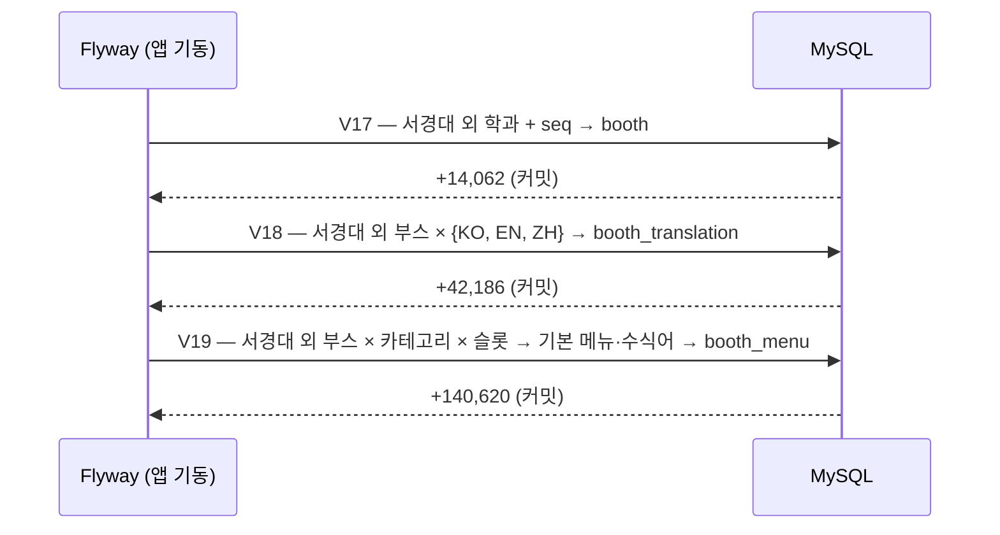

# LLD-0003: 전국 학과별 부스·번역·메뉴 대량 적재 (Flyway V17~V19)

| 항목 | 내용 |
|---|---|
| 상태 | **구현 완료** (2026-09-17, 로컬 DB 롤백 검증 + `./gradlew test` 통과) |
| 작성일 | 2026-09-17 |
| 관련 이슈 | [#12](https://github.com/silversieon/likelion14th-festival-be-V2/issues/12) (상위 [#6](https://github.com/silversieon/likelion14th-festival-be-V2/issues/6)의 부스·메뉴 단계) |
| 관련 ADR | [ADR-0002](../adr/ADR-0002-booth-menu-bulk-seed-path.md) (승인 2026-09-17, 옵션 1 — Flyway 버전 마이그레이션) |
| 대상 도메인 | booth · menu |
| 작업 갈래 | ② 대량 데이터 삽입 |
| 관련 방침 | `docs/policy/development-policy.md` 3.1·3.2·3.3, 4.1 |
| API 스펙 | 해당 없음 |
| 스키마 변경 | 없음 (행 추가만 — `V17`, `V18`, `V19`) |

## 1. 개요 및 범위

서경대학교를 제외한 전국 358개 대학의 학과 14,062개에 부스를 하나씩 만들고, 부스마다 번역 3행과 메뉴 10개를 넣는다. #6(부스·메뉴·주문 대량 적재)의 첫 단계이며, 이후 부스 목록·메뉴 조회 성능 측정의 데이터 기반이 된다.

### 사용자 지시 원문

1차 (컬럼 값 — 대상 범위는 2차에서 바뀜)

> "booth 테이블과 booth_menu 테이블, booth_operation 테이블에 데이터를 적재할 거야. booth 테이블은 departments 테이블과 1:1 관계로 하나의 학과가 하나의 부스를 가져. 서경대학교의 학과들(university_id가 151인)의 부스 정보를 채울 거야. booth 테이블에서 null 값으로 둘 항목들에 대해서 설명해줄게. id는 auto_increment, department_id는 학과 식별자(1:1), thumnail_image는 null로,  order_enabled는 1로, location null, booth_numbers null, account_name 아무 한국인 사람  이름(랜덤), account_number 아무 계좌번호 (랜덤), bank_name 아무 은행 이름(랜덤), booth_status는 OPEN으로 만들어서 모두 삽입하는 flyway 마이그레이션 버전 파일 만들어주고, 다음은 booth_menu야. 마찬가지로 서경대학교 부스를 제외한 모든 부스에 메뉴 10개씩을 삽입하려해. 들어가야하는 값들 알려줄게. id는 auto_increment, booth_id는 booth 식별자, name_ko는 한국어메뉴(기존 메뉴들 select해서 어떤 것이 있는지 보고 중복이 있어도 되고 새로운 메뉴여도 됨. 단 먹는 것이어야함.) name_en 해당 메뉴의 영어명, name_zh 해당 메뉴의 중국어명, price 메뉴 대비 적당한 가격 책정(알아서), time_type은 'ALL', is_sold_out은 0, description_ko, description_en, description_zh 전부 null, category는 MAIN, SIDE, DRINK 셋 중 하나해야하고 부스당 10개 메뉴니까 메인5사이드3음료2로 해서 마이그레이션 버전 파일 만들어주고, 마지막으로 booth_operation에 대해서 설명하려하는데 이거 적재는 필요하면 시킬게. 그냥 위에서 했던 말 무시하고 얜 뺴고 진행해줘."

2차 (대상 범위)

> "내용 전격 수정이 필요해. 서강대학교가 아니라 전체 대학교에 대해서 각 학과마다 하나씩 부스가 필요한 거야. docker exec -it mysql로 확인해보면 359개 대학이 있고, 학과는 14095개가 있어. 그러니 부스도 '서강'이 아니라 '서경'대학교를 제외한 14000개 이상의 부스 데이터 적재가 필요하며 메뉴는 14만개 정도가 필요하겠지? flyway로 넣는 방식이 부적합하면 말해줘(메뉴는 양이 좀 많긴함) 내용 다시 파악하고 전격 수정해."

3차 (ADR-0002 응답)

> "1번에 1번. 실제 운영에 쓰일 프로젝트가 아니라서 상관없어. 2번에 메뉴 종류를 늘려주고, 기존 데이터랑 상관없이 마음대로 지어도 돼. 3번 booth_translation에도 데이터 넣어주되, 토큰 많이 먹지 않도록 몇 글자, 한 줄 정도로 짧게 넣어도 돼. 비슷한 말을 반복해도 돼. 4번 OPEN으로 그냥 넣어줘 상관없어. 5. 매니저는 다음 작업에 넣을 거야."

### 범위에 포함

- `V17__insert_booths.sql` — 부스 14,062
- `V18__insert_booth_translations.sql` — 번역 42,186 (부스 × KO·EN·ZH)
- `V19__insert_booth_menus.sql` — 메뉴 140,620 (부스 × 10)

### 제외 (Out of Scope)

- ❌ `booth_operation` — 1차 지시 "얜 뺴고 진행해줘"
- ❌ `managers` — 3차 지시 "매니저는 다음 작업에 넣을 거야"
- ❌ `booth_detail_image`, `booth_menu_dictionary`, 주문 계열
- ❌ 서경대학교 부스·번역·메뉴 변경

### 현재 상태 (Before)

| 테이블 | 건수 | 비고 |
|---|---|---|
| `universities` / `departments` | 359 / 14,095 | V14~V16. 서경대학교 학과 33 |
| `booth` | 31 | 전부 서경대학교 |
| `booth_translation` | 93 | 서경대 부스 × 3 |
| `booth_menu` | 242 | 전부 서경대학교 부스 소속 |

## 2. 데이터 모델

### 2.1 대상 엔티티

| 엔티티 | 테이블 | 신규/변경 |
|---|---|---|
| `Booth` | `booth` | 변경 없음 (행 추가) |
| `BoothTranslation` | `booth_translation` | 변경 없음 (행 추가) |
| `BoothMenu` | `booth_menu` | 변경 없음 (행 추가) |

### 2.2 컬럼 값

**공통 — `seq`(순번)**: 서경대학교를 뺀 학과를 `(대학명, region, 학과명)` 순으로 정렬한 0부터의 번호(`ROW_NUMBER()` 윈도 함수 — 정렬된 행마다 1, 2, 3… 번호를 붙이는 함수). **id가 아니라 이름으로 정렬**하므로 환경마다 id가 달라도 같은 학과는 같은 `seq`를 받는다. 모든 "임의" 값은 이 `seq`의 함수다 (`RAND()` 미사용 → 재현 가능).

**booth (V17)**

| 컬럼 | 값 |
|---|---|
| `department_id` | 서경대 외 학과 id (1:1) |
| `thumbnail_url`, `location`, `booth_numbers` | NULL |
| `order_enabled` | 1 |
| `account_name` | 성 31개 중 `MOD(seq, 31)` + 이름 41개 중 `MOD(seq × 7, 41)` → 1,271가지 |
| `bank_name` | 8개 은행 중 `MOD(seq, 8)` |
| `account_number` | 은행별 자릿수·접두 관례를 흉내 낸 번호 (예: 카카오뱅크 `3333`+9자리, 토스뱅크 `1000`+8자리), 하이픈 없음, 14,062개 모두 서로 다름 |
| `booth_status` | `OPEN` |

**booth_translation (V18)** — 부스당 KO·EN·ZH 3행

| 컬럼 | 값 |
|---|---|
| `language` | `KO` / `EN` / `ZH` |
| `department_name` | 세 언어 모두 **한국어 학과명** (학과명 14,062개를 번역할 수단이 없다) |
| `booth_name` | 학과명 + 부스 유형 6종 중 `MOD(seq, 6)` (주점/Pub/酒馆, 포차/Pocha/大排档 …) |
| `description` | 한 줄 문구 5종 중 `MOD(seq × 3, 5)` (지시: "짧게… 비슷한 말을 반복해도 돼") |

**booth_menu (V19)**

| 컬럼 | 값 |
|---|---|
| `name_ko` / `name_en` / `name_zh` | **수식어 + 기본 메뉴** (예: `매콤 떡볶이` / `Spicy Tteokbokki` / `香辣炒年糕`). 중국어는 띄어쓰기 없이 붙인다 |
| `price` | 기본 가격 + 수식어 추가금 |
| `time_type` / `is_sold_out` | `ALL` / 0 |
| `description_*` | NULL |
| `category` | 부스당 MAIN 5 · SIDE 3 · DRINK 2 |

| 카테고리 | 기본 메뉴 | 수식어 | 메뉴명 종류 | 가격 범위 |
|---|---|---|---|---|
| MAIN | 41 | 11 | 451 | 4,000 ~ 20,000 |
| SIDE | 29 | 7 | 203 | 2,000 ~ 8,000 |
| DRINK | 23 | 5 | 115 | 1,000 ~ 5,000 |

> 지시 "메뉴 종류를 늘려주고" — ADR 작성 시점 프로토타입의 47종(메뉴명 하나가 약 3,000번 반복)에서 **769종**(카테고리별 한 메뉴명이 155~245번 반복)으로 늘렸다. 번역 행을 769개 쓰지 않고 기본 메뉴 93개 + 수식어 23개만 쓰는 조합 방식이라 파일이 짧다.

### 2.3 규칙 / 불변식

| # | 규칙 | 보장 방법 |
|---|---|---|
| R1 | 서경대 외 학과마다 부스 정확히 1개 | 학과 전체 `INSERT ... SELECT` + `UNIQUE(department_id)` |
| R2 | 서경대 외 부스마다 번역 3행 (언어별 1행) | 언어 3행 `CROSS JOIN` + `UNIQUE(booth_id, language)` |
| R3 | 부스마다 메뉴 10개, MAIN 5 · SIDE 3 · DRINK 2 | 카테고리별 `pick_count` |
| R4 | 한 부스 안에서 메뉴명이 겹치지 않는다 | 기본 메뉴를 `MOD(seq × step + slot, base_size)`로 연속 구간에서 고른다. `pick_count < base_size`라 슬롯마다 기본 메뉴가 다르다 |
| R5 | 서경대학교 데이터는 변하지 않는다 | 세 파일 모두 `WHERE NOT (u.name = '서경대학교' AND u.region = 'SEOUL')` |
| R6 | 환경이 달라도 결과가 같다 | 숫자 id 대신 이름 정렬 `seq`, 난수 없음 |

### 2.4 이벤트

해당 없음

## 3. 클래스 / 시그니처 정의

해당 없음 — Java 코드 변경 없음

## 4. 패키지 / 클래스 구조

```
src/main/resources/db/migration/     # ⚠️ 서브모듈 likelion14th-festival-be-V2-config
├── V17__insert_booths.sql
├── V18__insert_booth_translations.sql
└── V19__insert_booth_menus.sql
```

## 5. 시퀀스 흐름



## 6. API 명세

해당 없음. 단, 신규 부스가 번역 행을 가지므로 기존 부스 목록·검색 API(`BoothRepository.findBoothsByLanguage` 등 `JOIN BoothTranslation` 3종)에 **노출된다.**

## 7. 영속성 / 스키마 변경

### 7.1 마이그레이션

스키마는 바꾸지 않는다. 전문은 각 파일을 본다. 파일마다 `INSERT ... SELECT` 한 문장이다.

**V19 메뉴 배정**

```
기본 메뉴 idx = MOD(seq * step     + slot,     base_size)   slot = 0 .. pick_count-1
수식어   idx = MOD(seq * mod_step + slot * 2, mod_size)
```

| 카테고리 | pick_count | base_size | step | mod_size | mod_step |
|---|---|---|---|---|---|
| MAIN | 5 | 41 | 7 | 11 | 3 |
| SIDE | 3 | 29 | 5 | 7 | 2 |
| DRINK | 2 | 23 | 3 | 5 | 1 |

`base_size`와 `mod_size`를 서로 다른 소수(1과 자기 자신으로만 나누어지는 수)로 두어 `(시작점, 수식어)` 조합이 부스 전체에 고르게 돈다. 실측 결과 메뉴명별 사용 부스 수가 MAIN 155~157, SIDE 207~208, DRINK 244~245로 거의 균등하다.

**V19의 `STRAIGHT_JOIN` — 왜 넣었나 (실측)**

`STRAIGHT_JOIN`은 FROM에 적은 순서대로 조인하게 옵티마이저(실행 계획을 고르는 MySQL 구성 요소)에게 강제하는 키워드다.

| 시도 | V19 소요 | 원인 (`EXPLAIN ANALYZE`) |
|---|---|---|
| 기본 메뉴·수식어 VALUES 조인, 순서 미지정 | 20.3초 | 윈도 함수 파생 테이블(부스 14,062행)의 행 수를 옵티마이저가 **0으로 추정** → 작은 후보 테이블끼리 먼저 조인하고 부스와 조건 없이 곱해 **4,350만 행**을 만든 뒤 필터 |
| 번호 계산을 파생 테이블로 분리 | 15.1초 | 파생 테이블이 바깥 쿼리로 합쳐져(merge) 같은 계획 |
| 윈도 함수를 (부스×카테고리×슬롯) 14만 행에 적용 | 8.1초 | 14만 행을 한국어 문자열로 정렬하는 데만 약 2.3초, 조인 순서는 여전히 나쁨 |
| 후보를 PK 있는 임시 테이블로 | 4.4초 | 조인 순서가 여전히 후보 테이블부터 |
| **`STRAIGHT_JOIN` (채택)** | **2.03초** | 부스 → 카테고리 → 슬롯 → 후보 순으로 고정. 결과 행은 위 시도들과 동일 |

기존 방식과의 비교: V15·V16은 모든 행을 `VALUES`로 나열했다. V17~V19는 후보만 나열하고 조합은 SQL이 만든다 — 부스·번역·메뉴 19만 행을 파일 3개, 약 300줄로 표현한다.

### 7.2 기존 데이터 백필 / 롤백

- 백필: 해당 없음 (기존 행을 수정하지 않는다)
- 롤백: Flyway에는 되돌리기가 없다. 필요하면 **새 버전 파일로** 자식 → 부모 순서(FK)로 삭제한다.

```sql
DELETE m FROM booth_menu m JOIN booth b ON b.id = m.booth_id JOIN departments d ON d.id = b.department_id
    JOIN universities u ON u.id = d.university_id
WHERE NOT (u.name = '서경대학교' AND u.region = 'SEOUL');
DELETE t FROM booth_translation t JOIN booth b ON b.id = t.booth_id JOIN departments d ON d.id = b.department_id
    JOIN universities u ON u.id = d.university_id
WHERE NOT (u.name = '서경대학교' AND u.region = 'SEOUL');
DELETE b FROM booth b JOIN departments d ON d.id = b.department_id JOIN universities u ON u.id = d.university_id
WHERE NOT (u.name = '서경대학교' AND u.region = 'SEOUL');
```

그 사이 이 부스들에 주문·운영시간·매니저가 붙었다면 그것부터 지워야 한다.

### 7.3 ERD 갱신

- [x] 해당 없음 — 테이블·컬럼·제약 변경이 없다

## 8. 인덱스 / 쿼리 설계

해당 없음 — 새 조회 쿼리·인덱스 없음. 적재 쿼리의 실행 계획은 7.1에 기록했다. 적재 후 조회 성능 측정·인덱스 판단은 #6 이후 ③ 성능 작업에서 한다 (policy 5.1 — 실측 없는 인덱스 추가 금지).

## 9. 데이터 생성 스펙

### 9.1 사용자 지정 조건 (원문 인용)

1장 "사용자 지시 원문" 1·2·3차.

### 9.2 적재 스펙 (행 증폭 — policy 3.2)

```
학과 14,062 (서경대 제외)  →  booth 14,062  →  booth_translation 14,062 × 3 = 42,186
                                              →  booth_menu        14,062 × 10 = 140,620
```

| 테이블 | 건수 | 분포 |
|---|---|---|
| `booth` | 14,062 | 서경대 외 학과당 1. 대학당 1~179개 (대학별 학과 수를 그대로 따름) |
| `booth_translation` | 42,186 | 부스당 KO·EN·ZH 각 1 |
| `booth_menu` | 140,620 | 부스당 10 (MAIN 5 · SIDE 3 · DRINK 2) |
| 합계 | **196,868** | |

### 9.3 삽입 방식 (ADR-0002 구현 규칙)

- 방식: Flyway 버전 마이그레이션, 파일당 집합 기반 `INSERT ... SELECT` 한 문장. 저장 프로시저 없음
- 트랜잭션: Flyway가 파일 하나를 한 트랜잭션으로 실행하므로 **테이블 단위 3개 트랜잭션**. 가장 큰 V19도 2초
- 인덱스·FK: 끄지 않는다
- 실패 시: Flyway가 해당 파일을 롤백하고 앱 기동이 멈춘다. 원인을 고친 뒤 재기동하면 실패한 버전부터 다시 실행된다 (MySQL은 DML 롤백이 되므로 부분 적재가 남지 않는다)
- 적용 시점: **다음 앱 기동 시** (`.\start.bat` — jar를 다시 빌드하므로 새 마이그레이션이 포함된다)

### 9.4 실행 결과

로컬 `festival2`(V16 적용 상태, 앱 3대 기동 중, 인덱스·FK 켠 상태)에서 `START TRANSACTION` → V17 → V18 → V19 → 검증 → `ROLLBACK`.

| 파일 | 건수 | 소요 |
|---|---|---|
| V17 | 14,062 | 0.27초 |
| V18 | 42,186 | 0.76초 |
| V19 | 140,620 | 2.06초 |
| 실패 건수 | 0 | |

| 검증 | 결과 |
|---|---|
| 서경대 외 학과 수 / 부스 수 | 14,062 / 14,062 |
| 부스 컬럼 값이 지시와 다른 행 | 0 |
| 서로 다른 예금주 / 계좌번호 / 은행 | 1,271 / 14,062 / 8 |
| 부스별 (번역 수, 언어 수) | 14,062개 부스 전부 (3, 3) |
| 부스별 (메뉴, MAIN, SIDE, DRINK, 서로 다른 메뉴명) | 14,062개 부스 전부 (10, 5, 3, 2, 10) |
| 메뉴명 종류 (MAIN / SIDE / DRINK) | 451 / 203 / 115 |
| 신규 메뉴 `time_type`·`is_sold_out`·`description_*` 위반 | 0 |
| 서경대 번역 / 메뉴 | 93 / 242 (변화 없음) |
| 롤백 후 booth / translation / menu | 31 / 93 / 242 |

> 검증 중 롤백된 INSERT가 InnoDB `AUTO_INCREMENT` 값을 소모했으므로(롤백해도 되돌아가지 않는다), 검증 후 세 테이블의 `AUTO_INCREMENT`를 `MAX(id)+1`(39 / 151 / 306)로 되돌렸다. 데이터 변경은 없다.

## 10. 캐싱 / Read Model

해당 없음

## 11. 트랜잭션 / 동시성 / 멱등성

- 파일 = 트랜잭션 (9.3). 3인스턴스 동시 기동 시 마이그레이션 직렬화는 Flyway 자체 잠금에 맡긴다.
- 적재 중 `BoothScheduler.updateBoothStatusEveryMinute`(매분 `booth` UPDATE)가 V19의 공유 잠금에 최대 약 2초 대기할 수 있다. 앱 기동 과정 중이라 수용한다.
- 지시 4번에 따라 `booth_status = OPEN`으로 넣는다. `BoothScheduler.dailyBoothStatusToClose`가 매일 01:00에 모든 부스를 CLOSED로 바꾸는 것은 감수한다.

## 12. 예외 및 에러 정책

해당 없음 — 새 에러 코드 없음. 마이그레이션 실패 시 앱 기동이 실패한다.

## 13. 테스트 계획

### 13.1 단위 테스트

해당 없음 — Java 코드 변경이 없다 (AGENTS.md ④ "대량 데이터 생성 … 도구성 코드는 TDD 사이클을 강제하지 않는다").

### 13.2 통합 테스트

- [x] 로컬 DB 롤백 검증 — 9.4의 모든 항목이 기대값과 일치
- [x] `./gradlew test` — Testcontainers MySQL 8.0 빈 DB에 V1~V19가 적용되고 전체 테스트가 통과

### 13.3 분산 환경 검증

해당 없음 — 스키마 변경이 없다 (policy 17.2 필수 대상 아님). 3인스턴스 기동 시 적용 결과는 다음 기동 때 `flyway_schema_history`로 확인한다.

### 13.4 성능 측정

적재 소요는 9.4. 적재 후 조회 성능 측정은 이번 범위가 아니다 (#6 이후 ③).

## 14. 미해결 질문

- 매니저 계정 적재 — 사용자 지시로 다음 작업
- `booth_translation.department_name`이 EN·ZH에도 한국어 학과명이다 — #7(학과명 단일 출처 정리)에서 `departments.name`과 역할을 정리할 때 함께 본다
- #6 다음 단계(주문 수백만 건)는 Flyway로 넣기 어렵다 — 그 단계에서 적재 경로를 다시 정한다 (ADR-0002 트레이드오프)
