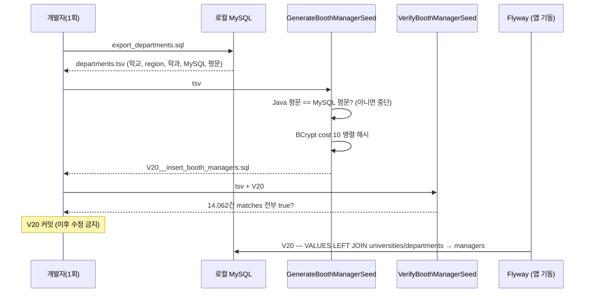

# LLD-0004: 전국 부스 매니저 계정 14,062개 적재 (BCrypt 사전 생성 + Flyway V20)

| 항목 | 내용 |
|---|---|
| 상태 | **구현 완료** (2026-09-17, 해시 전수 검증 + 로컬 롤백 검증 + `./gradlew test` 통과) |
| 작성일 | 2026-09-17 |
| 관련 이슈 | [#14](https://github.com/silversieon/likelion14th-festival-be-V2/issues/14) (상위 [#6](https://github.com/silversieon/likelion14th-festival-be-V2/issues/6), 선행 [#12](https://github.com/silversieon/likelion14th-festival-be-V2/issues/12)) |
| 관련 ADR | [ADR-0003](../adr/ADR-0003-booth-manager-seed-with-precomputed-bcrypt.md) (승인 2026-09-17, 옵션 B — cost 10, 비밀번호 규칙 ④) |
| 대상 도메인 | manager · auth |
| 작업 갈래 | ② 대량 데이터 삽입 |
| 관련 방침 | `docs/policy/development-policy.md` 3.1·3.3, 4.1, 13.4 |
| API 스펙 | 해당 없음 |
| 스키마 변경 | 없음 (행 추가만 — `V20`) |

## 1. 개요 및 범위

V17로 만든 전국 부스 14,062개(서경대학교 제외)에 운영자 계정을 하나씩 만든다. 비밀번호는 이름으로 만든 규칙 문자열을 **앱과 같은 BCrypt(cost 10)로 미리 해시**해 Flyway SQL에 넣는다. 이로써 모든 부스가 관리자 로그인이 가능해져, 부스 관리자 API(주문 조회 등) 부하 테스트의 전제가 갖춰진다.

### 사용자 지시 원문

ADR-0003 "요구사항 (사용자 지시 원문)" 7개 인용을 따른다. 확정된 결과만 옮기면:

> "department_id는 department당 하나(서경대 학과들 제외)면 되고, role은 BOOTH_MANAGER로 전부 통일하면 돼."
> "B안으로 ADR 작성부터해서 시작해줘. cos 10으로 해주고."
> "다른 방식을 고려하자. 학교명 앞 5글자_지역명 영문(SEOUL 등 DB에 있는 것으로)_학과명 5글자로 가는 거야."
> "1번은 a안으로 겹치는 건 그대로 두고"
> "아 최대 5글자인 거야. 3글자면 3글자 이렇게 가는 거지"
> "나)로 진행해줘"

### 범위에 포함

- `scripts/seed/booth-manager/` — 대상 추출 SQL, 해시 생성 도구, 전수 검증 도구, 실행 안내
- `V20__insert_booth_managers.sql` — `managers` 14,062행

### 제외 (Out of Scope)

- ❌ 서경대학교 학과 — 매니저 33명이 이미 있다 ("manager 존재하니까")
- ❌ 회원가입 API·인증 코드 변경
- ❌ 비밀번호 유일성 보장 — 중복 수용 (ADR-0003 ⓐ)

### 현재 상태 (Before)

| 테이블 | 건수 | 비고 |
|---|---|---|
| `managers` | 33 | 전부 서경대학교. `ADMIN` 1 · `STUDENT_COUNCIL` 1 · `BOOTH_MANAGER` 31, 비밀번호 전부 `$2a$10$` 60자 |
| 서경대 외 `departments` | 14,062 | 매니저 없음 |

## 2. 데이터 모델

### 2.1 대상 엔티티

| 엔티티 | 테이블 | 신규/변경 |
|---|---|---|
| `Manager` | `managers` | 변경 없음 (행 추가) |

### 2.2 컬럼 값

| 컬럼 | 값 |
|---|---|
| `department_id` | 서경대 외 학과 id (1:1, `UNIQUE(department_id)`) |
| `password` | 규칙 ④ 평문의 BCrypt 해시 — `$2a$10$` + 53자 = 60자 |
| `role` | `BOOTH_MANAGER` |
| `created_at`, `modified_at` | `NOW(6)` |

### 2.3 비밀번호 규칙 ④ (정의)

```
password(평문) = P(학교명) + "_" + region + "_" + P(학과명)
P(이름)        = 이름에서 공백(U+0020)을 모두 제거한 뒤, 앞에서 최대 5글자(코드 포인트 단위)
```

같은 규칙을 MySQL 식으로 쓰면 다음과 같다. **이 식이 규칙의 기준이다** — 생성 도구(Java)의 결과가 이 식과 한 글자라도 다르면 생성을 중단한다.

```sql
CONCAT(LEFT(REPLACE(u.name, ' ', ''), 5), '_', u.region, '_', LEFT(REPLACE(d.name, ' ', ''), 5))
```

| 원래 이름 | 평문 |
|---|---|
| 서강대학교 / 컴퓨터공학과 (SEOUL) | `서강대학교_SEOUL_컴퓨터공학` |
| 강원대학교 / 경영대학 무전공학과 (GANGWON) | `강원대학교_GANGWON_경영대학무` |
| 경북대학교 / IT 첨단자율학부 (DAEGU) | `경북대학교_DAEGU_IT첨단자` |
| 한국폴리텍 I 대학 성남캠퍼스 / … (GYEONGGI) | `한국폴리텍_GYEONGGI_…` |
| 가야대학교(김해) / 간호학과 (GYEONGNAM) | `가야대학교_GYEONGNAM_간호학과` (학과명 4글자 — 5글자 미만은 그대로) |

**데이터 확인** (서경대 외 14,062개):

| 항목 | 값 |
|---|---|
| 평문 최대 길이 | 41바이트 (BCrypt 한도 72바이트 이내) |
| 서로 다른 평문 | 12,743 (1,319개가 다른 계정과 같은 값 — 수용) |
| 이름에 든 공백 종류 | ASCII 공백만. 전각 공백(U+3000)·NBSP(U+00A0)·탭·줄바꿈 0 (바이트 단위 확인) |
| 작은따옴표·백슬래시 | 0 → SQL 문자열 이스케이프 문제 없음 (도구는 그래도 이스케이프한다) |
| 4바이트 문자(이모지 등) | 0 |

> MySQL `REPLACE()`는 대소문자·바이트를 구분해 **ASCII 공백만** 지운다. `utf8mb4_unicode_ci` 비교(`=`, `INSTR`)는 전각 공백을 일반 공백과 같게 보므로, 공백 종류 확인은 `BINARY`로 했다.

### 2.4 이벤트

해당 없음

## 3. 클래스 / 시그니처 정의

운영 코드 변경 없음. 도구 코드만 추가한다 (`src/` 밖 — 빌드·spotless 대상 아님).

```java
// scripts/seed/booth-manager/GenerateBoothManagerSeed.java
// 사용: java -cp <crypto.jar;commons-logging.jar> GenerateBoothManagerSeed.java <input.tsv> <output.sql>
public class GenerateBoothManagerSeed {
  static String prefix(String name);          // 공백 제거 후 앞 최대 5 코드 포인트
  static String plainPassword(String universityName, String region, String departmentName);
  public static void main(String[] args);     // TSV 읽기 → 규칙 검증 → 병렬 해시 → V20 SQL 쓰기
}

// scripts/seed/booth-manager/VerifyBoothManagerSeed.java
// 사용: java -cp <...> VerifyBoothManagerSeed.java <input.tsv> <V20.sql>
public class VerifyBoothManagerSeed {
  public static void main(String[] args);     // V20의 (학교, region, 학과, 해시) ↔ TSV의 MySQL 계산 평문, matches 전수 대조
}
```

**입력 TSV** (`export_departments.sql`의 출력, 탭 구분, 헤더 없음):

| 열 | 내용 |
|---|---|
| 1 | 학교명 |
| 2 | region |
| 3 | 학과명 |
| 4 | **MySQL로 계산한 평문** (2.3의 식) |

정렬: `(학교명, region, 학과명)` — V17~V19의 `seq` 정렬과 같다.

## 4. 패키지 / 클래스 구조

```
scripts/seed/booth-manager/          # 신규 — ADR-0003이 도구 위치를 scripts/seed/로 확정
├── README.md                        # 실행 순서·classpath 찾는 법
├── export_departments.sql           # 대상 추출 (서경대 제외) + MySQL 평문 계산
├── GenerateBoothManagerSeed.java    # 해시 생성 → V20
└── VerifyBoothManagerSeed.java      # 전수 검증

src/main/resources/db/migration/     # ⚠️ 서브모듈 likelion14th-festival-be-V2-config
└── V20__insert_booth_managers.sql
```

## 5. 시퀀스 흐름



## 6. API 명세

해당 없음. 로그인 API(`POST /api/auth/login`)는 그대로이며, 신규 계정은 `{universityId, departmentId, password=규칙 ④ 평문}`으로 로그인한다.

## 7. 영속성 / 스키마 변경

### 7.1 마이그레이션

```sql
INSERT INTO managers (department_id, password, role, created_at, modified_at)
SELECT d.id, v.password, 'BOOTH_MANAGER', NOW(6), NOW(6)
FROM (VALUES
    ROW ('학교명', 'REGION', '학과명', '$2a$10$...'),
    ...                                             -- 14,062행
) AS v (university_name, university_region, department_name, password)
LEFT JOIN universities u ON u.name = v.university_name AND u.region = v.university_region
LEFT JOIN departments d ON d.university_id = u.id AND d.name = v.department_name;
```

- **id를 박지 않고 이름으로 찾는다** (V16 관례). 학과 id에 빈 번호가 352개 있어 환경마다 id가 같다고 볼 수 없다 (ADR-0003).
- `LEFT JOIN` → 학교·학과를 못 찾으면 `department_id`가 NULL → `NOT NULL` 위반으로 **마이그레이션 실패**. 조용히 빠지는 계정이 없다.
- 평문은 파일에 넣지 않는다. 해시만 들어간다.
- 해시는 salt가 무작위라 다시 생성하면 내용이 바뀐다 → **한 번 생성해 커밋하고, 적용 후에는 수정하지 않는다** (policy 4.1).

### 7.2 기존 데이터 백필 / 롤백

- 백필: 해당 없음 (기존 33행을 건드리지 않는다)
- 롤백: 새 버전 파일로 삭제한다. 매니저를 참조하는 FK는 없다 (현재 스키마 기준).

```sql
DELETE m FROM managers m
    JOIN departments d ON d.id = m.department_id
    JOIN universities u ON u.id = d.university_id
WHERE NOT (u.name = '서경대학교' AND u.region = 'SEOUL');
```

### 7.3 ERD 갱신

- [x] 해당 없음 — 테이블·컬럼·제약 변경 없음

## 8. 인덱스 / 쿼리 설계

해당 없음 — 새 조회 쿼리 없음. V20의 조인은 기존 `uq_universities_name_region`, `uq_departments_university_name` 유니크 인덱스를 탄다 (적용 시간은 9.4에 실측).

## 9. 데이터 생성 스펙

### 9.1 사용자 지정 조건 (원문 인용)

1장 및 ADR-0003 "요구사항 (사용자 지시 원문)".

### 9.2 적재 스펙

| 테이블 | 건수 | 분포 |
|---|---|---|
| `managers` | 14,062 | 서경대 외 학과당 1, role 전부 `BOOTH_MANAGER` |

행 증폭 없음 (1 학과 → 1 매니저).

### 9.3 삽입 방식

- 해시 생성: 일회성 Java 도구, `spring-security-crypto` 7.0.4 `BCryptPasswordEncoder`(strength 10, `$2a$`) — 앱의 `SecurityConfig`와 같은 클래스. 병렬 스트림으로 계산하되 **출력 순서는 입력 순서를 유지**한다
- 적재: Flyway V20, `INSERT ... SELECT` 한 문장 (파일 = 트랜잭션)
- 인덱스·FK: 끄지 않는다
- 실패 시: 마이그레이션이 롤백되고 앱 기동이 멈춘다 (부분 적재 없음)

### 9.4 실행 결과

**측정 조건**: 로컬 22코어, Java 21.0.6, `spring-security-crypto` 7.0.4, MySQL 8.0.46 (`festival2`, V16 적용 상태, 앱 3대 기동 중, 인덱스·FK 켠 상태)

| 단계 | 결과 |
|---|---|
| 1) 대상 추출 | 14,062행 |
| 2) 생성 — Java 평문 ↔ MySQL 평문 대조 | 불일치 **0**, 서경대 행 0, 72바이트 초과 0 |
| 2) 생성 — BCrypt cost 10 해시 | **63.6초** (병렬 22스레드) |
| 2) V20 파일 | **1,867,511바이트** |
| 3) 전수 검증 — `matches(MySQL 평문, V20 해시)` | **14,062 / 14,062 통과**, 실패 0, 87.2초 |
| 3) 음성 검사 — 평문 끝에 한 글자 추가 | 거부됨 (`false`) |
| V20 적용 (트랜잭션 롤백) | 14,062행, **0.27초**, 실패 0 |

**로컬 롤백 검증** (`START TRANSACTION` → V20 → 검증 → `ROLLBACK`):

| 검증 | 결과 |
|---|---|
| 서경대 외 학과 / 매니저 / 서로 다른 학과 | 14,062 / 14,062 / 14,062 |
| 신규 행 중 role ≠ `BOOTH_MANAGER` 또는 password ≠ `$2a$10$` 60자 | 0 |
| 서경대 매니저 | `BOOTH_MANAGER` 31 · `ADMIN` 1 · `STUDENT_COUNCIL` 1 = 33 (변화 없음) |
| 서로 다른 해시 (전체 managers) | 14,095 / 14,095 (salt가 달라 평문이 같아도 해시는 모두 다름) |
| 롤백 후 managers | 33 |

**DB에 들어간 해시로 표본 `matches`** (앱 로그인과 같은 `BCryptPasswordEncoder.matches`):

| universityId | departmentId | 학과명 | 평문 | 결과 |
|---|---|---|---|---|
| 151 | 7078 | 컴퓨터공학과 | `서강대학교_SEOUL_컴퓨터공학` | ✅ |
| 14 | 443 | 경영대학 무전공학과 (공백) | `강원대학교_GANGWON_경영대학무` | ✅ (공백 포함 규칙 `경영대학␣`로는 ❌) |
| 28 | 1210 | IT 첨단자율학부 (가운데 공백) | `경북대학교_DAEGU_IT첨단자` | ✅ (`IT 첨단`으로는 ❌) |
| 3 | 69 | 간호학과 (공백 제거 후 5글자 미만) | `가야대학교_GYEONGNAM_간호학과` | ✅ |
| 178 | 8180 / 8181 | [외국인전담학과]경영정보학과 / …골프캐디학과 | 둘 다 `송곡대학교_GANGWON_[외국인전` | ✅ 둘 다 (해시는 서로 다름) |

> id는 로컬 `festival2` 기준이다. 다른 DB에서는 id가 다를 수 있지만 평문은 이름으로 정해지므로 같다.

**`./gradlew test`**: 59개 통과, 실패 0 — Testcontainers MySQL 8.0에 V1~V20 적용 3.8초 (V1~V19 때 4.1초, 측정 편차 범위)

> 롤백된 INSERT가 소모한 `managers` `AUTO_INCREMENT`(16,417)는 `ALTER TABLE managers AUTO_INCREMENT = 1`로 `MAX(id)+1`(34)로 되돌렸다. 데이터 변경은 없다.

## 10. 캐싱 / Read Model

해당 없음

## 11. 트랜잭션 / 동시성 / 멱등성

- 파일 = 트랜잭션. 동시 기동 시 직렬화는 Flyway 잠금에 맡긴다.
- 만약 V20이 두 번 실행되더라도 `UNIQUE(department_id)` 위반으로 실패한다 — 중복 매니저가 생기지 않는다.

## 12. 예외 및 에러 정책

해당 없음 — 새 에러 코드 없음. 비밀번호가 틀리면 기존 `AuthErrorCode.LOGIN_FAIL`.

## 13. 테스트 계획

### 13.1 단위 테스트

해당 없음 — 운영 코드 변경 없음 (AGENTS.md ④ "도구성 코드는 TDD 사이클을 강제하지 않는다"). 대신 도구가 스스로 검증한다:

- [x] 생성 도구: 14,062행 전부 Java 평문 == MySQL 평문 (하나라도 다르면 종료 코드 1)
- [x] 생성 도구: 서경대학교 행이 입력에 있으면 종료 코드 1 (코드 경로 확인 — 실제 입력에는 0행)
- [x] 생성 도구: 모든 평문이 72바이트 이하
- [x] 검증 도구: V20의 14,062개 해시 전부 `$2a$10$` 60자이고, MySQL 평문으로 `matches` 가 **전부 true**
- [x] 검증 도구: 표본 음성 검사 — 평문을 한 글자 바꾸면 `matches` false

### 13.2 통합 테스트

- [x] 로컬 DB 트랜잭션 롤백 검증
  - 서경대 외 학과 수 = 매니저 수 = 14,062, 학과당 1
  - role 전부 `BOOTH_MANAGER`, password 전부 `LIKE '$2a$10$%'` AND 길이 60
  - 서경대 매니저 33 변화 없음
  - DB에 들어간 해시로 표본 계정 `matches` (공백이 있던 학과 / 5글자 미만 학과 / 평문이 겹치는 두 계정) — 9.4
- [x] `./gradlew test` — Testcontainers MySQL 8.0에 V1~V20 적용

### 13.3 분산 환경 검증

해당 없음 — 스키마 변경 없음 (policy 17.2 필수 대상 아님).

### 13.4 성능 측정

해시 생성 소요, V20 파일 크기·적용 소요를 9.4에 기록한다. 로그인 API 성능 측정은 이번 범위가 아니다.

## 14. 미해결 질문

- 없음 (ADR-0003 열린 질문 해소)
