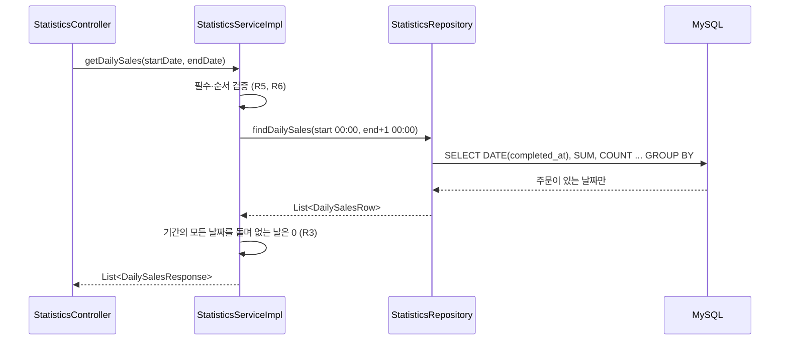

# LLD-0005: 운영진 매출·부스·메뉴 통계 조회 API

| 항목 | 내용 |
|---|---|
| 상태 | **구현 완료** (2026-10-10, `./gradlew test` 전체 97건 통과) |
| 작성일 | 2026-10-10 |
| 관련 이슈 | [#16](https://github.com/silversieon/likelion14th-festival-be-V2/issues/16) |
| 관련 ADR | 해당 없음 (사용자 지시 기반) — 스키마 변경·성능 기법·저장소 변경이 없는 조회 기능 추가다. 지시 원문은 1장 |
| 대상 도메인 | **statistics (신규 패키지, 엔티티 없음)** — order · booth · university 테이블을 읽기만 한다 |
| 작업 갈래 | 기타 (기능 추가) — 성능 최적화는 사용자 지시로 제외 |
| 관련 방침 | `docs/policy/development-policy.md` 5.3(3-hop 조인), 5.6(DTO 프로젝션), 9.4(readOnly 트랜잭션), 13장(인가) |
| API 스펙 | [`docs/api-spec/statistics.md`](../api-spec/statistics.md) — **본 문서보다 먼저 작성** |
| 스키마 변경 | 없음 |

## 1. 개요 및 범위

운영진 통계 화면(프런트 `/admin`)이 지금은 `adminStatisticsDummyData.js` 더미 데이터로 그려진다. 실제 주문 데이터를 집계해 내려주는 조회 API 7종을 만든다.

**사용자 지시 원문**

> "총 주문수와 총 수익을 반환하는 API, 일별 매출 추이를 조회하는 API (날짜 ~ 날짜로 조회 가능) 날짜별 일자, 총 주문 금액, 주문  수 조회 API, 시간대별 매출 추이 (전체, 기간 선택 가능) 전체 선택 시 전체 기간의 각 시각 11:00 ~ 24:00까지 각각 총 주문 금액, 주문 수 반환, 기간 선택 시 (날짜 ~ 날짜로 조회 가능) 해당 날짜의 시각 11:00 ~ 24:00까지 각각 총 주문 금액, 주문 수 반환하는 API, 부스별 매출 TOP 10 (순위, 학교, 학과, 총매출, 평균 주문 금액, 총 주문 건수, 총 판매 메뉴 수) 반환 API, 부스별 매출 검색 (순위, 학교, 학과, 총 매출, 평균 주문 금액, 총 주문 건수, 총 판매 메뉴 수)를 반환해야하며 학교명으로 검색 시 해당 학교의 모든 부스를 띄워야하고, 학교명+부스명으로 검색 시 해당 부스만 조회하는 API, 부스별 인기 메뉴 순위로 학교, 학과, 메뉴명, 주문 수, 총 수익, 순위를 반환해야하며 마찬가지로 학교명으로 검색 가능하고 학교명+부스명으로 검색 가능한 API, 마지막으로 가장 많이 팔린 메뉴 TOP10 이며 판매순, 수익 순으로 (순위, 학교, 학과, 메뉴명, 판매량, 총 수익)을 반환하는 API. (…) 프론트엔드 코드는 절대 수정해서는 안 됨. 또한 인덱스, 최적화 등의 요소는 임의로 하지말고 단순히 개발만 진행해야함."

### 범위에 포함

- `domain/statistics` 패키지 신설 — `controller` / `service` / `repository` / `dto/response` / `enums` / `exception`
- API 7종 (상세는 API 스펙): 총계, 일별, 시간대별, 부스 TOP 10, 부스 검색, 부스별 메뉴 순위, 메뉴 TOP 10
- 응답 필드명은 프런트 더미 데이터(`adminStatisticsDummyData.js`)의 필드명에 맞춘다 — 프런트는 더미 함수를 API 호출로 바꾸기만 하면 된다

### 제외 (Out of Scope)

- ❌ **인덱스 추가, 쿼리 튜닝, 캐싱, 집계 테이블(사전 집계)** — 사용자 지시 "인덱스, 최적화 등의 요소는 임의로 하지말고 단순히 개발만 진행". 대량 데이터 기준 성능은 후속 ③ 작업에서 실측(policy 5.1) 후 다룬다
- ❌ 프런트엔드 코드 수정
- ❌ 페이지네이션 — 화면이 전체 목록을 표로 그린다 (14장 O1)

### 현재 상태 (Before)

통계 API가 없다. 매출 집계는 부스 관리자용 `GET /api/orders/sales`(자기 부스 하루치)와 `BoothServiceImpl`의 부스 매출뿐이며, 둘 다 `COMPLETED` 주문의 `total_order_price`를 `completed_at` 기준으로 합산한다. 이번 작업도 **같은 규칙**을 따른다.

### 왜 `domain/order`가 아니라 새 패키지인가

통계는 `orders`·`order_items`·`booth_menu`·`booth`·`departments`·`universities` 여섯 테이블을 가로지르는 **조회 전용** 코드다. `order` 패키지는 이미 주문 처리(쓰기)·이벤트·SSE로 무겁고, 어느 한 도메인에 넣으면 의존 방향이 어색해진다. 엔티티가 없는 도메인은 `auth`라는 선례가 있다 (AGENTS.md 3.1 "필요한 것만 만든다").

## 2. 데이터 모델

### 2.1 대상 엔티티

| 엔티티 | 테이블 | 신규/변경 |
|---|---|---|
| `Order`, `OrderItem` | `orders`, `order_items` | 변경 없음 (읽기만) |
| `BoothMenu`, `Booth` | `booth_menu`, `booth` | 변경 없음 (읽기만) |
| `Department`, `University` | `departments`, `universities` | 변경 없음 (읽기만) |

### 2.2 필드 / 컬럼 정의

해당 없음 — 스키마 변경 없음. 현행 정의는 `docs/erd/erd-0002-university-schema.md`.

### 2.3 비즈니스 규칙

| # | 규칙 | 위치 |
|---|---|---|
| R1 | 집계 대상은 `order_status = 'COMPLETED'` 주문뿐이다 | 모든 쿼리의 WHERE |
| R2 | 날짜·시각 기준은 `orders.completed_at`이다. 기간 `[startDate, endDate]`는 `completed_at >= startDate 00:00` AND `completed_at < (endDate+1) 00:00`로 바꿔 건다 (반열린 구간 — 끝 시각의 소수점 초를 놓치지 않는다) | 서비스가 `LocalDateTime` 경계를 만들어 넘긴다 |
| R3 | 일별 추이는 기간 안의 **모든 날짜**를 반환한다. 주문이 없는 날은 0으로 채운다 | 서비스 |
| R4 | 시간대별 추이는 **11~23시 13개 구간**을 항상 반환한다. 11시 이전 완료 주문은 제외한다. 주문이 없는 구간은 0 | 쿼리 `HOUR(completed_at) >= 11` + 서비스 0 채움 |
| R5 | 일별은 `startDate`·`endDate` 둘 다 필수. 시간대별은 둘 다 없거나(전체) 둘 다 있어야(기간) 한다. 하나만 있으면 `STATISTICS_40001` | 서비스 |
| R6 | `startDate > endDate`면 `STATISTICS_40002` | 서비스 |
| R7 | 부스 매출: 총 매출 = 부스 메뉴의 `order_items.total_order_item_price` 합, 주문 건수 = 서로 다른 주문 수, 총 판매 메뉴 수 = `order_items.quantity` 합 | 쿼리 |
| R8 | 평균 주문 금액 = 총 매출 ÷ 주문 건수 **반올림**(`Math.round`). 주문 건수 0이면 0 (프런트 더미의 `Math.round`와 동일) | 서비스 |
| R9 | 부스 순위는 **전체 부스 기준**이다 — 총 매출 내림차순, 동점이면 `booth.id` 오름차순. `ROW_NUMBER`라 순위가 겹치지 않는다. 검색은 순위를 매긴 **뒤에** 거른다 | 쿼리 (윈도 함수를 서브쿼리 안에서 먼저 계산) |
| R10 | 부스 TOP 10은 완료 주문이 1건 이상인 부스만. 검색은 주문이 없는 부스도 0으로 포함 | 쿼리 |
| R11 | 학교명은 필수(없거나 공백뿐이면 `STATISTICS_40003`), 부스명은 선택(없거나 공백뿐이면 조건 없음). 둘 다 앞뒤 공백 제거 후 **부분 일치**. `!`·`%`·`_`는 `!`로 이스케이프한다 (`UniversityServiceImpl`과 같은 방식) | 서비스 + 쿼리 `ESCAPE '!'` |
| R12 | 부스별 메뉴 순위는 **부스 안에서** 매긴다 — 주문 수 내림차순 → 총 수익 내림차순 → `booth_menu.id` 오름차순. 팔리지 않은 메뉴도 0으로 포함 | 쿼리 (`PARTITION BY booth.id`) |
| R13 | 메뉴 TOP 10은 판매된 메뉴만. `QUANTITY`는 판매량 → 수익 → id, `SALES`는 수익 → 판매량 → id 순 | 쿼리 2개 |
| R14 | 부스명 = 부스를 운영하는 학과명(`departments.name`), 메뉴명 = `booth_menu.name_ko` | 쿼리 |

> **주문 1건 = 부스 1개**를 전제한다. 주문 생성 API가 한 부스 경로(`/api/booths/{boothId}/orders`)로만 들어오기 때문이다. 다만 policy 13.2의 확인된 누락(다른 부스 메뉴를 섞어 주문 가능) 때문에 예외 데이터가 있을 수 있어, 부스 매출은 `orders.total_order_price`가 아니라 **부스 메뉴의 `order_items` 금액 합**으로 계산한다. 그러면 섞인 주문도 부스별로 정확히 나뉜다.

### 2.4 이벤트

해당 없음 — 조회만 한다.

## 3. 클래스 / 시그니처 정의

### 3.1 Controller

```java
@Tag(name = "Statistics", description = "운영진 매출·부스·메뉴 통계 조회 API")
@RestController
@RequiredArgsConstructor
@RequestMapping("/api/statistics")
public class StatisticsController {

  private final StatisticsService statisticsService;

  @PreAuthorize("hasRole('ADMIN')")
  @GetMapping("/sales/summary")
  ResponseEntity<BaseResponse<SalesSummaryResponse>> getSalesSummary();

  @PreAuthorize("hasRole('ADMIN')")
  @GetMapping("/sales/daily")
  ResponseEntity<BaseResponse<List<DailySalesResponse>>> getDailySales(
      @RequestParam(required = false) @DateTimeFormat(iso = ISO.DATE) LocalDate startDate,
      @RequestParam(required = false) @DateTimeFormat(iso = ISO.DATE) LocalDate endDate);

  @PreAuthorize("hasRole('ADMIN')")
  @GetMapping("/sales/hourly")
  ResponseEntity<BaseResponse<List<HourlySalesResponse>>> getHourlySales(
      @RequestParam(required = false) @DateTimeFormat(iso = ISO.DATE) LocalDate startDate,
      @RequestParam(required = false) @DateTimeFormat(iso = ISO.DATE) LocalDate endDate);

  @PreAuthorize("hasRole('ADMIN')")
  @GetMapping("/booths/top")
  ResponseEntity<BaseResponse<List<BoothSalesResponse>>> getTopBoothSales();

  @PreAuthorize("hasRole('ADMIN')")
  @GetMapping("/booths/search")
  ResponseEntity<BaseResponse<List<BoothSalesResponse>>> searchBoothSales(
      @RequestParam(required = false) String universityName,
      @RequestParam(required = false) String boothName);

  @PreAuthorize("hasRole('ADMIN')")
  @GetMapping("/booths/menus")
  ResponseEntity<BaseResponse<List<BoothMenuSalesResponse>>> getBoothMenuRanking(
      @RequestParam(required = false) String universityName,
      @RequestParam(required = false) String boothName);

  @PreAuthorize("hasRole('ADMIN')")
  @GetMapping("/menus/top")
  ResponseEntity<BaseResponse<List<MenuSalesResponse>>> getTopMenus(
      @RequestParam(defaultValue = "QUANTITY") MenuSortType sortType);
}
```

- 필수 파라미터도 `required = false`로 받고 서비스에서 검증한다. 필수 `@RequestParam` 누락(`MissingServletRequestParameterException`)은 `GlobalExceptionHandler`가 **500**으로 처리하기 때문이다 (LLD-0002 2.3 R2와 같은 이유).

### 3.2 Service

```java
public interface StatisticsService {
  SalesSummaryResponse getSalesSummary();
  List<DailySalesResponse> getDailySales(LocalDate startDate, LocalDate endDate);
  List<HourlySalesResponse> getHourlySales(LocalDate startDate, LocalDate endDate);   // 둘 다 null이면 전체 기간
  List<BoothSalesResponse> getTopBoothSales();
  List<BoothSalesResponse> searchBoothSales(String universityName, String boothName);
  List<BoothMenuSalesResponse> getBoothMenuRanking(String universityName, String boothName);
  List<MenuSalesResponse> getTopMenus(MenuSortType sortType);
}

@Service
@RequiredArgsConstructor
public class StatisticsServiceImpl implements StatisticsService {
  private final StatisticsRepository statisticsRepository;
  // 모든 메서드 @Transactional(readOnly = true) — 트랜잭션 경계는 메서드 하나
}
```

| 상수 | 값 | 의미 |
|---|---|---|
| `FIRST_HOUR` | 11 | 시간대별 첫 구간 |
| `LAST_HOUR` | 23 | 시간대별 마지막 구간 (23:00~24:00) |
| `TOP_LIMIT` | 10 | TOP N |

### 3.3 Repository

`StatisticsRepository extends Repository<Order, Long>` — 저장 메서드가 필요 없어 `JpaRepository`가 아니라 최상위 `Repository`를 쓴다 (`save`·`delete`가 노출되지 않는 조회 전용 리포지토리).

| 메서드 | 방식 | 반환 |
|---|---|---|
| `SalesSummaryResponse findSalesSummary()` | JPQL 생성자 표현식 | 총계 1행 |
| `List<DailySalesRow> findDailySales(LocalDateTime startAt, LocalDateTime endAt)` | native | 주문이 있는 날짜만 |
| `List<HourlySalesRow> findHourlySales(LocalDateTime startAt, LocalDateTime endAt)` | native | 주문이 있는 11~23시 구간만. 두 인자 null이면 전체 기간 |
| `List<BoothSalesRow> findTopBoothSales(int limit)` | native (윈도 함수) | 매출 있는 부스 상위 N |
| `List<BoothSalesRow> searchBoothSales(String universityName, String boothName)` | native (윈도 함수) | `boothName` null이면 학교 조건만 |
| `List<MenuSalesRow> findBoothMenuRanking(String universityName, String boothName)` | native (윈도 함수) | |
| `List<MenuSalesRow> findTopMenusByQuantity(int limit)` | native (윈도 함수) | |
| `List<MenuSalesRow> findTopMenusBySales(int limit)` | native (윈도 함수) | |

- 검색어 인자는 **이미 이스케이프된 값**이다 (R11).
- native를 쓰는 이유: 순위에 MySQL 8 윈도 함수(`ROW_NUMBER() OVER (...)` — 행을 줄이지 않고 정렬 순서대로 번호를 매기는 SQL 함수)가 필요하고, `DATE()`·`HOUR()`로 묶는 집계를 JPQL 생성자 표현식으로 받으면 반환 타입이 방언마다 달라진다.
- native 결과는 **인터페이스 프로젝션**(getter만 선언한 인터페이스에 Spring Data가 결과 컬럼을 별칭 이름으로 매핑해 주는 방식)으로 받는다 → `repository/projection/*Row`.

### 3.4 조회 전용 서비스

해당 없음 — CQRS 도입 전이다 (AGENTS.md 3.2는 ④ 작업부터 적용).

### 3.5 DTO

**응답 DTO** (`dto/response`, Lombok `@Getter @Builder @NoArgsConstructor @AllArgsConstructor` — 기존 관례)

| DTO | 필드 |
|---|---|
| `SalesSummaryResponse` | totalOrders(Long), totalSales(Long) |
| `DailySalesResponse` | date(LocalDate), totalSales(Long), orderCount(Long) |
| `HourlySalesResponse` | hour(Integer), totalSales(Long), orderCount(Long) |
| `BoothSalesResponse` | rank(Long), boothId(Long), universityName(String), departmentName(String), totalSales(Long), averageOrderAmount(Long), orderCount(Long), totalQuantity(Long) |
| `BoothMenuSalesResponse` | rank(Long), boothId(Long), boothMenuId(Long), universityName(String), departmentName(String), menuName(String), quantity(Long), sales(Long) |
| `MenuSalesResponse` | `BoothMenuSalesResponse`와 같은 필드 (화면이 다르므로 클래스를 분리해 Swagger 설명을 각자 둔다) |

**프로젝션** (`repository/projection`)

| 인터페이스 | getter |
|---|---|
| `DailySalesRow` | `LocalDate getSalesDate()`, `Long getTotalSales()`, `Long getOrderCount()` |
| `HourlySalesRow` | `Integer getSalesHour()`, `Long getTotalSales()`, `Long getOrderCount()` |
| `BoothSalesRow` | `Long getSalesRank()`, `Long getBoothId()`, `String getUniversityName()`, `String getDepartmentName()`, `Long getTotalSales()`, `Long getOrderCount()`, `Long getTotalQuantity()` |
| `MenuSalesRow` | `Long getMenuRank()`, `Long getBoothId()`, `Long getBoothMenuId()`, `String getUniversityName()`, `String getDepartmentName()`, `String getMenuName()`, `Long getQuantity()`, `Long getSales()` |

**enum** `MenuSortType { QUANTITY, SALES }` (`enums/`)

## 4. 패키지 / 클래스 구조

```
com.skulikelion.festival.domain.statistics
├── controller/   StatisticsController
├── dto/response/ SalesSummaryResponse, DailySalesResponse, HourlySalesResponse,
│                 BoothSalesResponse, BoothMenuSalesResponse, MenuSalesResponse
├── enums/        MenuSortType
├── exception/    StatisticsErrorCode
├── repository/   StatisticsRepository
│   └── projection/  DailySalesRow, HourlySalesRow, BoothSalesRow, MenuSalesRow
└── service/      StatisticsService, StatisticsServiceImpl
```

의존 방향은 `statistics → order·booth·university`(엔티티·테이블 읽기) 한쪽뿐이다. 다른 도메인이 `statistics`를 참조하지 않는다.

## 5. 시퀀스 흐름



시간대별도 같은 모양이다(11~23시 0 채움). 부스·메뉴 API는 서비스가 검색어 검증·이스케이프 후 쿼리 결과를 응답 DTO로 옮기기만 한다.

## 6. API 명세

| Method | Path | 설명 | 스펙 문서 |
|---|---|---|---|
| GET | /api/statistics/sales/summary | 총 주문 수·총 수익 | [statistics.md 1장](../api-spec/statistics.md#1-총-주문-수총-수익) |
| GET | /api/statistics/sales/daily | 일별 매출 추이 | [statistics.md 2장](../api-spec/statistics.md#2-일별-매출-추이) |
| GET | /api/statistics/sales/hourly | 시간대별 매출 추이 | [statistics.md 3장](../api-spec/statistics.md#3-시간대별-매출-추이) |
| GET | /api/statistics/booths/top | 부스별 매출 TOP 10 | [statistics.md 4장](../api-spec/statistics.md#4-부스별-매출-top-10) |
| GET | /api/statistics/booths/search | 부스별 매출 검색 | [statistics.md 5장](../api-spec/statistics.md#5-부스별-매출-검색) |
| GET | /api/statistics/booths/menus | 부스별 인기 메뉴 순위 | [statistics.md 6장](../api-spec/statistics.md#6-부스별-인기-메뉴-순위) |
| GET | /api/statistics/menus/top | 메뉴 TOP 10 | [statistics.md 7장](../api-spec/statistics.md#7-가장-많이-팔린-메뉴-top-10) |

## 7. 영속성 / 스키마 변경

해당 없음 — 마이그레이션·ERD 변경 없음.

## 8. 인덱스 / 쿼리 설계

### 8.1 대상 쿼리

**인덱스는 추가하지 않는다** (사용자 지시). 아래는 새로 생기는 쿼리 전문이다. `<COMPLETED>`는 `'COMPLETED'` 리터럴이다.

```sql
-- 총계 (JPQL)
SELECT new ...SalesSummaryResponse(COUNT(o), COALESCE(SUM(o.totalOrderPrice), 0L))
FROM Order o WHERE o.orderStatus = COMPLETED

-- 일별
SELECT DATE(o.completed_at) AS salesDate,
       COALESCE(SUM(o.total_order_price), 0) AS totalSales,
       COUNT(*) AS orderCount
FROM orders o
WHERE o.order_status = 'COMPLETED'
  AND o.completed_at >= :startAt AND o.completed_at < :endAt
GROUP BY DATE(o.completed_at)
ORDER BY salesDate

-- 시간대별 (startAt·endAt이 null이면 전체 기간)
SELECT HOUR(o.completed_at) AS salesHour, COALESCE(SUM(o.total_order_price), 0) AS totalSales, COUNT(*) AS orderCount
FROM orders o
WHERE o.order_status = 'COMPLETED'
  AND HOUR(o.completed_at) >= 11
  AND (:startAt IS NULL OR o.completed_at >= :startAt)
  AND (:endAt IS NULL OR o.completed_at < :endAt)
GROUP BY HOUR(o.completed_at)
ORDER BY salesHour

-- 부스 순위 (공통 서브쿼리 ranked) — TOP: WHERE ranked.order_count > 0 ... LIMIT :limit
--                                    검색: WHERE university_name LIKE ... AND (boothName 조건)
SELECT * FROM (
  SELECT ROW_NUMBER() OVER (ORDER BY COALESCE(s.total_sales, 0) DESC, b.id ASC) AS salesRank,
         b.id AS boothId, u.name AS universityName, d.name AS departmentName,
         COALESCE(s.total_sales, 0) AS totalSales,
         COALESCE(s.order_count, 0) AS orderCount,
         COALESCE(s.total_quantity, 0) AS totalQuantity
  FROM booth b
  JOIN departments d ON d.id = b.department_id
  JOIN universities u ON u.id = d.university_id
  LEFT JOIN (
    SELECT bm.booth_id,
           SUM(oi.total_order_item_price) AS total_sales,
           COUNT(DISTINCT oi.order_id)    AS order_count,
           SUM(oi.quantity)               AS total_quantity
    FROM order_items oi
    JOIN orders o      ON o.id = oi.order_id
    JOIN booth_menu bm ON bm.id = oi.booth_menu_id
    WHERE o.order_status = 'COMPLETED'
    GROUP BY bm.booth_id
  ) s ON s.booth_id = b.id
) ranked
WHERE ...
ORDER BY ranked.salesRank

-- 부스별 메뉴 순위
SELECT ROW_NUMBER() OVER (PARTITION BY b.id
         ORDER BY COALESCE(s.quantity, 0) DESC, COALESCE(s.sales, 0) DESC, bm.id ASC) AS menuRank,
       b.id AS boothId, bm.id AS boothMenuId, u.name AS universityName, d.name AS departmentName,
       bm.name_ko AS menuName, COALESCE(s.quantity, 0) AS quantity, COALESCE(s.sales, 0) AS sales
FROM booth_menu bm
JOIN booth b       ON b.id = bm.booth_id
JOIN departments d ON d.id = b.department_id
JOIN universities u ON u.id = d.university_id
LEFT JOIN (
  SELECT oi.booth_menu_id, SUM(oi.quantity) AS quantity, SUM(oi.total_order_item_price) AS sales
  FROM order_items oi JOIN orders o ON o.id = oi.order_id
  WHERE o.order_status = 'COMPLETED'
  GROUP BY oi.booth_menu_id
) s ON s.booth_menu_id = bm.id
WHERE u.name LIKE CONCAT('%', :universityName, '%') ESCAPE '!'
  AND (:boothName IS NULL OR d.name LIKE CONCAT('%', :boothName, '%') ESCAPE '!')
ORDER BY universityName, departmentName, boothId, menuRank

-- 메뉴 TOP (QUANTITY) — SALES는 ORDER BY의 앞 두 키 순서만 바뀐다
SELECT ROW_NUMBER() OVER (ORDER BY s.quantity DESC, s.sales DESC, bm.id ASC) AS menuRank, ...
FROM (판매 집계 서브쿼리) s
JOIN booth_menu bm ON bm.id = s.booth_menu_id  JOIN booth b ...  JOIN departments d ...  JOIN universities u ...
ORDER BY menuRank
LIMIT :limit
```

- 부스 메뉴 순위는 `PARTITION BY b.id`라 **WHERE로 다른 부스를 걸러도 한 부스 안의 순위는 변하지 않는다** (부스 단위로 통째로 남거나 빠지므로). 그래서 서브쿼리로 감싸지 않는다.
- 부스 매출 순위는 반대로 **전체 기준**이어야 하므로(R9) 서브쿼리 안에서 순위를 먼저 매기고 바깥에서 거른다. 윈도 함수는 같은 SELECT의 WHERE가 끝난 뒤에 계산되기 때문이다.

### 8.2 실행 계획 비교

해당 없음 — 최적화 범위 밖. 참고로 부스 순위 쿼리는 요청마다 **전체 완료 주문 × 3-hop 조인**(policy 5.3)을 집계하고 전국 부스 14,062개 전부에 순위를 매긴다. 대량 주문 데이터에서 가장 먼저 느려질 후보이며, 14장 O2로 남긴다.

### 8.3 추가/변경할 인덱스

없음 (사용자 지시).

## 9. 데이터 생성 스펙

해당 없음.

## 10. 캐싱 / Read Model

해당 없음 — policy 6.2는 "매출 집계 — 실시간 정확도 요구"를 캐싱하면 안 되는 대상으로 둔다. 도입 여부는 실측 후 ADR로.

## 11. 트랜잭션 / 동시성 / 멱등성

- 서비스 메서드마다 `@Transactional(readOnly = true)` 하나 (policy 9.4). 외부 호출 없음.
- 쓰기가 없으므로 락·멱등성 해당 없음.
- 같은 요청 안에서 여러 쿼리를 하지 않으므로(메서드당 쿼리 1개) 쿼리 사이 정합성 문제도 없다.

## 12. 예외 및 에러 정책

| 상황 | 에러 코드 (enum) | HTTP | message 문자열 |
|---|---|---|---|
| 기간의 시작일·종료일 중 누락 (일별: 하나라도 없음 / 시간대별: 하나만 있음) | `STATISTICS_DATE_RANGE_REQUIRED` (`STATISTICS_40001`) | 400 | 조회 시작일과 종료일을 모두 입력해주세요. |
| 시작일 > 종료일 | `STATISTICS_INVALID_DATE_RANGE` (`STATISTICS_40002`) | 400 | 시작일은 종료일보다 늦을 수 없습니다. |
| 학교명 없음·공백 | `STATISTICS_UNIVERSITY_NAME_REQUIRED` (`STATISTICS_40003`) | 400 | 검색할 학교명을 입력해주세요. |
| 날짜 형식 오류, `sortType` 값 오류 | (공통 — `MethodArgumentTypeMismatchException`) | 400 | 유효하지 않은 입력 요청 발생 |
| `ADMIN` 아님 | (공통 — `AuthorizationDeniedException`) | 403 | 권한 없는 요청 발생 |

- 신규 도메인 접두사 `STATISTICS`를 쓴다 (api-conventions 5.3 규칙 `<도메인>_<HTTP 3자리><일련 2자리>`).

## 13. 테스트 계획

### 13.1 단위 테스트 — TDD 사이클 대상 (`StatisticsServiceImplTest`, Mockito)

repository는 Mock이다. 실제 SQL은 13.2에서 검증한다.

**getSalesSummary**
- [x] 리포지토리가 준 총계를 그대로 반환한다

**getDailySales**
- [x] 시작일이나 종료일이 null이면 `STATISTICS_DATE_RANGE_REQUIRED`를 던진다
- [x] 시작일이 종료일보다 늦으면 `STATISTICS_INVALID_DATE_RANGE`를 던진다
- [x] 리포지토리에 `[시작일 00:00, 종료일+1일 00:00)` 경계를 넘긴다
- [x] 주문이 없는 날짜를 0으로 채워 기간의 모든 날짜를 날짜 오름차순으로 반환한다
- [x] 시작일과 종료일이 같으면 하루치 1건을 반환한다

**getHourlySales**
- [x] 시작일·종료일이 모두 null이면 리포지토리에 null 경계를 넘긴다 (전체 기간)
- [x] 둘 중 하나만 null이면 `STATISTICS_DATE_RANGE_REQUIRED`를 던진다
- [x] 시작일이 종료일보다 늦으면 `STATISTICS_INVALID_DATE_RANGE`를 던진다
- [x] 11시부터 23시까지 13개 구간을 반환하고, 주문이 없는 구간은 0으로 채운다

**getTopBoothSales / searchBoothSales**
- [x] TOP 조회는 리포지토리에 limit 10을 넘기고 결과를 응답으로 옮긴다
- [x] 평균 주문 금액은 총 매출 ÷ 주문 건수를 반올림한 값이다
- [x] 주문 건수가 0이면 평균 주문 금액은 0이다
- [x] 학교명이 null·빈 문자열·공백뿐이면 `STATISTICS_UNIVERSITY_NAME_REQUIRED`를 던진다
- [x] 학교명·부스명의 앞뒤 공백을 제거하고 `!`·`%`·`_`를 이스케이프해 조회한다
- [x] 부스명이 null이거나 공백뿐이면 부스명 조건 없이(null) 조회한다

**getBoothMenuRanking**
- [x] 학교명이 공백뿐이면 `STATISTICS_UNIVERSITY_NAME_REQUIRED`를 던진다
- [x] 정제한 검색어로 조회하고 결과를 응답으로 옮긴다

**getTopMenus**
- [x] `QUANTITY`면 판매량 순 쿼리를, `SALES`면 수익 순 쿼리를 limit 10으로 호출한다

### 13.2 통합 테스트 (`StatisticsApiIntegrationTest`, Testcontainers MySQL)

- Flyway가 V17~V20 더미(부스 14,062개·메뉴 140,620개, 주문 없음)를 테스트 DB에도 적재하므로, 테스트는 **고유한 학교명**으로 대학·학과·부스·메뉴를 새로 만들고, 주문은 `JdbcTemplate`으로 `completed_at`을 직접 지정해 넣는다. 테스트 클래스 간에 DB를 공유하므로 전체 합계 검증은 **호출 전후 차이**로 한다.
- 인증은 `SecurityMockMvcRequestPostProcessors.user(..).roles("ADMIN")`.

- [x] `ADMIN`이 아니면 403이다
- [x] 총계는 `COMPLETED` 주문만 센다 — 완료 2건·대기 1건·취소 1건을 넣으면 주문 수 +2, 금액 +완료분만 증가
- [x] 일별은 주문 없는 날을 0으로 채우고, 자정 경계(23:59:59.999999 / 00:00)의 주문을 올바른 날에 넣는다
- [x] 시간대별은 13개 구간을 반환하고, 10시대 주문은 제외하며, 기간을 주면 기간 밖 주문을 제외한다
- [x] 부스 검색은 학교명만 주면 그 학교 부스 전부(주문 없는 부스 포함)를, 부스명까지 주면 그 부스만 반환한다
- [x] 부스 검색의 순위는 전체 기준 순위다 — 검색된 매출 1위 부스의 rank가 TOP 10 응답의 rank와 같다
- [x] 부스 TOP 10에서 평균 주문 금액·총 판매 메뉴 수가 올바르다
- [x] 부스별 메뉴 순위는 부스 안에서 판매량 순으로 1위부터 매기고, 팔리지 않은 메뉴를 0으로 포함한다
- [x] 메뉴 TOP 10은 `sortType`에 따라 판매순·수익순이 다르게 정렬된다
- [x] 학교명 없이 부스 검색하면 400과 `검색할 학교명을 입력해주세요.`
- [x] 일별에서 시작일이 종료일보다 늦으면 400

### 13.3 분산 환경 검증

해당 없음 — SSE·이벤트·스케줄러·멱등성·Redis·스키마를 건드리지 않는 조회 API다 (policy 17.2 목록에 없음).

### 13.4 성능 측정

해당 없음 — 사용자 지시로 최적화 범위 밖. 14장 O2.

## 14. 미해결 질문 (Open Questions)

- **O1. 페이지네이션** — 부스 검색에 "서울"처럼 넓은 학교명을 넣으면 수백~수천 행이 한 번에 나간다. 화면은 지금 전체를 표로 그리므로 이번에는 넣지 않았다. 필요해지면 커서 방식으로 추가한다.
- **O2. 대량 데이터 성능** — 부스·메뉴 순위 쿼리는 요청마다 전체 완료 주문을 3-hop 조인으로 집계한다 (policy 5.3). 주문 대량 적재(#6) 이후 실측하고, 인덱스 / `orders.booth_id` 비정규화 / 사전 집계 중에서 ADR로 고른다.
- **O3. 일별 조회 기간 상한** — 프런트는 최대 7일로 막지만 서버는 상한을 두지 않았다 (지시에 없음). 서버에서도 막아야 하면 에러 코드를 추가한다.
- **O4. 검색 일치 방식** — 학교명·부스명은 프런트 더미와 같이 **부분 일치**로 했다. "서경대학교"만 정확히 맞아야 한다면 완전 일치로 바꾼다.
