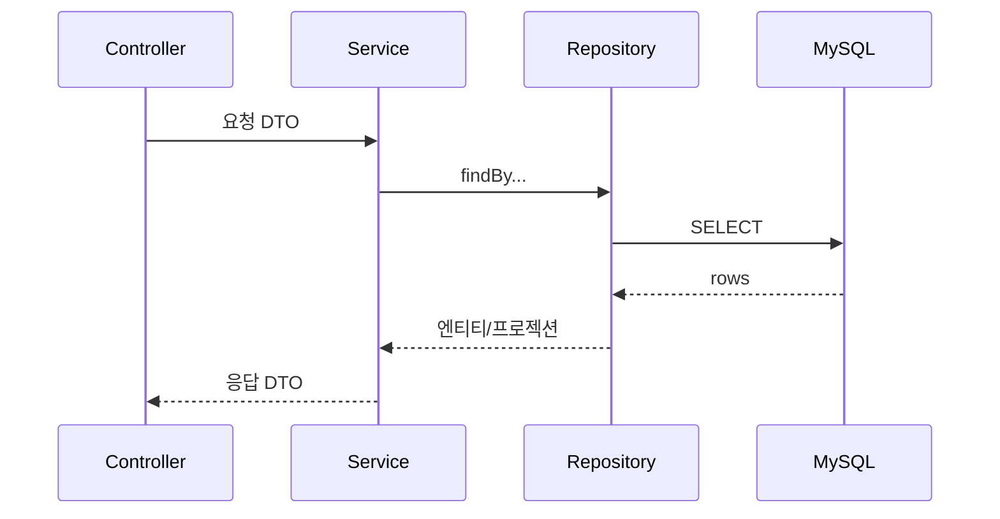

# LLD-NNNN: <설계 제목>

<!--
  파일 이름 규칙: docs/lld/LLD-NNNN-<kebab-case-영문-제목>.md
  예: docs/lld/LLD-0001-university-booth-mapping.md
  NNNN은 4자리 일련번호이며 기존 LLD의 최대 번호 + 1을 사용한다.
  LLD는 "구현 직전"에 작성하는 상세 설계 문서로, 이 문서만 보고 구현할 수 있는 수준이어야 한다.

  [작성 스타일 — AGENTS.md "문서 작성 스타일" 준수]
  새 개념이 처음 나오는 지점마다 괄호로 쉬운 설명을 병기하고,
  설계 선택마다 "왜"(어떤 병목을 없애려는지, 어떤 규칙을 지키는지)를 한 줄 남긴다.

  [해당 없는 장은 지우지 말고 "해당 없음"이라고 적는다.]
  이 프로젝트의 작업은 크게 넷(전국 확장 / 대량 적재 / 성능 개선 / CQRS)이라 매번 쓰는 장이 다르다.
  장을 통째로 지우면 "빠뜨린 것"과 "해당 없는 것"이 구분되지 않는다.

  완료 후 C:\code\study\festival\lld\ 에도 사본을 커밋·푸시한다. (AGENTS.md 워크플로 ⑥)
  작성 후 docs/lld/README.md 목록 표에 한 줄 추가하는 것을 잊지 않는다.
-->

| 항목 | 내용 |
|---|---|
| 상태 | 작성 중 \| 확정 \| 구현 완료 \| 폐기 |
| 작성일 | YYYY-MM-DD |
| 관련 이슈 | #<이슈번호> |
| 관련 ADR | [ADR-NNNN](../adr/ADR-NNNN-xxx.md) — 없으면 "해당 없음 (사용자 지시 기반)" + 지시 요약 |
| 대상 도메인 | auth \| booth \| menu \| lostitem \| manager \| order \| sse \| outbox \| idempotency \| global \| university(예정) |
| 작업 갈래 | ① 전국 대학 확장 \| ② 대량 데이터 삽입 \| ③ 성능 개선 \| ④ Read Replica·CQRS \| 기타 (AGENTS.md 1.4) |
| 관련 방침 | `docs/policy/development-policy.md` N장 |
| API 스펙 | `docs/api-spec/<domain>.md` — **컨트롤러가 있으면 이 문서보다 먼저 작성한다** \| 해당 없음 |
| 스키마 변경 | `V{N}__*.sql` + `docs/erd/` 갱신 \| 없음 |

## 1. 개요 및 범위

<!--
  - 이 설계가 다루는 기능/작업을 1~2문단으로 요약
  - 범위에 포함되는 것 / 명시적으로 제외되는 것 (Out of Scope)
  - 근거가 ADR이 아니라 사용자 지시라면, 지시 내용을 여기에 그대로 인용한다
-->

### 현재 상태 (Before)

<!--
  손대기 전 구조를 한 문단 + 필요하면 코드/쿼리 한 조각으로 적는다.
  현행 스키마: docs/erd/erd-0001-initial-schema.md
  현행 기반 코드(멱등성/아웃박스/SSE/커서 페이징 등): AGENTS.md 1.3
  성능 작업이면 여기에 측정치를 적는다 (아래 9장과 짝을 이룬다).
-->

## 2. 데이터 모델 (엔티티 / 테이블)

<!-- 이번 작업이 다루는 엔티티와 테이블. 새로 만드는 것과 고치는 것을 구분한다. -->

### 2.1 대상 엔티티

| 엔티티 | 테이블 | 신규/변경 | 위치 |
|---|---|---|---|
| 예: Booth | `booth` | 변경 (university_id 추가) | `domain/booth/entity/Booth.java` |

### 2.2 필드 / 컬럼 정의

| 필드 (Java) | 컬럼 | 타입 | 제약 | 설명 |
|---|---|---|---|---|
| 예: universityId | `university_id` | BIGINT | NOT NULL, FK → universities(id) | 소속 대학 |

- enum은 `@Enumerated(EnumType.STRING)` + `VARCHAR`로 매핑한다 (ERD 2장).
- 시각 컬럼이 필요하면 `BaseTimeEntity`를 상속한다 (`created_at`/`modified_at` 자동 관리).
- 금액은 `INT`(KRW)를 쓴다. `BigDecimal`/`double` 금지.

### 2.3 비즈니스 규칙 / 불변식

<!-- 엔티티가 항상 지켜야 하는 규칙. 엔티티 메서드 안에서 강제한다 (예: Order.changeOrderStatus의 상태 전이 검증). -->
- 예: 주문은 COMPLETED에서 WAITING으로 돌아갈 수 없다

### 2.4 이벤트 (해당 시)

<!--
  주문 상태가 바뀌면 SSE 이벤트가 나간다. 새 이벤트를 추가하면 OrderSseEventType과 프런트 계약이 함께 바뀐다.
  발행 경로는 order.event.pattern 설정에 따라 direct 또는 outbox다 (AGENTS.md 1.3).
-->

| 이벤트 이름 | 발행 시점 | 페이로드 클래스 | 수신 대상 |
|---|---|---|---|
| 예: waitingOrderEvent | 주문 생성 커밋 후 | `WaitingOrderPayload` | 해당 부스 WAITING 구독자 |

## 3. 클래스 / 시그니처 정의

<!--
  이 장이 TDD Red의 직접적 입력이다. 메서드 시그니처와 DTO 필드를 실제 컴파일 가능한 형태로 적는다.
  구조 규칙: DDD 미적용. service가 repository를 직접 주입받는다 (AGENTS.md 3.1).
-->

### 3.1 Controller

```java
@Tag(name = "...", description = "...")
@RestController
@RequiredArgsConstructor
@RequestMapping("/api/...")
public class XxxController {
  // 반환 타입은 항상 ResponseEntity<BaseResponse<T>>
  // 상세 계약은 docs/api-spec/<domain>.md — 여기에 중복 기술하지 않는다
}
```

### 3.2 Service

```java
public interface XxxService {
  // 유스케이스 메서드 시그니처. 트랜잭션 경계가 되는 지점을 주석으로 표시한다.
}

@Service
@RequiredArgsConstructor
public class XxxServiceImpl implements XxxService {
  private final XxxRepository xxxRepository;
}
```

### 3.3 Repository

```java
public interface XxxRepository extends JpaRepository<Xxx, Long> {
  // @Query(JPQL) 또는 nativeQuery. QueryDSL은 도입하지 않았다.
  // 커서 페이지네이션이면 정렬 키 조합을 파라미터로 받는 형태로 적는다.
}
```

### 3.4 조회 전용 서비스 (CQRS 도입 이후에만)

```java
// domain/<도메인>/query/XxxQueryService — 조회 로직을 명령 서비스와 분리한다 (AGENTS.md 3.2)
// Read Model 문서 클래스는 domain/<도메인>/readmodel/ 아래에 둔다
```

### 3.5 DTO

| DTO | 종류 | 필드 |
|---|---|---|
| 예: OrderCreateRequest | 요청 | tableNumber(Integer), orderItems(List\<OrderItemCreateRequest\>) … |

## 4. 패키지 / 클래스 구조

<!-- 이번 구현으로 추가/변경되는 클래스를 실제 패키지 트리로 명시한다 (AGENTS.md 3.1의 구조를 따른다). -->

```
com.skulikelion.festival
├── domain/<도메인>/
│   ├── controller/
│   ├── dto/{request,response}/
│   ├── entity/{,enums}/
│   ├── exception/          # <Domain>ErrorCode
│   ├── mapper/
│   ├── repository/
│   └── service/
└── global/                 # 여러 도메인이 공유하는 것만
```

## 5. 시퀀스 흐름

<!-- 핵심 흐름을 mermaid로 작성한다. 이벤트·SSE가 얽히면 그 경로까지 한 다이어그램에 담는다. -->



## 6. API 명세

<!--
  상세는 docs/api-spec/<domain>.md에 있다. 여기에는 목록과 링크만 남긴다 (중복 기술 금지).
  컨트롤러가 없는 작업이면 "해당 없음".
-->

| Method | Path | 설명 | 스펙 문서 |
|---|---|---|---|
| 예: GET | /api/orders/waiting | 대기 중 주문 목록 | [order.md](../api-spec/order.md#대기-중-주문-목록-조회) |

## 7. 영속성 / 스키마 변경

<!-- 스키마를 바꾸지 않으면 "해당 없음". -->

### 7.1 마이그레이션

- 파일: `src/main/resources/db/migration/V{N}__<snake_case_설명>.sql`
- **이미 적용된 마이그레이션은 절대 수정하지 않는다.** 항상 새 번호로 추가한다.

```sql
-- 이번에 추가할 DDL 전문
```

### 7.2 기존 데이터 백필 / 롤백

<!--
  컬럼 추가만으로 끝나지 않는 변경(비정규화 컬럼 추가, FK 신설 등)은
  기존 행을 어떻게 채울지, 실패 시 어떻게 되돌릴지 반드시 적는다.
-->

### 7.3 ERD 갱신

- [ ] `docs/erd/erd-NNNN-*.md`를 이번 변경에 맞게 갱신했다 (테이블 명세 + 다이어그램 + "적용된 마이그레이션" 표)

## 8. 인덱스 / 쿼리 설계

<!--
  이 프로젝트의 핵심 장이다. 인덱스를 추가한다면 실측 근거 없이 추가하지 않는다.
  현재 인덱스 현황은 docs/erd/erd-0001-initial-schema.md 5장에 정리되어 있다.
  해당 없으면 "해당 없음".
-->

### 8.1 대상 쿼리

```sql
-- 이번 작업이 개선하려는 쿼리 (또는 새로 생기는 쿼리)
```

### 8.2 실행 계획 비교

| | Before | After (예상 또는 실측) |
|---|---|---|
| type / key | 예: ALL / (없음) | 예: ref / idx_orders_status_created_at |
| rows | | |
| Extra | 예: Using where; Using filesort | 예: Using index condition |

### 8.3 추가/변경할 인덱스

| 테이블 | 인덱스 | 컬럼 순서와 그 이유 |
|---|---|---|
| 예: orders | `idx_orders_status_created_at` | `(order_status, created_at DESC)` — 등호 조건 컬럼을 앞에, 정렬·범위 컬럼을 뒤에 두어야 인덱스로 정렬까지 해결된다 |

- 커버링 인덱스(조회에 필요한 컬럼을 모두 인덱스에 포함시켜, 실제 테이블을 다시 읽지 않고 인덱스만으로 조회를 끝내는 방식)를 쓴다면 포함 컬럼과 그 이유를 적는다.
- 인덱스 추가로 느려지는 쓰기 경로(INSERT/UPDATE)를 함께 적는다.

## 9. 데이터 생성 스펙 (대량 적재 작업에만)

<!--
  ⚠️ 규모·분포는 반드시 사용자가 지정한 값을 그대로 인용한다. 에이전트가 임의로 가정하지 않는다 (AGENTS.md 1.4-2, 3.3).
  해당 없으면 "해당 없음".
-->

### 9.1 사용자 지정 조건 (원문 인용)

> <사용자 프롬프트에서 지정한 규모·편향·분포 조건을 그대로 붙여넣는다>

### 9.2 적재 스펙

| 테이블 | 목표 건수 | 분포 | 비고 |
|---|---|---|---|
| 예: orders | 1,000,000 | 부스 200개 균등, 최근 3일에 70% 집중 | |
| 예: order_items | ≈3,200,000 | 주문당 1~5건 | orders에 종속 |
| 예: order_item_units | ≈7,800,000 | 항목당 quantity만큼 | **행 증폭 주의** (ERD 3.4) |

### 9.3 삽입 방식

- 방식: 배치 삽입(insert를 한 건씩 보내지 않고 여러 건을 묶어 한 번에 보내 왕복 횟수를 줄이는 방식) \| 저장 프로시저 \| 기타
- 배치 크기 / 트랜잭션 단위:
- 실패 시 재시도·재개 전략:
- 스크립트 위치: `scripts/...` (운영 코드 `src/main`과 분리 — AGENTS.md 3.3)
- **실행 결과(적재 건수, 소요 시간)를 커밋 메시지 또는 이슈에 기록한다.**

## 10. 캐싱 / Read Model (해당 시)

<!-- Redis 캐싱이나 MongoDB Read Model을 도입하는 작업에만 작성한다. 해당 없으면 "해당 없음". -->

| 항목 | 내용 |
|---|---|
| 캐시 키 설계 | 예: `booth:list:{location}` |
| TTL | |
| 무효화 시점 | |
| 갱신 방식 | 동기 갱신 \| 이벤트 기반 비동기 갱신 (기존 `outbox` 재사용 여부를 반드시 검토) |
| 정합성 수준 | 강한 일관성 \| 최종적 일관성 (지연 허용 범위를 수치로) |

## 11. 트랜잭션 / 동시성 / 멱등성

<!--
  - 트랜잭션 경계: 어떤 서비스 메서드가 하나의 트랜잭션인지
  - 락 전략, 격리 수준, 재시도 정책
  - 동시 요청 시나리오와 그 처리
  - 멱등성이 필요하면 @Idempotent 전략(DB/REDIS/WRITETHROUGH/FALLBACK) 중 무엇을 쓰고 왜인지
    (현행 동작은 docs/api-spec/api-conventions.md 7장)
  - 이벤트를 발행한다면 트랜잭션 커밋과 발행 순서를 어떻게 보장하는지
    (direct 방식은 트랜잭션 내 전파, outbox 방식은 커밋된 행을 폴링 — AGENTS.md 1.3)
-->

## 12. 예외 및 에러 정책

| 상황 | 에러 코드 (enum) | HTTP | message 문자열 |
|---|---|---|---|
| 예: 총액 불일치 | `ORDER_4001` | 400 | 주문 총 가격이 메뉴 목록 총 가격과 일치하지 않습니다. |

- 새 에러 코드는 `docs/api-spec/api-conventions.md` 5.3 명명 규칙을 따르고, 번호를 중복·재사용하지 않는다.
- **에러 코드 문자열은 현재 응답 본문에 나가지 않는다** (api-conventions 5.2). 스펙 문서에는 message 문자열을 정확히 적는다.

## 13. 테스트 계획

<!--
  구현은 TDD(Red→Green→Refactor)로 진행되며, 아래 각 항목이 하나의 TDD 사이클 단위가 된다.
  각 항목은 tdd-red 스킬(.agents/skills/tdd-red/SKILL.md)의 입력으로 바로 쓸 수 있도록
  "검증 가능한 하나의 동작"으로 작성한다.
  tdd-red가 요구하는 사전 정보(대상 클래스, 메서드 시그니처, DTO 필드, 비즈니스 규칙/예외, 의존 객체)는
  본 문서 2·3·12장에서 충족되어야 한다. 부족하면 해당 장을 먼저 보완한다.
-->

### 13.1 단위 테스트 — TDD 사이클 대상

<!-- 사이클 진행 순서(위→아래)대로 나열한다. repository → service → controller 순. -->

- [ ] 예: 총 주문 금액이 항목 합계와 다르면 `CustomException(ORDER_TOTAL_PRICE_MISMATCH)`가 발생한다
- [ ] 예: 주문 생성 시 `OrderRepository.save`가 호출되고 생성된 orderId를 반환한다

### 13.2 통합 테스트

<!--
  Testcontainers(MySQL 8.0 + Redis 7)를 쓰는 테스트는 `IntegrationTestSupport`를 상속한다.
  ⚠️ Docker Desktop이 실행 중이어야 통과한다.
-->

- [ ] 예: `POST /api/booths/{boothId}/orders` 호출 시 201과 orderId를 반환한다
- [ ] 예: 같은 `Idempotency-Key`로 두 번 요청하면 주문이 하나만 생성된다

### 13.3 성능 측정 (성능 관련 작업이면 필수)

<!-- 기능 테스트만으로는 이 프로젝트의 목표를 검증할 수 없다. 측정 방법을 여기에 못 박는다. -->

| 항목 | 내용 |
|---|---|
| 측정 대상 | 예: `GET /api/orders/completed?date=...&keyword=...` |
| 데이터 조건 | 9장의 적재 결과 (건수·분포) |
| 부하 시나리오 | 예: 동시 사용자 50, 60초, 워밍업 10초 |
| 측정 지표 | p50/p95/p99 응답시간, TPS, 에러율, `EXPLAIN` 실행 계획 |
| 도구 | 예: k6 \| JMeter \| `@TimeTrace` 로그 (`global/util/timetrace`) |
| 목표치 | 예: p95 < 300ms |
| 결과 기록 위치 | ADR-NNNN "개선 실측치" 표 + 이슈 코멘트 |

## 14. 미해결 질문 (Open Questions)

<!-- 설계 시점에 결정하지 못한 사항. 구현 중 결정되면 본 문서를 갱신하고, 해결되면 취소선 + 해결 근거(ADR·이슈 번호)를 남긴다. -->
-
